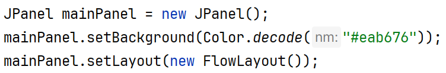
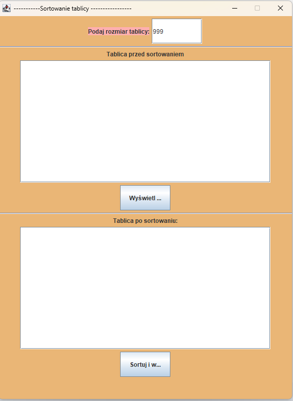
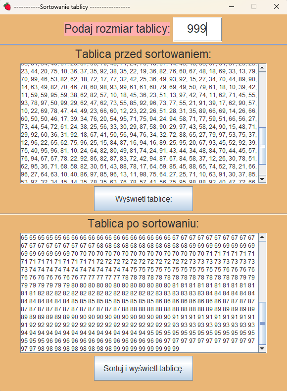
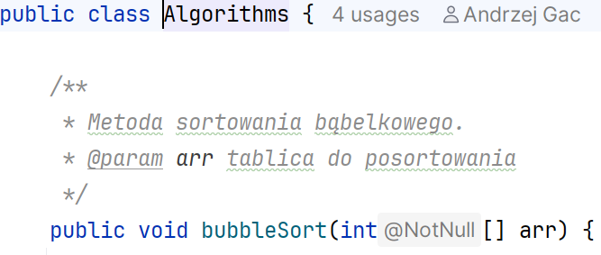
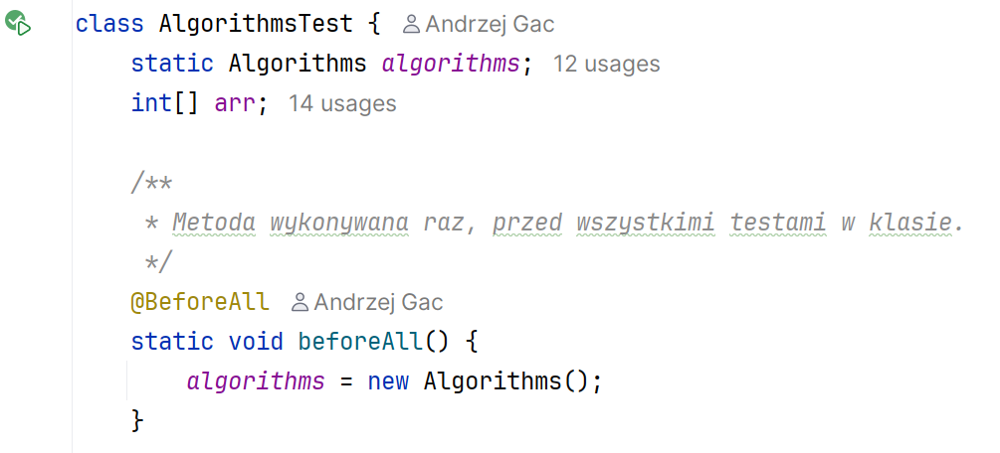
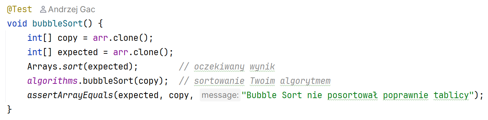
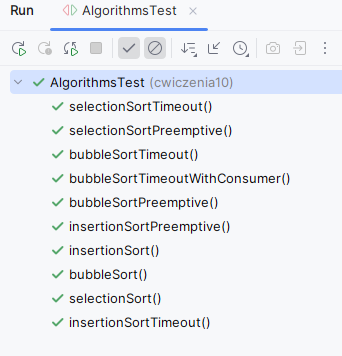

Ćwiczenia 10 -- praca z JFrame, JTextArea, ActionListener
Na koniec zajęć prześlij pliki źródłowe i z danymi, wynikami do zasobu w
teams.
1.  Utwórz nowy projekt w katalogu na dysku C:
2.  Dodaj nowy package oraz nową klasę.
3.  
    Dla panelu ustaw:
4.  Postać aplikacji do testów:
> 
5.  Wylosować 999 liczb dwucyfrowych całkowitych i przechować w
    ArrayList.
> Wyświetlić liczby w polu tekstowym przed i po sortowaniu, dwa różne
> JTextArea.
>
> Następnie posortować.
6.  Dodaj 3 etykiety i pole tekstowe na pobranie wielkości tablicy
    przechowującej liczby liczb.
7.  Dodaj dwa przyciski, pierwszy powoduje wyświetlenie nieposortowanych
    liczb, drugi służy do sortowania.
> Dodaj ActionListenera dla każdego z przycisków.
8.  Dodaj ikonę aplikacji.
9.  Popraw wygląd aplikacji poprzez:
<!-- -->
a)  dobór czcionki, klasa Font,
b)  wyświetlenie całych napisów na przyciskach,
<!-- -->
10. Efekt końcowy:
> 
11. Dodaj klasę Algorithms, w której zapiszesz 3 metody sortowania:
    przez wstawianie, bąbelkowe i przez wybór.
> 
12. Wywołaj w kodzie własną metodę i sprawdź działanie.
13. 
    Dodaj klasę do testów metod
    sortowania:
14. 
    Przykład metody testującej:
15. Sprawdź działanie testów:
> 
16. KONIEC.
