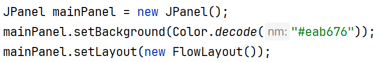
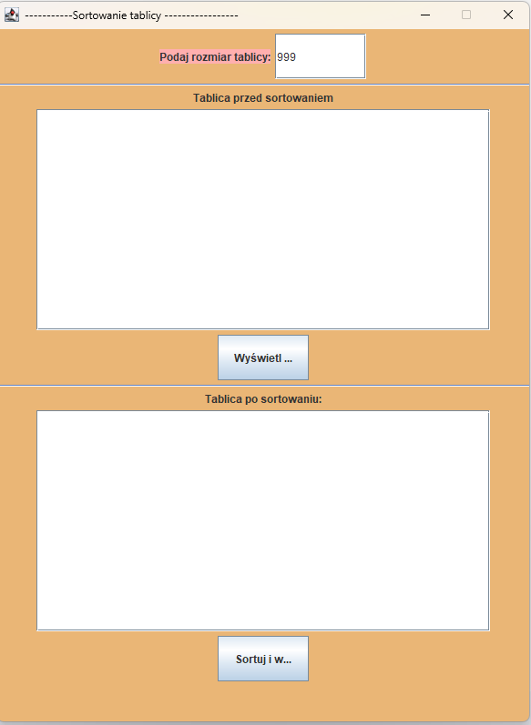
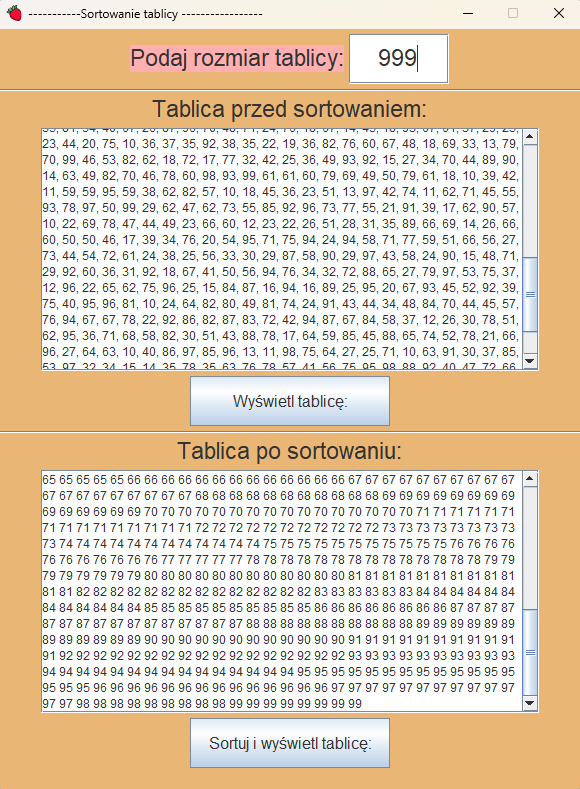
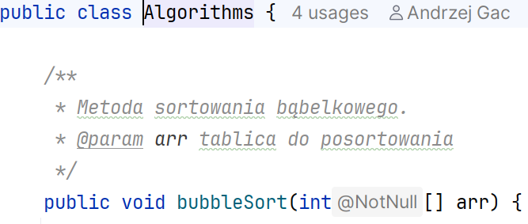
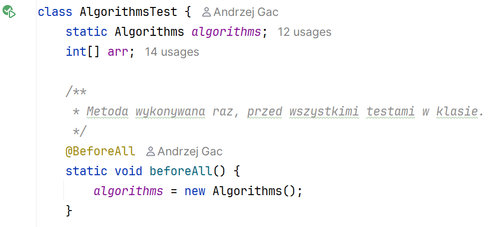
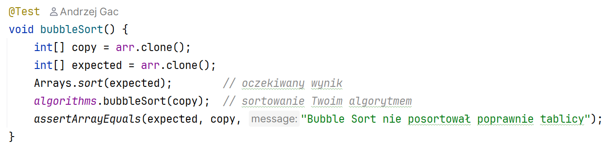
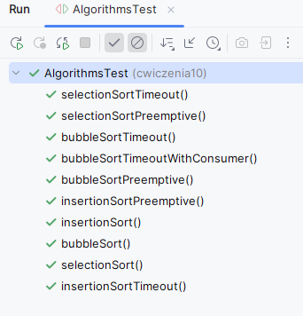

# Ćwiczenia 10 -- praca z JFrame, JTextArea, ActionListener

Na koniec zajęć prześlij pliki źródłowe i z danymi, wynikami do zasobu w
teams.

1. Utwórz nowy projekt w katalogu na dysku C:

1. Dodaj nowy package oraz nową klasę.

1. Dla panelu ustaw:

   

1. Postać aplikacji do testów:

   

1. Wylosować 999 liczb dwucyfrowych całkowitych i przechować w
    ArrayList.

   Wyświetlić liczby w polu tekstowym przed i po sortowaniu, dwa różne
   JTextArea.

   Następnie posortować.

1. Dodaj 3 etykiety i pole tekstowe na pobranie wielkości tablicy
    przechowującej liczby liczb.

1. Dodaj dwa przyciski, pierwszy powoduje wyświetlenie nieposortowanych
    liczb, drugi służy do sortowania.

   Dodaj ActionListenera dla każdego z przycisków.

1. Dodaj ikonę aplikacji.

1. Popraw wygląd aplikacji poprzez:

   - dobór czcionki, klasa Font,
   - wyświetlenie całych napisów na przyciskach,

1. Efekt końcowy:

   

1. Dodaj klasę Algorithms, w której zapiszesz 3 metody sortowania:
    przez wstawianie, bąbelkowe i przez wybór.

   

1. Wywołaj w kodzie własną metodę i sprawdź działanie.

1. Dodaj klasę do testów metod sortowania:

   

1. Przykład metody testującej:

   

1. Sprawdź działanie testów:

   

1. KONIEC.
