Ćwiczenia 11 -- praca z JFrame, JComboBox, ItemListener
Na koniec zajęć prześlij pliki źródłowe i z danymi, wynikami do zasobu w
teams.
Pliki ikon, obrazów ściągnij z teams. ( animals.zip )
1.  Utwórz nowy projekt w katalogu na dysku C:
2.  Otwórz dokumentację:
> <https://docs.oracle.com/javase/tutorial/uiswing/components/combobox.html>
3.  Dodaj podstawowe
    metody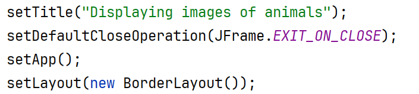
4.  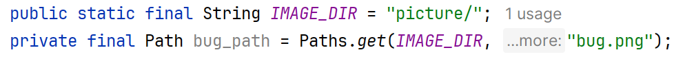
    Ustaw ścieżki do obrazków:
5.  Postać aplikacji do testów:
> 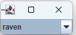
6.  Przygotuj tablicę nazw zwierząt, ptaków, ... około 10 sztuk.
7.  Dodaj JComoBox na północ.
8.  Dodaj ItemListenera dla listy rozwijanej.
9.  Testy: wypisz zaznaczany i odznaczany element w terminalu. ()
10. Dodaj 3 przyciski i umieść je na południu:
> 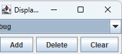
11. Dodaj nowy element np.: wolf, sheep.
12. Usuń wybrany, zaznaczony element.
13. Usuń wszystkie elementy z listy.
14. Dodaj etykietę i obsłuż wyświetlanie, dodawanie i usuwanie:
> 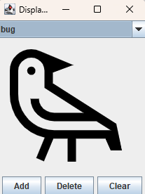
15. Popraw wygląd aplikacji poprzez:
<!-- -->
a)  dobór czcionki, klasa Font,
b)  wyświetlenie całych napisów na przyciskach,
c)  dodaj ikonę aplikacji.
d)  Dodaj kolory.
<!-- -->
16. 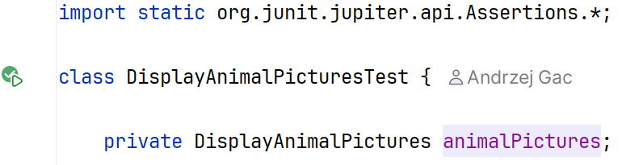
    Dodaj klasę z testem:
17. Dodaj metodę setUp():
> 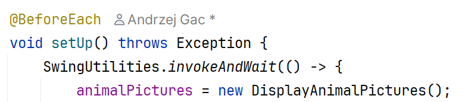
18. 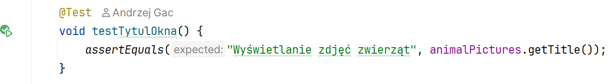
    Dodaj metodę dla testu sprawdzającego
    czy aplikacja posiad tytuł:
19. Dodaj metodę tearDown():
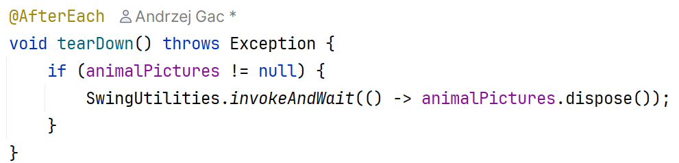
20. 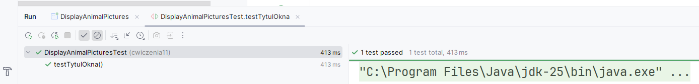
    Sprawdzić działanie testów:
21. 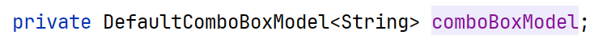
    Dodaj nowy package, a w nim nową
    klasę w której wykonasz to samo, ale za pomocą modelu:
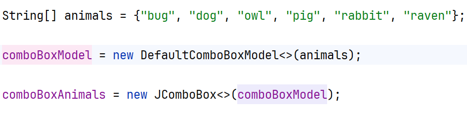
22. 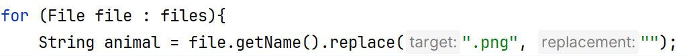
    Zastąp tablicę animals swoją tablicą
    utworzoną z nazw plików. Czytaj nazwy zwierząt z katalogu picture,
    usuń rozszerzenie .png:
23. Zmodyfikuj klasę tak, aby implementowała ItemListener.
24. KONIEC.
