# Ćwiczenia 11 -- praca z JFrame, JComboBox, ItemListener

Na koniec zajęć prześlij pliki źródłowe i z danymi, wynikami do zasobu w
teams.
Pliki ikon, obrazów ściągnij z teams. ( animals.zip )

1. Utwórz nowy projekt w katalogu na dysku C:

1. Otwórz dokumentację:

   <https://docs.oracle.com/javase/tutorial/uiswing/components/combobox.html>

1. Dodaj podstawowe metody

   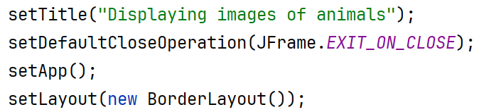

1. Ustaw ścieżki do obrazków:

   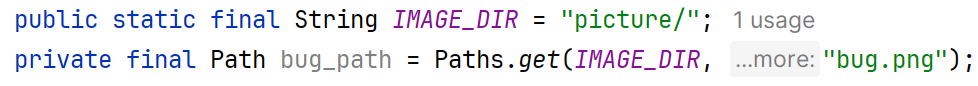

1. Postać aplikacji do testów:

   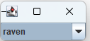

1. Przygotuj tablicę nazw zwierząt, ptaków, ... około 10 sztuk.

1. Dodaj JComoBox na północ.

1. Dodaj ItemListenera dla listy rozwijanej.

1. Testy: wypisz zaznaczany i odznaczany element w terminalu. ()

1. Dodaj 3 przyciski i umieść je na południu:

   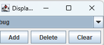

1. Dodaj nowy element np.: wolf, sheep.

1. Usuń wybrany, zaznaczony element.

1. Usuń wszystkie elementy z listy.

1. Dodaj etykietę i obsłuż wyświetlanie, dodawanie i usuwanie:

   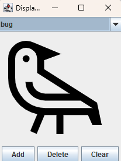

1. Popraw wygląd aplikacji poprzez:
   - dobór czcionki, klasa Font,
   - wyświetlenie całych napisów na przyciskach,
   - dodaj ikonę aplikacji.
   - dodaj kolory.

1. Dodaj klasę z testem:

   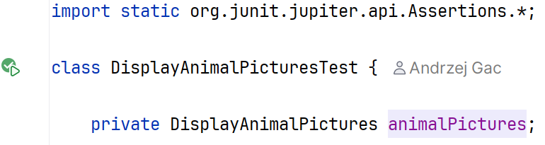

1. Dodaj metodę setUp():

   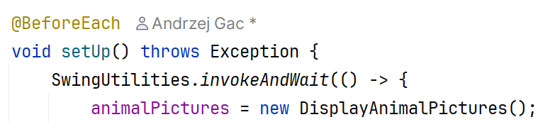

1. Dodaj metodę dla testu sprawdzającego
    czy aplikacja posiad tytuł:

   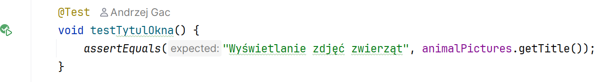

1. Dodaj metodę tearDown():

   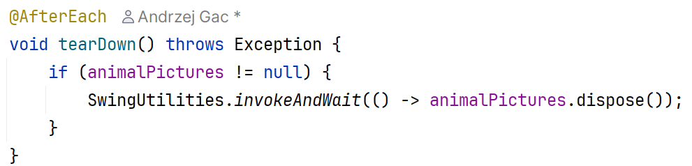

1. Sprawdzić działanie testów:

   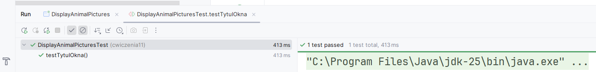

1. Dodaj nowy package, a w nim nową
    klasę w której wykonasz to samo, ale za pomocą modelu:

   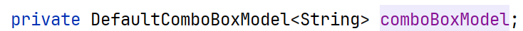

   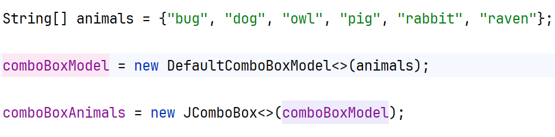

1. Zastąp tablicę animals swoją tablicą
    utworzoną z nazw plików. Czytaj nazwy zwierząt z katalogu picture,
    usuń rozszerzenie .png:

   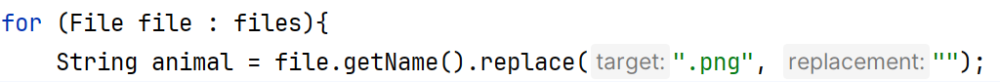

1. Zmodyfikuj klasę tak, aby implementowała ItemListener.

1. KONIEC. 🔚
