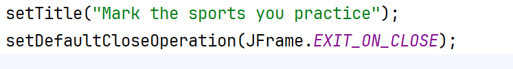
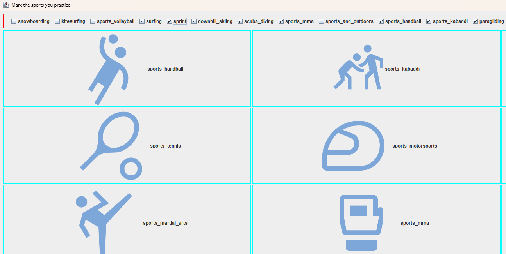

Ćwiczenia 12 -- praca z JFrame, JComboBox, ItemListener
Na koniec zajęć prześlij pliki źródłowe i z danymi, wynikami do zasobu w
teams.
Potrzebne obrazki ściągnij z teams.
1.  Utwórz nowy projekt w katalogu na dysku C:
2.  Dodaj podstawowe metody
> 
3.  Ikony pobierz z teams: plik sport.zip.
4.  
    Postać aplikacji do testów:
5.  Przygotuj panel dla checkbox i umieść go na północ.
6.  Przygotuj panel na obrazki w układzie gridLayout(3,3) i umieść panel
    w centrum.
7.  Zaznaczenie danego checkboxa dodaje obrazek do panelu, odznaczenie
    powoduje zniknięcie.
8.  Zastosuj obramowania dla paneli oraz obrazków.
9.  Popraw wygląd aplikacji poprzez:
<!-- -->
a)  dobór czcionki, klasa Font,
b)  wyświetlenie całych napisów na przyciskach,
c)  dodaj ikonę aplikacji.
d)  Dodaj kolory.
<!-- -->
10. Zmodyfikuj klasę tak, aby implementowała ItemListener.
11. KONIEC.
