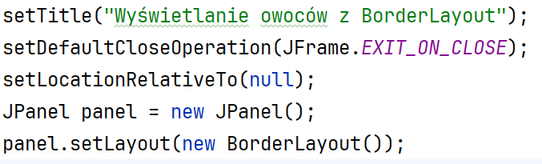
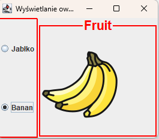
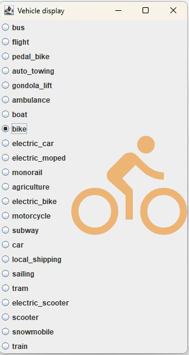

Ćwiczenia 13 -- praca z JFrame, JRadioButton, ActionListener
Na koniec zajęć prześlij pliki źródłowe i z danymi, wynikami do zasobu w
teams.
Potrzebne obrazki ściągnij z teams.
1.  Utwórz nowy projekt w katalogu na dysku C:
2.  Dodaj w konstruktorze
> 
3.  Ikony pobierz z teams: plik fruits.zip.
4.  Postać aplikacji do testów:
> 
5.  Przygotuj panel w układzie Grid z jedną kolumną dla jradiobox i
    umieść go na lewo( zachód).
6.  Etykietę na obrazek umieść w centrum.
7.  Zaznaczenie danego jradiobuttona wyświetla dany obrazek.
8.  Zastosuj obramowania dla panelu oraz etykiety.
9.  Popraw wygląd aplikacji poprzez:
<!-- -->
a)  dobór czcionki, klasa Font,
b)  dodaj ikonę aplikacji.
c)  Dodaj kolory.
<!-- -->
10. Zmodyfikuj klasę tak, aby implementowała ActionListener.
11. Przygotuj nową klasę, w której zaprogramujesz obsługę większej
    ilości jradiobuttonów:
> 
12. Nazwy plików i ścieżki można przechować w HashMap.
13. Dodaj obramowania jak wcześniej.
14. KONIEC.
