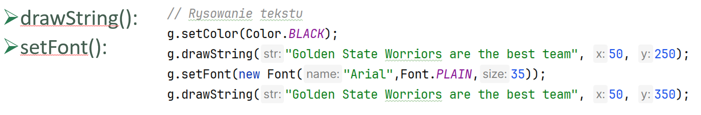
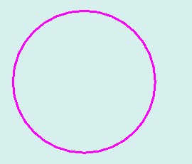
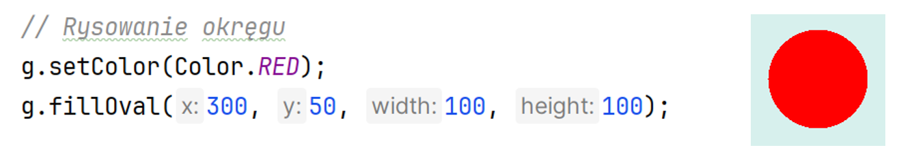
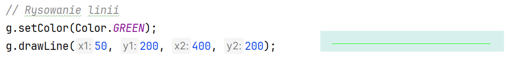
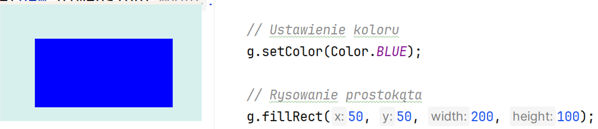
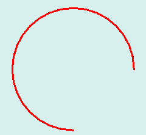
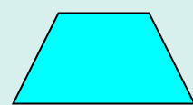
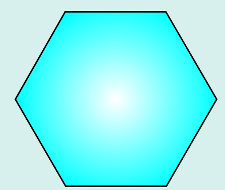
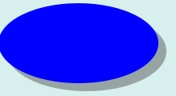
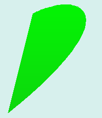

# Ćwiczenia 14 -- rysowanie

---

_Na koniec zajęć prześlij pliki źródłowe i z danymi, wynikami do zasobu w
teams._  
_*Potrzebne obrazki ściągnij z teams.*_

---

1.  Utwórz nowy projekt w katalogu na dysku C:
2.  Dodaj klasę MyDraw, która rozszerza JFrame.
3.  Dodaj 3 klasy o nazwach LeftPanel, MiddlePanel i RightPanel , które dziedziczą po JPanel.

4.  Zastosuj BoxLayout:

  

5.  W klasach LeftPanel, MiddlePanel i RightPanel dodaj konstruktory, a w nich delikatne kolory tła, oraz preferowany rozmiar.

  

6. W klasach LeftPanel, MiddlePanel i RightPanel nadpisz metodę paintComponent ( Ctrl+o ).

7. Dodaj antyaliasing.
8. Przetestuj proste przykłady z wykładu, dobierz odpowiednie kolory:    

    
*  Rysowanie tekstu

*   Rysowanie koła i okręgu

    
 
*  Rysowanie linii, dodaj również linię
 pionową i pod kątem 45 stopni.
    
 
*  Rysowanie prostokąta
 
    
*  Inne: rysowanie: łuku, wycinka
    koła    
 

9.  Dodaj trapez, metody moveTo, lineTo dla Path2D. Dodaj obrys.    
 

10. Dodaj prostokąt z gradientem liniowym, na dwa kolory i trzy:  
 
 
 
 
11. Dodaj koło z gradientem radialnym na dwa i trzy kolory:

12. Odrysuj wybrane warzywo z pliku.

13. Dodaj wycinek koła:    
 
14. Dodaj sześciokąt z obrysem:  
 
15. Dodaj elipsę z cieniem:  
 
16. Dodaj gwiazdę (drawPolygon):  
 
17. Dodaj prostokąt z zaokrąglonymi narożnikami:  
 
18. Narysuj krzywą Beziera:  
 
19. Narysuj krzywą kwadratową:  
 
20. Zapisz wybrane grafiki do pliku png, np.:  

22. KONIEC.  

