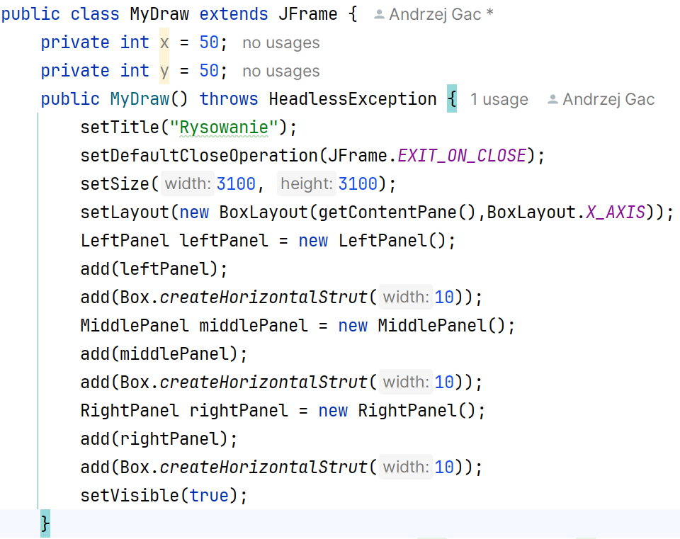
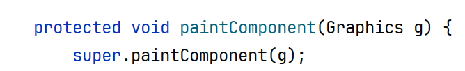
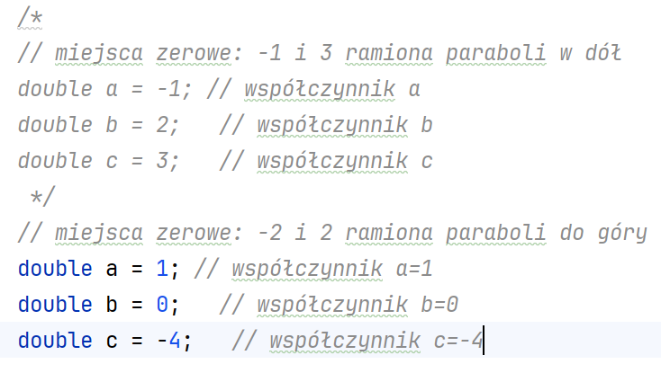
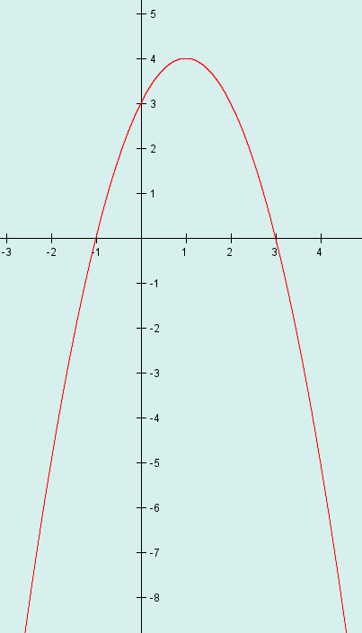
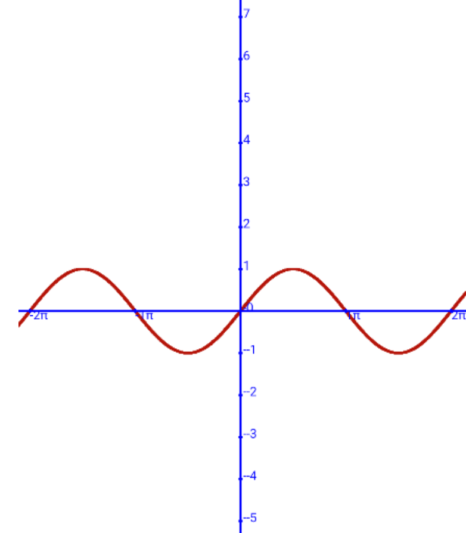

Ćwiczenia 15 -- rysowanie wykresów funkcji
Na koniec zajęć prześlij pliki źródłowe i z danymi, wynikami do zasobu w
teams.
Potrzebne obrazki ściągnij z teams.
1.  Utwórz nowy projekt w katalogu na dysku C:
2.  Dodaj klasę MyDraw, która rozszerza JFrame.
3.  Dodaj 3 klasy o nazwach LeftPanel, MiddlePanel i RightPanel , które
    dziedziczą po JPanel.
4.  
    Zastosuj BoxLayout:
5.  
    W klasach LeftPanel, MiddlePanel i
    RightPanel dodaj konstruktory, a w nich delikatne kolory tła, oraz
    preferowany rozmiar.
6.  W klasach LeftPanel, MiddlePanel i RightPanel nadpisz metodę
    paintComponent ( Ctrl+o ).

7.  Dodaj antyaliasing.
8.  Narysuj funkcję kwadratową. Podaj współczynniki a, b, c.
> 
>
> 
9.  Narysuj wykres funkcji sinus, dodaj również układ współrzędnych z
    jednostką dla π lub 2π.

10. Narysuj funkcję cosinus i tangens i cotangens.
11. Zapisz poszczególne wykresy funkcji do pliku do pliku png, np.:

12. KONIEC.
