# Ćwiczenia 16-17 -- tworzenie menu aplikacji

💡_*Na koniec zajęć prześlij pliki źródłowe i z danymi, wynikami do zasobu w
teams.*_  
_*Potrzebne obrazki ściągnij z teams.*_

1.  Utwórz nowy projekt w katalogu na dysku C:

2.  Efekt po pierwszym etapie ćwiczeń:

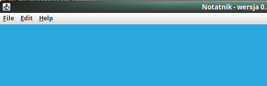
    
3.  Dodaj klasę MainWindow, która rozszerza JFrame.

4.  Dodaj potrzebne metody:
    
 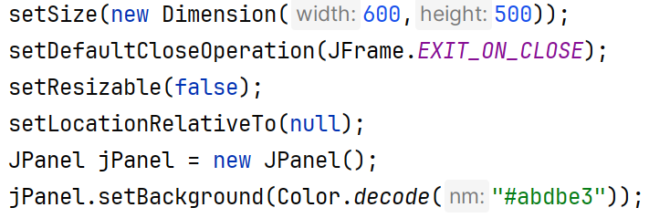 

    
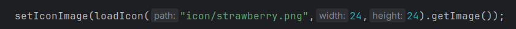
    
5.  Utwórz główny pasek menu i podmenu file:

    
 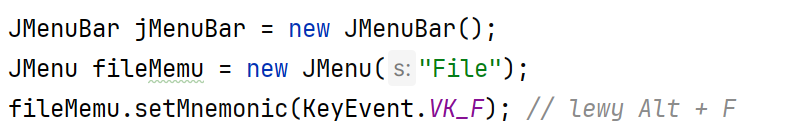 

    
 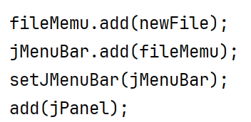 

6.  Dodaj w katalogu projektu katalog icon z ikonami pobranymi z teams:
    notatnik.zip
7.  Dodaj

    
  

    
8.  Dodaj obsługę pozycji nowy plik oraz
    ikonę i skrót:

    
 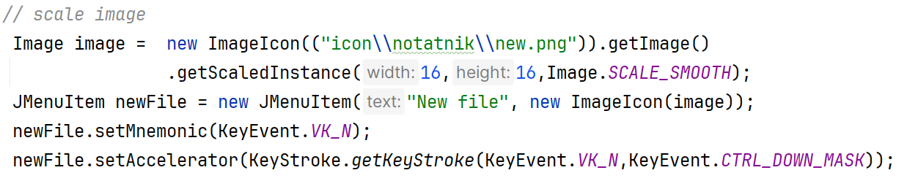 

9.  Przetestuj aplikację:

 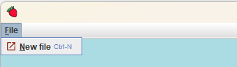

10. Zmień wygląd okien na nimbus:

    
  

11. Dodaj pasek narzędziowy u góry:

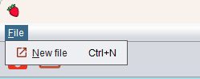

 

12. Dodaj pozycję exit, która zamyka okno
    aplikacji, oddziel ją separatorem od pozycji new file:

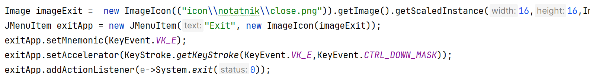

13. Widok menu file:

 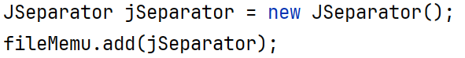

 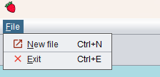

13. Przetestuj działanie pozycji exit.

14. Utwórz metodę pomocniczą:

 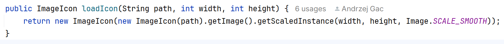

15. Dodaj metody grupujące dla jmenu i toolbara

 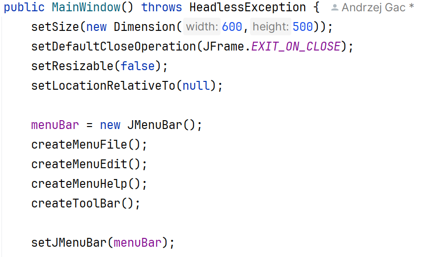

16. Dodaj menu Edycja i Help z pozycjami:

 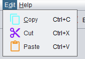
 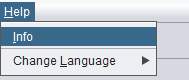

17. Dodaj do paska narzędzi następujące przyciski:

 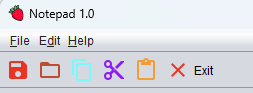

18. Dodaj akcje dla toolbara i przetestuj działanie.

 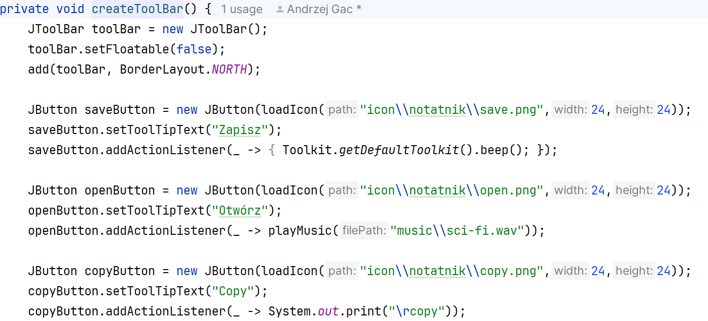

19. Dodaj do paska narzędzi opcję undo, redo oraz do menu edycja.

 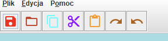

20. Do menu plik dodaj pozycję zapisu pliku, otwarcia pliku i
    drukowania.

 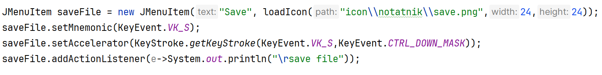

 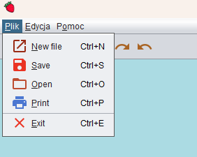

21. Dla każdej pozycji menu przetestuj działanie dodając
    System.out.print(\"\\rnazwa pozycji menu\")

 

22. KONIEC.🔚
