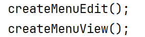
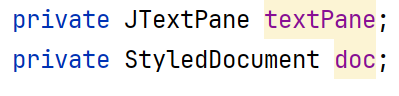
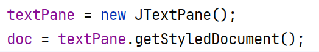
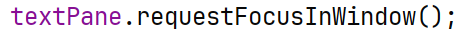
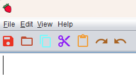
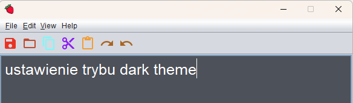
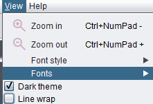
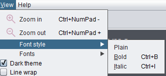
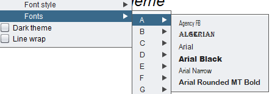
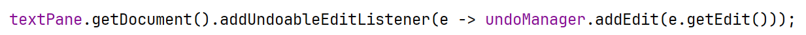

Ćwiczenia 16-17 -- tworzenie menu aplikacji, listener
Na koniec zajęć prześlij pliki źródłowe i z danymi, wynikami do zasobu w
teams.
Potrzebne obrazki ściągnij z teams.
1.  Otwórz projekt z ćwiczeń 14-15.
2.  W całym projekcie ujednolicić język na polski/angielski.
3.  Dodaj pozycję menu Widok (View).
> 
4.  Sugerowana zmiana komponentu TextArea na TextPane.
> 
>
> 
5.  Ustaw focus na komponent tekstowy.
> 
>
> <https://docs.oracle.com/javase/tutorial/uiswing/events/focuslistener.html>
>
> lub
>
> <https://docs.oracle.com/javase/8/docs/api/java/awt/event/WindowListener.html>
>
> 
6.  Ustaw powiększanie i pomniejszanie czcionki dla Ctrl+NumPad- i
    analogicznie powiększenie.
7.  Ustaw tryb ciemny:
> 
> 
8.  Zmiana tekstu na zwykły, pochyły, pogrubiony:
> 
9.  Wybór czcionki:
> 
10. Dodaj obsługę akcji cofania oraz do przodu:
> 
11. Dla każdej pozycji menu zaimplementuj odpowiednie działania.
12. KONIEC.
