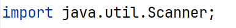
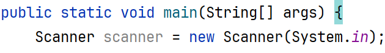
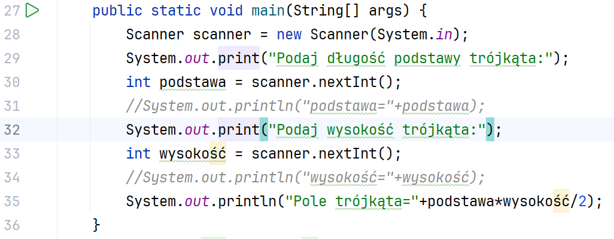
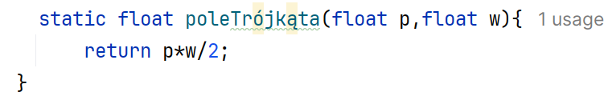
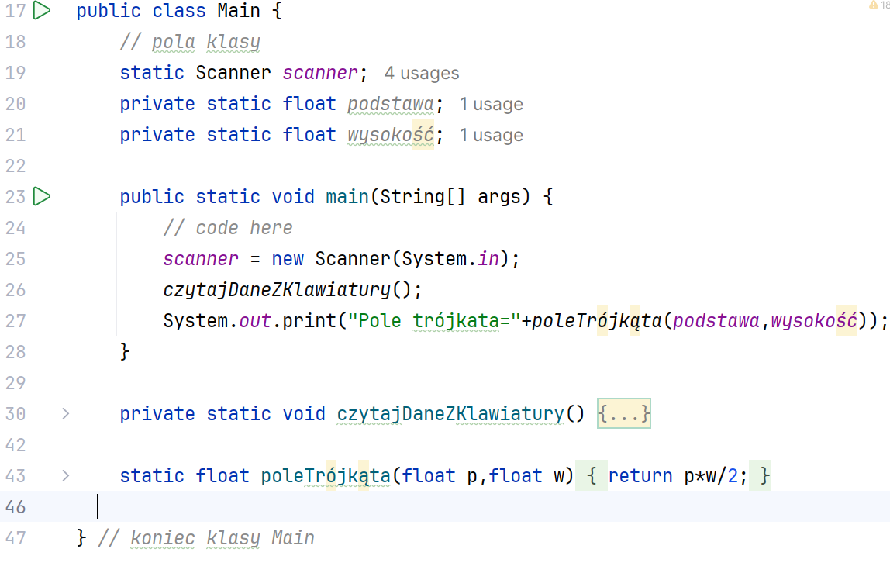
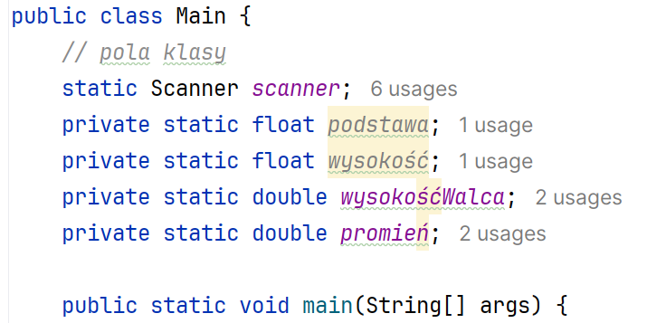
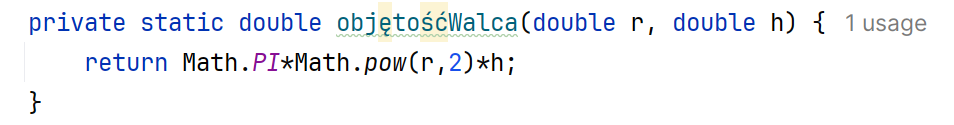
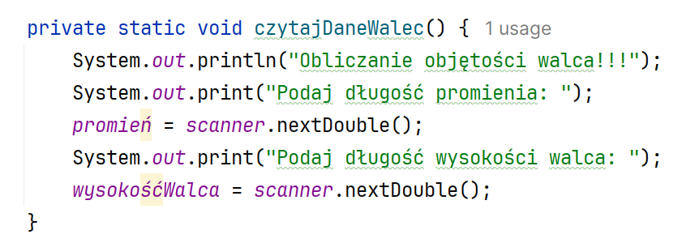
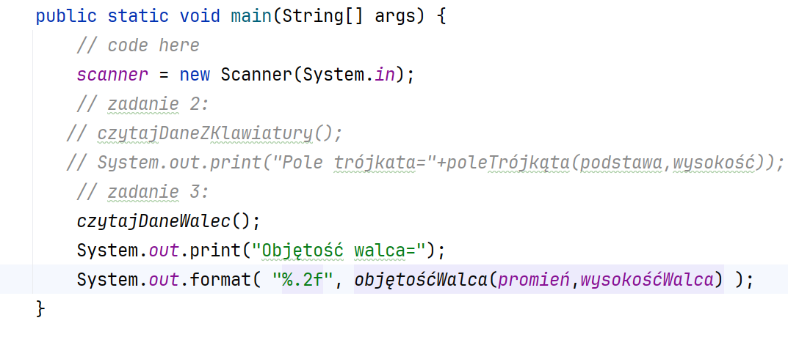

Ćwiczenia 1 -- java, podstawy, metody
Na koniec zajęć prześlij pliki źródłowe z danymi, wynikami do zasobu w
teams.
1.  
    Utwórz nowy projekt w katalogu na dysku
    C:
2.  Nie importuj żadnych bibliotek, zostaną zaimportowane automatycznie.
> 
3.  **Zadanie 1**: Zaczytaj z klawiatury długość podstawy i wysokość
    trójkąta.
> Oblicz i wypisz na ekranie wartość pola trójkąta.
>
> 
>
> 
4.  **Zadanie 2**: Napisz metodę zwracającą wartość pola trójkąta, która
    posiada dwa argumenty: podstawę  i  wysokość typu rzeczywistego.
    Dane pobierz z klawiatury. Wywołaj tę metodę.
5.  **Zadanie 3**: Napisz metodę zwracającą objętość walca, która
    posiada dwa argumenty:
> promień i wysokość typu rzeczywistego podwójnej precyzji.
Wywołaj tę metodę.
> Dane pobierz z klawiatury.
Wynik wyświetl z dokładnością do dwóch miejsc po przecinku.
6.  **Zadanie 4:** Napisz metodę zwracającą objętość stożka, która
    posiada dwa argumenty:
> promień i wysokość typu rzeczywistego podwójnej precyzji.
Wywołaj tę metodę.
> Dane pobierz z klawiatury.
Wynik wyświetl z dokładnością do trzech miejsc po przecinku.
7.  **Zadanie 5:** Napisz metodę zwracającą pole trapezu, która posiada
    trzy argumenty:
> Podstawę dolną, górną i wysokość typu rzeczywistego podwójnej
> precyzji.
Wywołaj tę metodę.
> Dane pobierz z klawiatury.
Wynik wyświetl z dokładnością do czterech miejsc po przecinku.
8.  **Zadanie 6:** Napisz metodę zwracającą pole trójkąta, która posiada
    trzy argumenty:
> Podaj trzy boki trójkąta typu rzeczywistego podwójnej precyzji.
Wywołaj tę metodę.
> Dane pobierz z klawiatury.
Wynik wyświetl z dokładnością do dwóch miejsc po przecinku.
9.  Przykładowa realizacja zadania 1:
Zaczytaj z klawiatury długość podstawy i wysokość trójkąta.
Oblicz i wypisz na ekranie wartość pola trójkąta.

10. Przykładowa realizacja zadania 2:
Napisz metodę zwracającą wartość pola trójkąta, która posiada dwa
argumenty: podstawę i wysokość typu rzeczywistego. Dane pobierz z
klawiatury. Wywołaj tę metodę.

Cały kod:
11. Przykładowa realizacja zadania 3:
> Napisz metodę zwracającą objętość walca, która posiada dwa argumenty:
> promień i wysokość typu rzeczywistego podwójnej precyzji. Wynik
> wyświetl z dokładnością do dwóch miejsc po przecinku.
>
> 
>
> 
>
> 
>
> Wywołanie z formatowaniem do dwóch miejsc po przecinku:
>
> 
12. Dodatokowe zadania na obliczenie pola lub objętości:
> // kula sphere
>
> // romb pole z przekątnych rhombus
>
> // sześciokąt foremny hexagon
>
> // objętość ostrosłupa o podstawie trójkąta, kwadratu i sześciokąta
> pyramid
13. Rozbić kod na klasy.
14. KONIEC.
