# Ćwiczenia 1 -- java, podstawy, metody

Na koniec zajęć prześlij pliki źródłowe z danymi, wynikami do zasobu w
teams.

 1. Utwórz nowy projekt w katalogu na dysku C:

   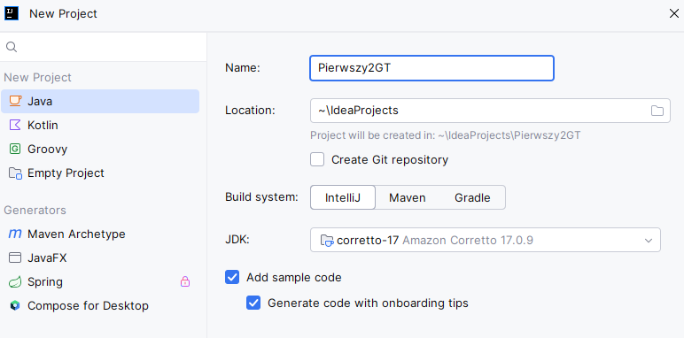

1. Nie importuj żadnych bibliotek, zostaną zaimportowane automatycznie.

   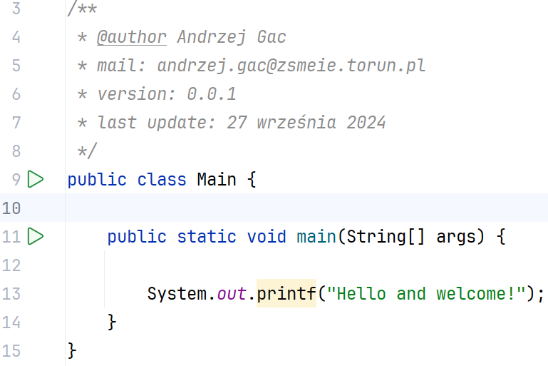

1. **Zadanie 1**: Zaczytaj z klawiatury długość podstawy i wysokość trójkąta.

   Oblicz i wypisz na ekranie wartość pola trójkąta.

   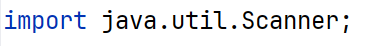

   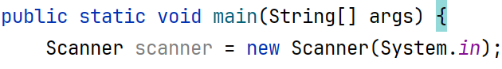

1. **Zadanie 2**: Napisz metodę zwracającą wartość pola trójkąta, która
    posiada dwa argumenty: podstawę  i  wysokość typu rzeczywistego.

    Dane pobierz z klawiatury. Wywołaj tę metodę.

1. **Zadanie 3**: Napisz metodę zwracającą objętość walca, która
    posiada dwa argumenty:

   promień i wysokość typu rzeczywistego podwójnej precyzji.

   - wywołaj tę metodę.
   - dane pobierz z klawiatury.
   - wynik wyświetl z dokładnością do dwóch miejsc po przecinku.

1. **Zadanie 4:** Napisz metodę zwracającą objętość stożka, która
    posiada dwa argumenty:

   promień i wysokość typu rzeczywistego podwójnej precyzji.

   - wywołaj tę metodę.
   - dane pobierz z klawiatury.
   - wynik wyświetl z dokładnością do trzech miejsc po przecinku.

1. **Zadanie 5:** Napisz metodę zwracającą pole trapezu, która posiada
    trzy argumenty:

   Podstawę dolną, górną i wysokość typu rzeczywistego podwójnej precyzji.
   - Wywołaj tę metodę.
   - Dane pobierz z klawiatury.
   - Wynik wyświetl z dokładnością do czterech miejsc po przecinku.

1. **Zadanie 6:** Napisz metodę zwracającą pole trójkąta, która posiada
    trzy argumenty:

   Podaj trzy boki trójkąta typu rzeczywistego podwójnej precyzji.
   - Wywołaj tę metodę.
   - Dane pobierz z klawiatury.
   - Wynik wyświetl z dokładnością do dwóch miejsc po przecinku.

1. Przykładowa realizacja zadania 1:
   Zaczytaj z klawiatury długość podstawy i wysokość trójkąta.
   Oblicz i wypisz na ekranie wartość pola trójkąta.

   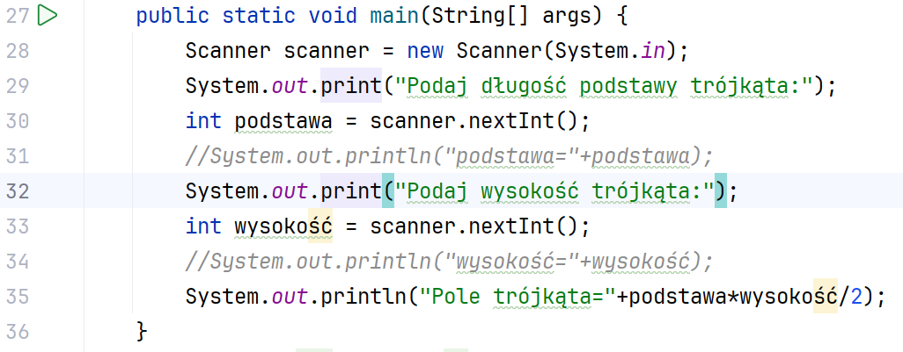

1. Przykładowa realizacja zadania 2:
   Napisz metodę zwracającą wartość pola trójkąta, która posiada dwa
   argumenty: podstawę i wysokość typu rzeczywistego. Dane pobierz z
   klawiatury. Wywołaj tę metodę.

   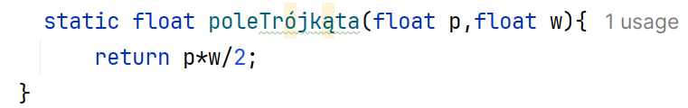

   Cały kod:

   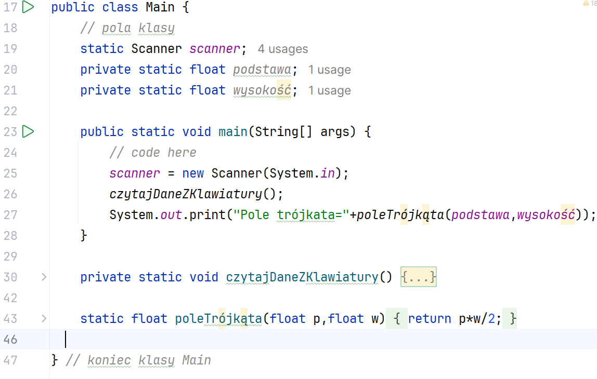

1. Przykładowa realizacja zadania 3:

   Napisz metodę zwracającą objętość walca, która posiada dwa argumenty:
   promień i wysokość typu rzeczywistego podwójnej precyzji. Wynik
   wyświetl z dokładnością do dwóch miejsc po przecinku.

   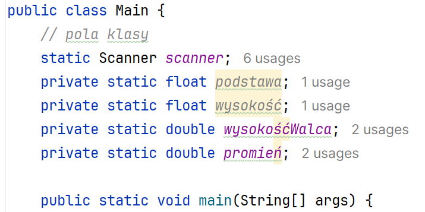

   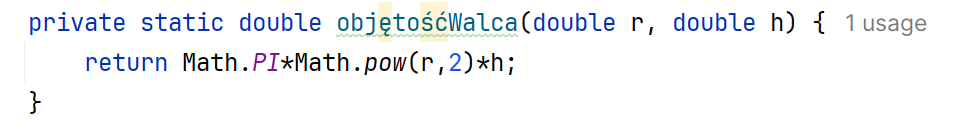

   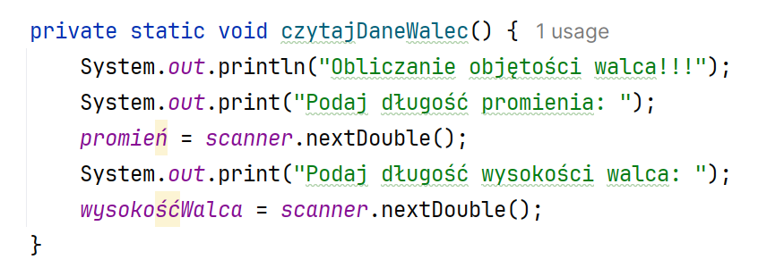

   Wywołanie z formatowaniem do dwóch miejsc po przecinku:

   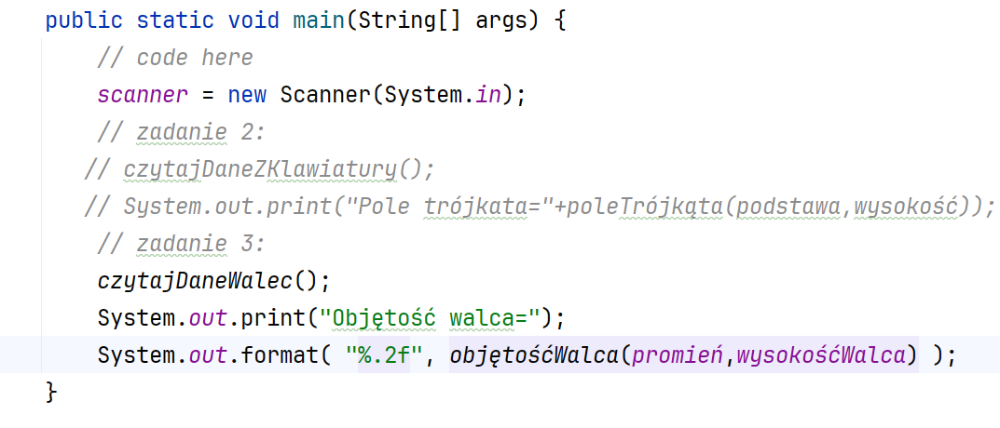

1. Dodatokowe zadania na obliczenie pola lub objętości:

   // kula sphere

   // romb pole z przekątnych rhombus

   // sześciokąt foremny hexagon

   // objętość ostrosłupa o podstawie trójkąta, kwadratu i sześciokąta

   // pyramid

1. Rozbić kod na klasy.

1. KONIEC.
