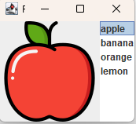

Ćwiczenia 20 -- tworzenie listy
Na koniec zajęć prześlij pliki źródłowe i z danymi, wynikami do zasobu w
teams.
Potrzebne obrazki ściągnij z teams.
1.  Otwórz nowy projekt.
2.  Dokumentacja:
> <https://docs.oracle.com/javase/tutorial/uiswing/components/list.html>
>
> <https://docs.oracle.com/en/java/javase/17/docs/api/java.desktop/javax/swing/JList.html>
3.  Pierwszy etap: lista z tekstem
> 
4.  Kliknięcie w pozycje wyświetla tekst:
> 
5.  Dodanie obsługi kliknięcia z wyświetleniem obrazka:
> 
6.  KONIEC.
