Ćwiczenia 18-23 -- tworzenie listy
Na koniec zajęć prześlij pliki źródłowe i z danymi, wynikami do zasobu w
teams.
Potrzebne obrazki ściągnij z teams.
1.  Otwórz nowy projekt.
2.  Dokumentacja:
> <https://docs.oracle.com/javase/tutorial/uiswing/components/list.html>
>
> <https://docs.oracle.com/en/java/javase/17/docs/api/java.desktop/javax/swing/JList.html>
3.  Pierwszy etap: lista z tekstem bez modelu
> 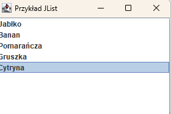
4.  Dodaj obsługę kliknięcia:
> 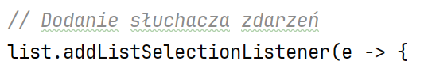
5.  Kliknięcie w pozycje wyświetla tekst:
> 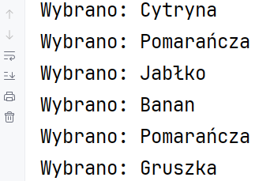
6.  Dodanie obsługi kliknięcia z wyświetleniem obrazka (bez modelu):
> 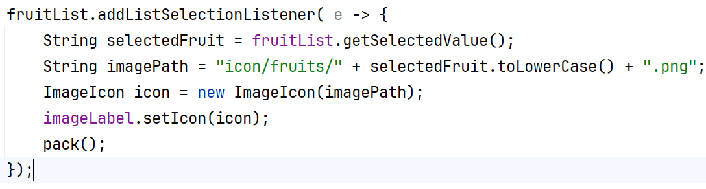
7.  Dodaj przyciski dodaj, usuń, wyczyść listę ( zastosuj model ):
> 
>
> 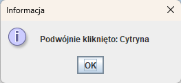
>
> 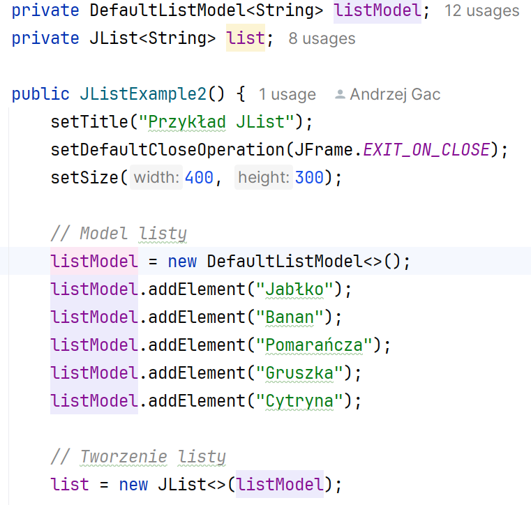
8.  Kasowanie zaznaczonego elementu listy.
9.  Dodawanie:
> 
10. Utwórz nową klasę rozszerzającą JPanel, która zaczyta dane z pliku:
> 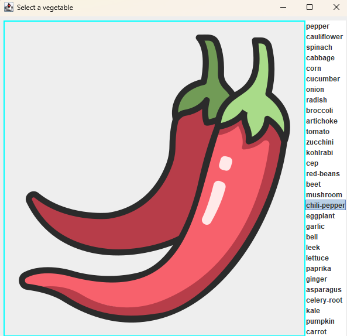
11. 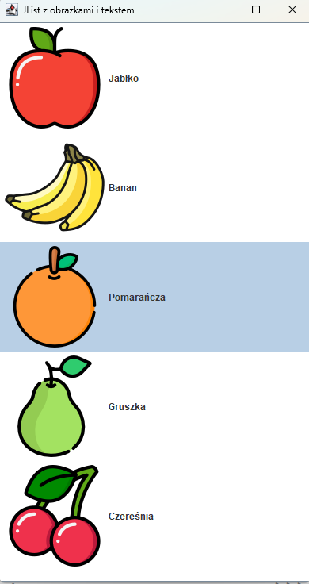
    Z odmalowaniem obrazek + tekst, bez
    czytania z pliku.
12. 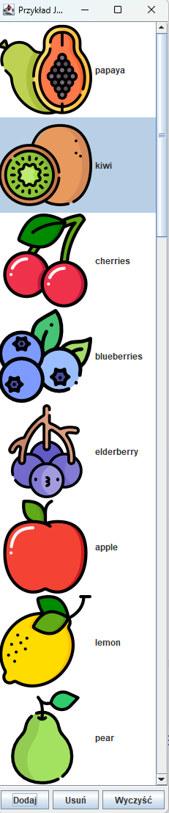
    Ostatnie zadanie:
> Zaczytaj obrazki z folderu
>
> dodawanie, usuwanie i czyszczenie, odmalowanie itemu(obrazek z
> tekstem)
13. Dodanie menu kontekstowego:
> 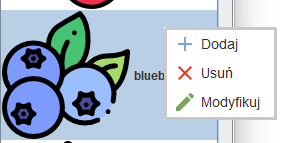
>
> 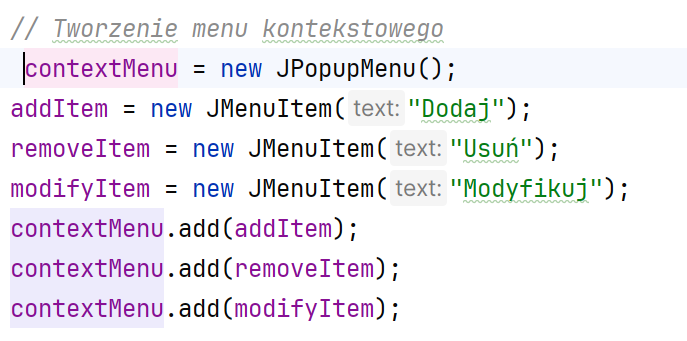
14. Dodaj pole wyszukiwania:
> 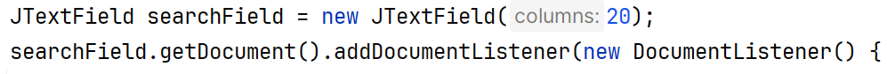
15. KONIEC.
