Ćwiczenia 26-27 -- gra pong - KeyListener
Na koniec zajęć prześlij pliki źródłowe i z danymi, wynikami do zasobu w
teams.
Potrzebne obrazki ściągnij z teams.
1.  Napisz grę w swing i języku java, która polega na
> poruszaniu dwoma paletkami(zastosuj Rectangle i Graphics2D)
>
> i odbijaniu piłki paletkami.
>
> Lewa paletka, czerwona porusza się za pomocą klawiszy WSAD, a prawa,
> niebieska strzałek.
>
> Paletki mają czarną obwódkę.
>
> Zastosuj klasę Timer.
>
> Główna klasa rozszerza JFrame.
>
> Klasa wewnętrzna JPanel z paintComponent.
>
> Wynik na środku, stan początkowy 0:0.Otwórz nowy projekt.
2.  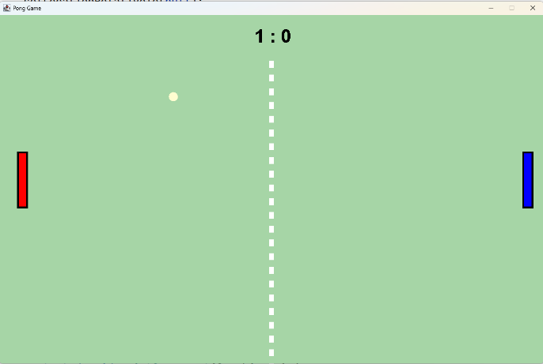
    Efekt końcowy:
3.  Dokumentacja:
> <https://docs.oracle.com/javase/8/docs/api/java/awt/Rectangle.html>
>
> <https://docs.oracle.com/javase/8/docs/api/java/awt/event/KeyListener.html>
>
> <https://docs.oracle.com/javase/8/docs/api/javax/swing/Timer.html>
4.  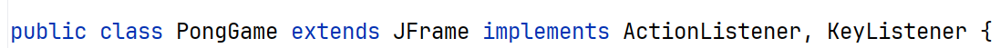
    Utworzenie głównej klasy:
5.  Zaimplementuj wszystkie wymagane metody.
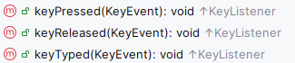
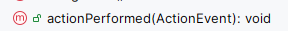
6.  Utworzenie konstruktora klasy PongGame
> 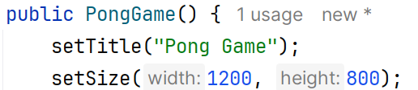
7.  Utworzenie klasy wewnętrznej dla JPanel
> 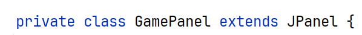
8.  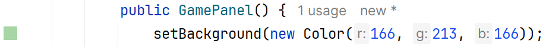
    Utworzenie konstruktora :
> i metody paintComponent()
>
> 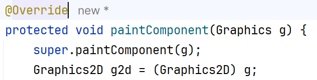
9.  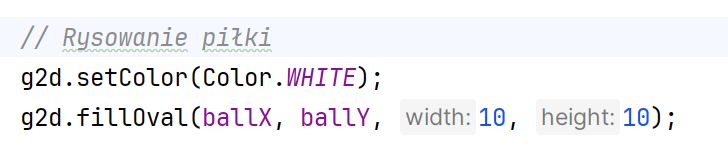
    Dodaj rysowanie piłki:
10. W konstruktorze klasy PongGame dodaj Timer:
> 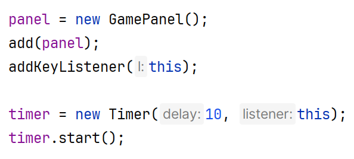
11. W actionPerformed dodać zmianę współrzędnych piłki, np.:
> 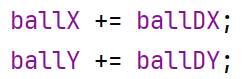
>
> 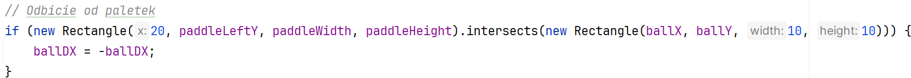
> krawędzi oraz piłki od paletek
>
> na końcu dodać :
>
> 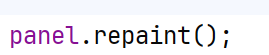
12. 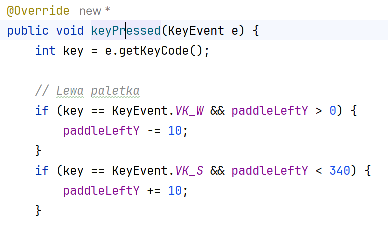
    Dodać obsługę dla klawiszy np.:
13. 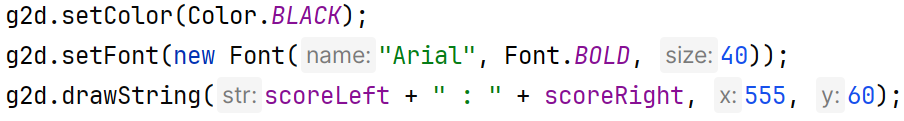
    Dodaj rysowanie paletek i wyniku.
14. Przeprowadź testy.
15. Dodaj płynność poruszania się paletki:
> [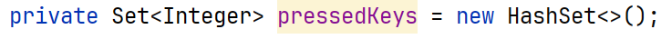
>
> 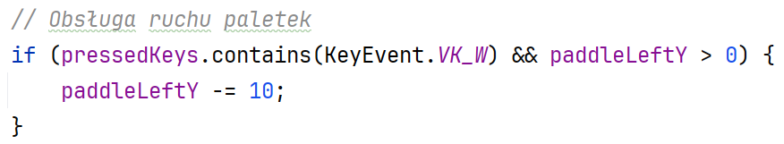
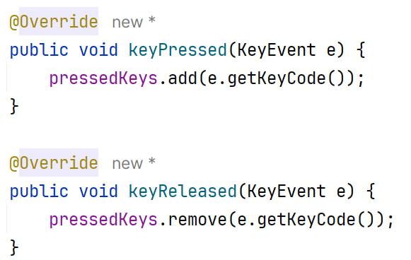
16. KONIEC.
