# Ćwiczenia 28-31 -- puzzle - MouseListener

💡Na koniec zajęć prześlij pliki źródłowe i z danymi, wynikami do zasobu w
teams.
Potrzebne obrazki ściągnij z teams.

1. Napisz puzzle z wykorzystaniem MouseListenera

1. Efekt końcowy:

   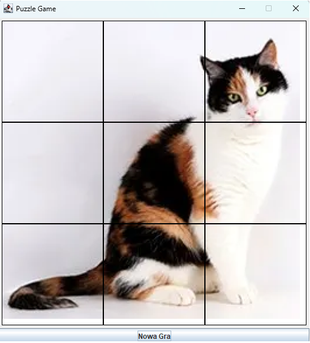

1. Dokumentacja:

   <https://docs.oracle.com/javase/8/docs/api/java/awt/event/MouseListener.html>

   <https://docs.oracle.com/javase/8/docs/api/java/awt/image/BufferedImage.html>

1. Utworzenie głównej klasy z konstruktorem.

   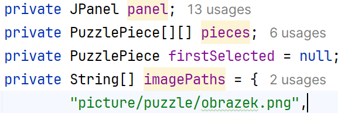

1. Dodanie panelu w układzie grid:

   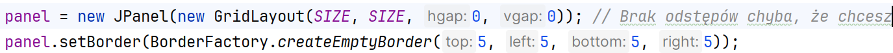

1. W konstruktorze wywołaj metodę, która podzieli obrazek, np.:

   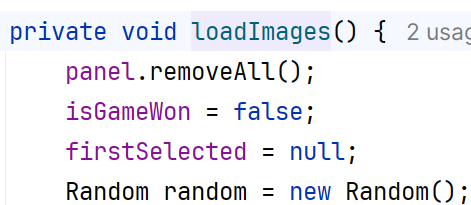

   Sprawdzenie rozmiarów dla obrazka:

   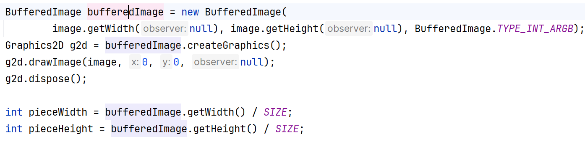

1. Skorzystaj z klasy BufferedImage lub DrawImage, metody getSubimage
    do podzielenia obrazka na 9 części:

   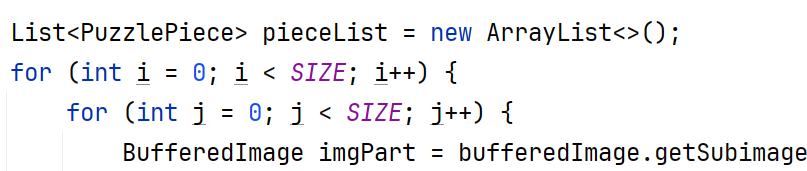

   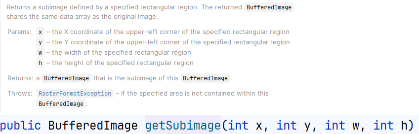

1. Utworzenie klasy wewnętrznej, rozszerza JLabel lub JButton:

   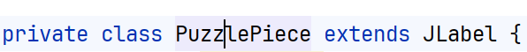

   Z konstruktorem:

   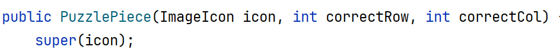

1. Utworzenie listenera w tej klasie:

   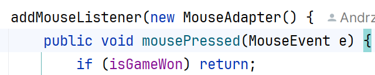

1. Dodaj metodę zamieniającą puzzle
   wewnątrz mousePressed(MouseEvent e), np.:

   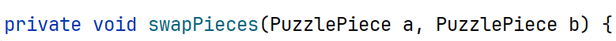

1. Na starcie losujemy pozycje elementów:

   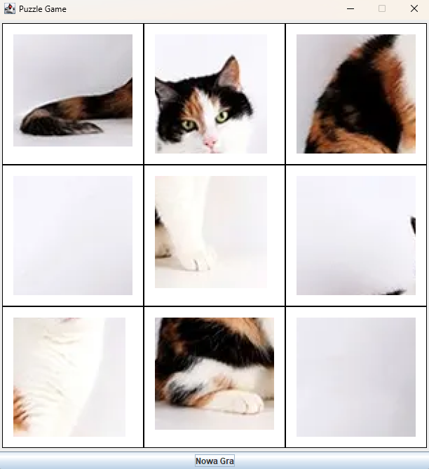

1. Przeprowadź testy.

1. Stwórz drugi projekt, w którym chcemy przeciągać puzzle.

1. Zaimplementuj listenery:

   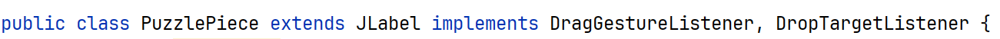

1. KONIEC.🔚
