Ćwiczenia 2 -- instrukcje pętli, tablice
Na koniec zajęć prześlij pliki źródłowe i z danymi, wynikami do zasobu w
teams.
1.  Utwórz nowy projekt w katalogu na dysku C:
2.  Użyte w ćwiczeniach biblioteki: ( zostaną zaimportowane
    automatycznie)
> 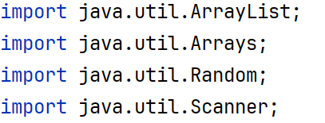
3.  **Zadanie 1**: podaj z klawiatury 5 liczb całkowitych nieujemnych,
    zapisz je w tablicy,
> 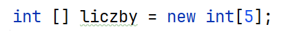
następnie wypisz na ekranie oddzielając tabulatorem.
4.  **Zadanie 2**: Zadeklaruj tablicę do przechowywania 15 znaków,
następnie podaj z klawiatury randomowe znaki minimum 30.

Zachowaj je w tablicy, a następnie wyświetl zawartość
tablicy na ekranie.
5.  **Zadanie 3**: Zapisz bezpośrednio w kodzie 7 liczb do tablicy na
    etapie deklaracji. Następnie posortuj te liczby i wypisz na ekranie.
> 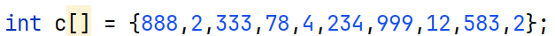
6.  **Zadanie 4**: Zapisz bezpośrednio w kodzie 6 liczb rzeczywistych
    podwójnej precyzji do tablicy dwuwymiarowej 2x3 na etapie
    deklaracji. Następnie wypisz je na ekranie w układzie 2x3.
> 
7.  **Zadanie 5**: Zadeklaruj tablicę dwuwymiarową 2x3 liczb
    rzeczywistych podwójnej precyzji,
> 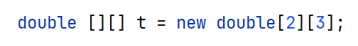
a następnie podaj 6 liczb rzeczywistych używając za separator kropkę.
Następnie wypisz je na ekranie w układzie 2x3.
8.  **Zadanie 6**: Zadeklaruj tablicę dynamiczną (listę) do
    przechowywania liczb całkowitych.
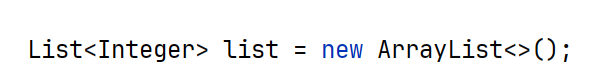
Dodaj liczbę 5, następnie na pierwszej
pozycji dodaj 7. Wypisz listę.
Następnie dodaj liczbę 6 na pozycji 0, 1 lub 2. Wypisz listę.
9.  **Zadanie 7**: Zadeklaruj tablicę do przechowania minimum 5 nazw
    owoców. Trzy elementy podaj bezpośrednio w kodzie, a dwa z
    klawiatury.
10. **Zadanie 8**: Realizacja menu programu.
11. Przykładowa realizacja zadania 1: podaj z klawiatury 5 liczb
    całkowitych nieujemnych, zapisz je w tablicy,

1.  Przykładowa realizacja zadania 2: Zadeklaruj tablicę do
    przechowywania 15 znaków,
następnie podaj z klawiatury randomowe znaki minimum 30.
Zachowaj je w tablicy, a następnie wyświetl zawartość tablicy na
ekranie.
> 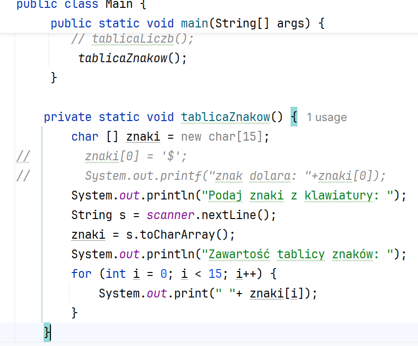
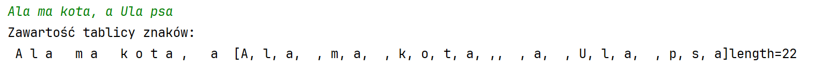
2.  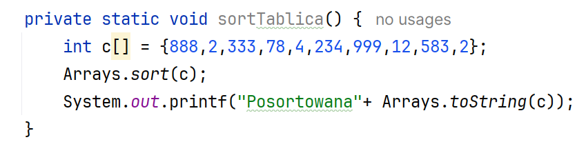
    Przykładowa realizacja zadania 3:
> Wynik działa:
>
> 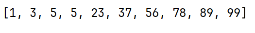
3.  Przykładowa realizacja zadania 4: Zapisz bezpośrednio w kodzie 6
    liczb rzeczywistych do tablicy dwuwymiarowej 2x3 na etapie
    deklaracji. Następnie wypisz je na ekranie w układzie 2x3.
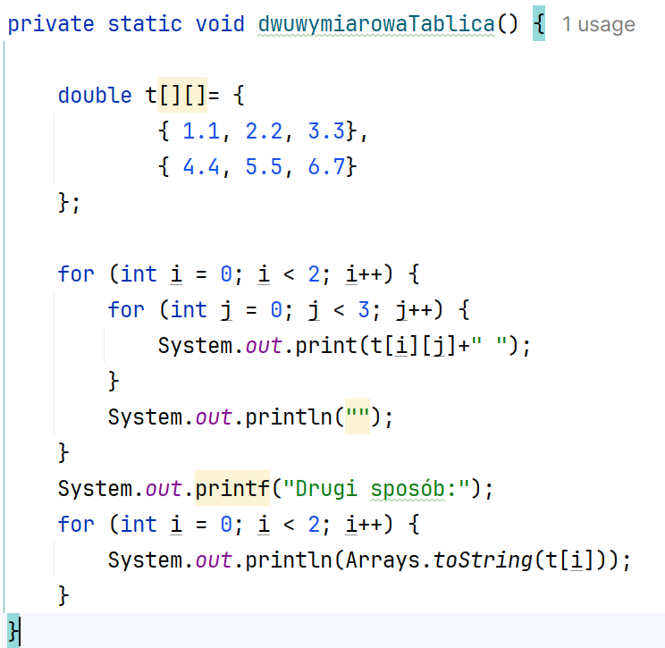
>
4.  Przykładowa realizacja zadania 5:
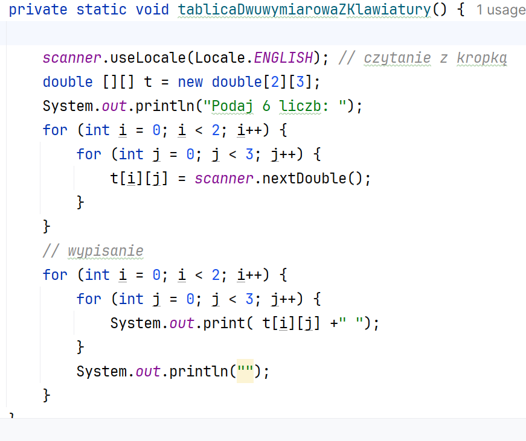
5.  Przykładowa realizacja **zadania 6**: Zadeklaruj tablicę dynamiczną
    (listę) do przechowywania liczb całkowitych. Dodaj liczbę 5 i 7 na
    pierwszej pozycji. Wylosuj 50 elementów. Podaj rozmiar listy.
> 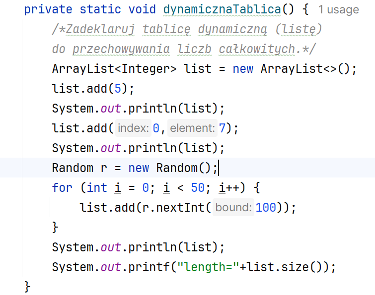
6.  Przykładowa realizacja zadania 7: Zadeklaruj tablicę do przechowania
    minimum 5 nazw owoców.
> Trzy elementy podaj bezpośrednio w kodzie, a dwa z klawiatury. Wypisz
> listę na ekran.
>
> 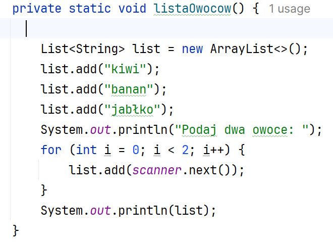
>
> Efekt działania:
>
> 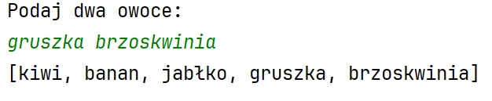
7.  Realizacja menu programu:
> 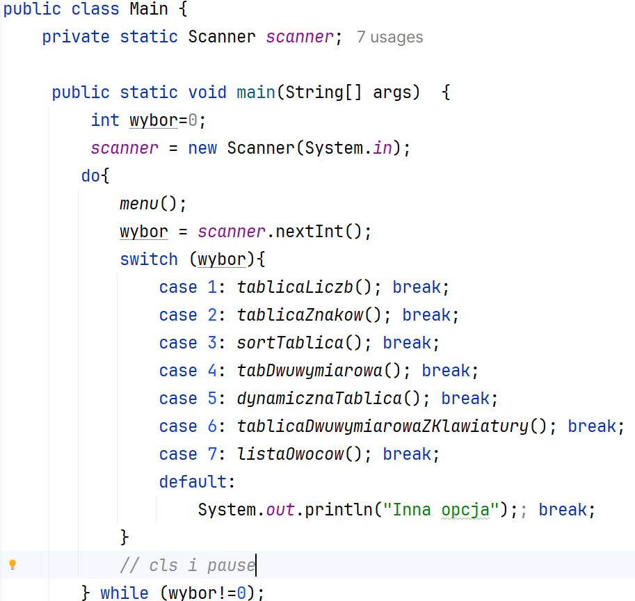
>
> 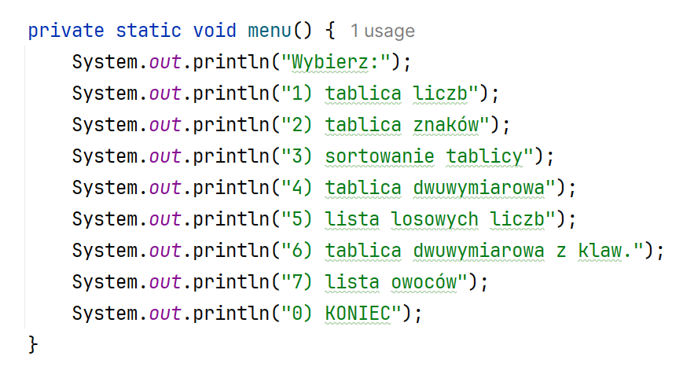
8.  KONIEC.
