# Ćwiczenia 2 -- instrukcje pętli, tablice

Na koniec zajęć prześlij pliki źródłowe i z danymi, wynikami do zasobu w
teams.

1. Utwórz nowy projekt w katalogu na dysku C:

1. Użyte w ćwiczeniach biblioteki: ( zostaną zaimportowane
    automatycznie)

   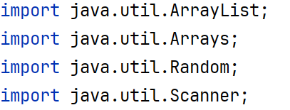

1. **Zadanie 1**: podaj z klawiatury 5 liczb całkowitych nieujemnych,
    zapisz je w tablicy,

   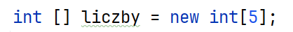

   następnie wypisz na ekranie oddzielając tabulatorem.

1. **Zadanie 2**: Zadeklaruj tablicę do przechowywania 15 znaków,
   następnie podaj z klawiatury randomowe znaki minimum 30.

   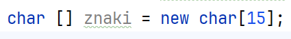

   Zachowaj je w tablicy, a następnie wyświetl zawartość
   tablicy na ekranie.

1. **Zadanie 3**: Zapisz bezpośrednio w kodzie 7 liczb do tablicy na
    etapie deklaracji. Następnie posortuj te liczby i wypisz na ekranie.

   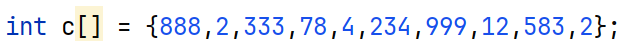

1. **Zadanie 4**: Zapisz bezpośrednio w kodzie 6 liczb rzeczywistych
   podwójnej precyzji do tablicy dwuwymiarowej 2x3 na etapie
   deklaracji.
   Następnie wypisz je na ekranie w układzie 2x3.

   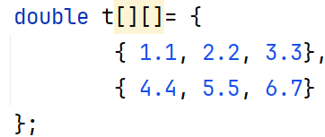

1. **Zadanie 5**: Zadeklaruj tablicę dwuwymiarową 2x3 liczb
    rzeczywistych podwójnej precyzji,

   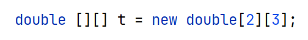

   a następnie podaj 6 liczb rzeczywistych używając za separator kropkę.

   Następnie wypisz je na ekranie w układzie 2x3.

1. **Zadanie 6**: Zadeklaruj tablicę dynamiczną (listę) do
    przechowywania liczb całkowitych.

   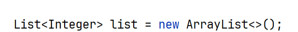

   Dodaj liczbę 5, następnie na pierwszej pozycji dodaj 7.

   Wypisz listę.

   Następnie dodaj liczbę 6 na pozycji 0, 1 lub 2. Wypisz listę.

1. **Zadanie 7**: Zadeklaruj tablicę do przechowania minimum 5 nazw
    owoców. Trzy elementy podaj bezpośrednio w kodzie, a dwa z
    klawiatury.

1. **Zadanie 8**: Realizacja menu programu.

1. Przykładowa realizacja zadania 1: podaj z klawiatury 5 liczb
   całkowitych nieujemnych, zapisz je w tablicy,

   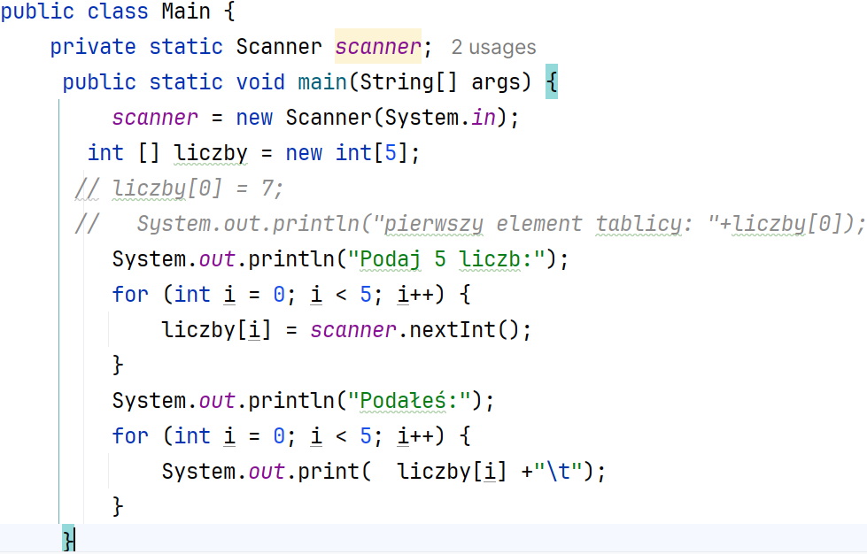

1. Przykładowa realizacja zadania 2: Zadeklaruj tablicę do
   przechowywania 15 znaków,
   następnie podaj z klawiatury randomowe znaki minimum 30.

   Zachowaj je w tablicy, a następnie wyświetl zawartość tablicy na ekranie.

   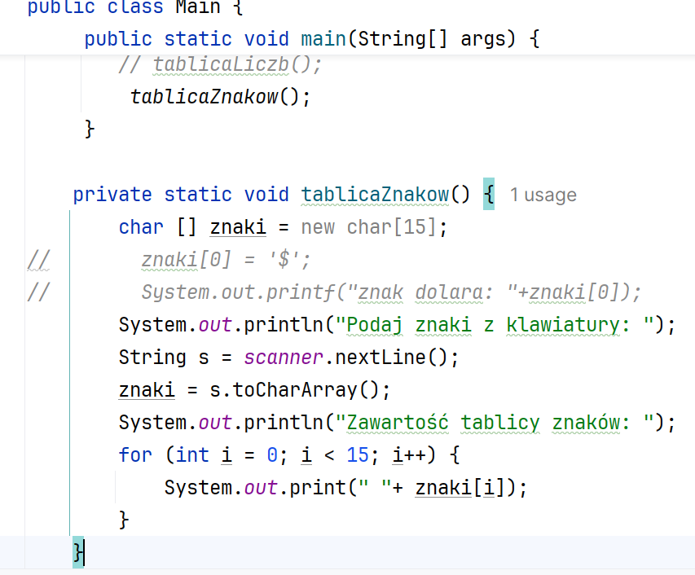

   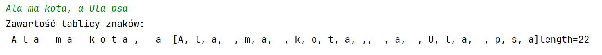

1. Przykładowa realizacja zadania 3:

   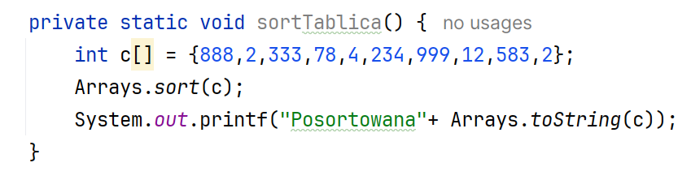

   Wynik działa:

   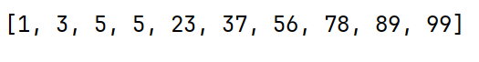

1. Przykładowa realizacja zadania 4: Zapisz bezpośrednio w kodzie 6
   liczb rzeczywistych do tablicy dwuwymiarowej 2x3 na etapie
   deklaracji.
   Następnie wypisz je na ekranie w układzie 2x3.

   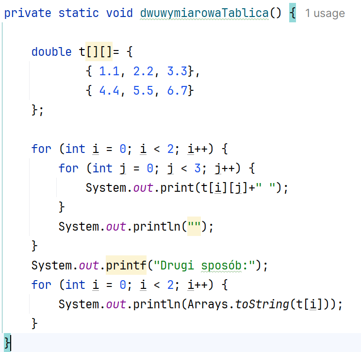

1. Przykładowa realizacja zadania 5:

   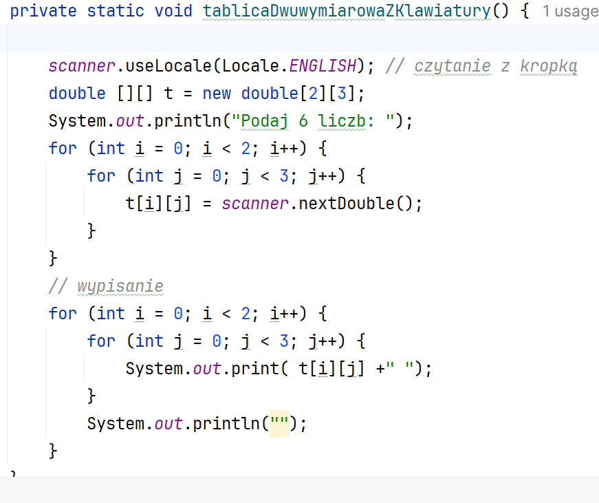

1. Przykładowa realizacja **zadania 6**: Zadeklaruj tablicę dynamiczną
   (listę) do przechowywania liczb całkowitych.
   Dodaj liczbę 5 i 7 na pierwszej pozycji.
   Wylosuj 50 elementów.
   Podaj rozmiar listy.

   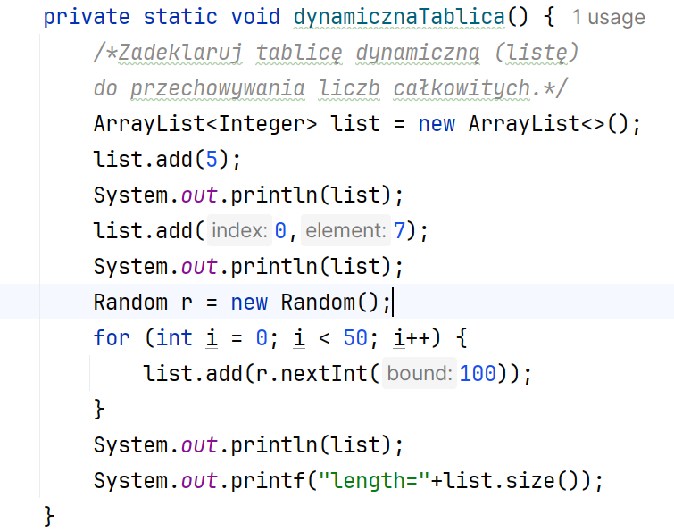

1. Przykładowa realizacja zadania 7: Zadeklaruj tablicę do przechowania
    minimum 5 nazw owoców.

   Trzy elementy podaj bezpośrednio w kodzie, a dwa z klawiatury. Wypisz
   listę na ekran.

   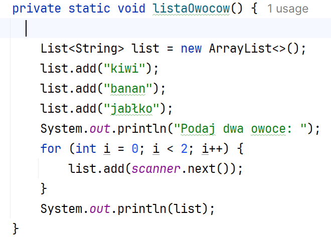

   Efekt działania:

   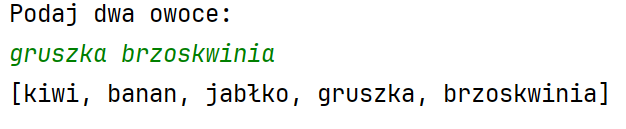

1. Realizacja menu programu:

   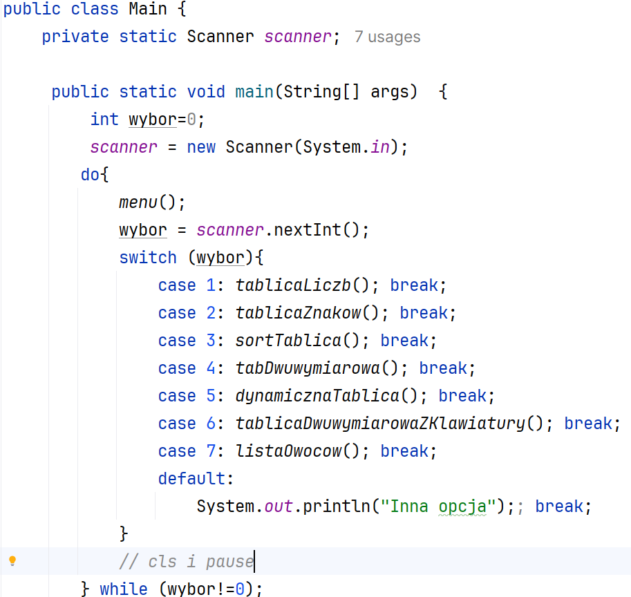

   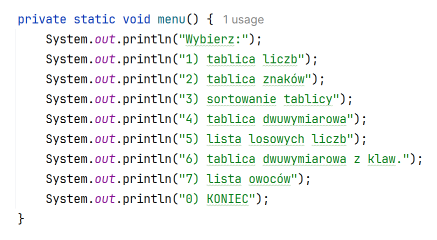

1. KONIEC. 🔚
