Ćwiczenia 32-37 -- JTable - TableModelListener
Na koniec zajęć prześlij pliki źródłowe i z danymi, wynikami do zasobu w
teams.
Potrzebne obrazki ściągnij z teams.
1.  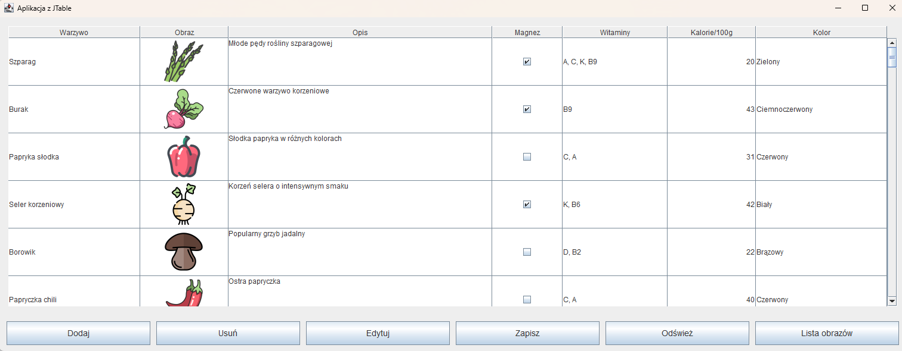
    Napisz aplikację:
2.  Dokumentacja:
> <https://docs.oracle.com/javase/8/docs/api/index.html?javax/swing/event/TableModelListener.html>
>
> <https://docs.oracle.com/javase/8/docs/api/java/awt/event/ComponentListener.html>
>
> <https://docs.oracle.com/javase/tutorial/uiswing/events/componentlistener.html>
>
> <https://docs.oracle.com/javase/8/docs/api/javax/swing/JTable.html>
>
> <https://docs.oracle.com/javase/tutorial/uiswing/components/table.html>
>
> <https://regex101.com/>
3.  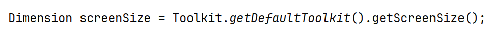
    Utworzenie głównej klasy z
    konstruktorem. Okno responsywne, początkowo 60% szerokości ekranu i
    95% wysokości. Ustaw minimalne dopuszczalne rozmiary okna na
    800x600.
> 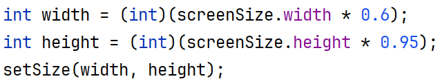
4.  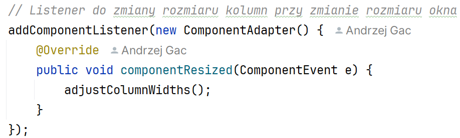
    Dodaj
5.  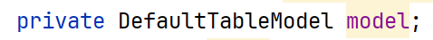
    Dodaj model i ustaw identyfikatory dla
    kolumn:
Napisz : model = new DefaultTableModel()
W środkuCtrl+o i zacznij pisać metodę getColumnClass
> 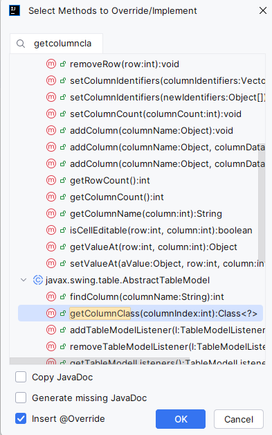
>
> Dla return wpisz:
> 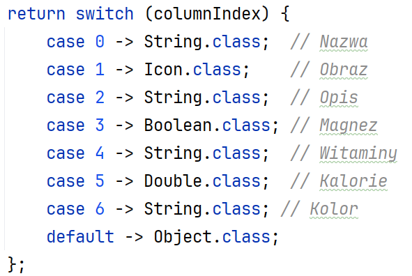
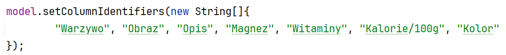
6.  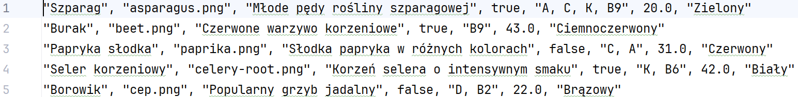
    Utwórz metodę czytającą dane z pliku
    vegetables.txt i ją wywołaj. Format danych:
7.  Ustaw dla tabeli wysokość wiersza na 80 oraz domyślne auto
    sortowanie dla kolumn.
> 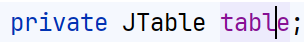
8.  Dodaj listener dla modelu, który reaguje na dodawanie usuwanie i
    edytowanie.
> 
9.  Dodanie panelu w układzie BorderLayout
10. 
    Ustaw renderery i edytory
11. 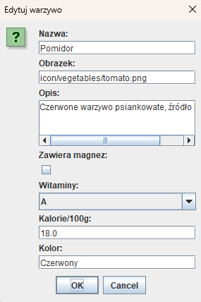
    Dodaj obsługę dla przycisku edytuj
> 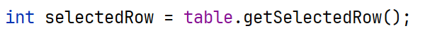
>
> 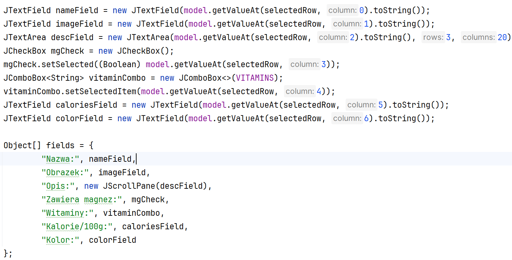
>
> 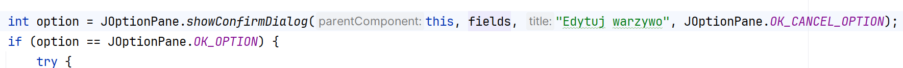
12. 
    Dodaj obsługę pozostałych przycisków.
13. Dla listy obrazów wypisz wszystkie posiadane, ikonki
> 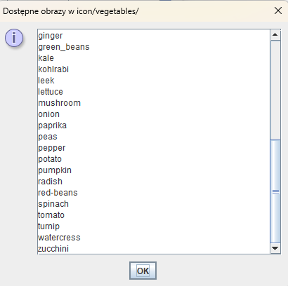
14. Wypisuj informacje o dodaniu, edycji i usunięciu:
> 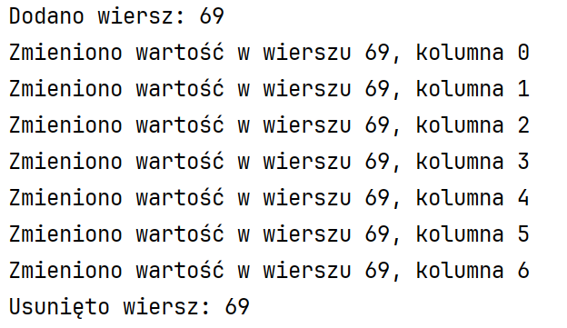
>
> 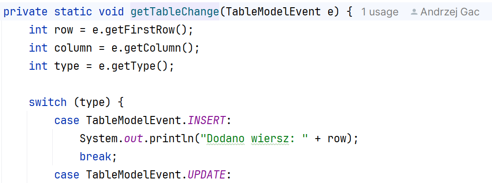
15. KONIEC.
