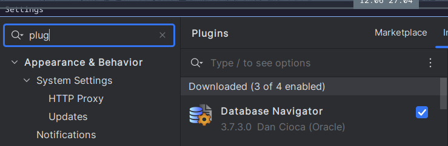
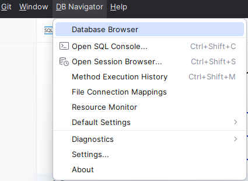
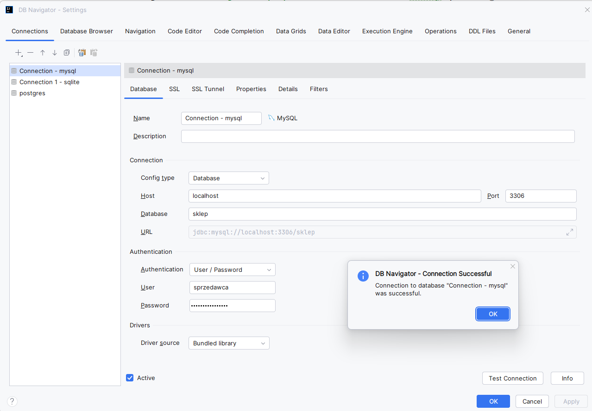
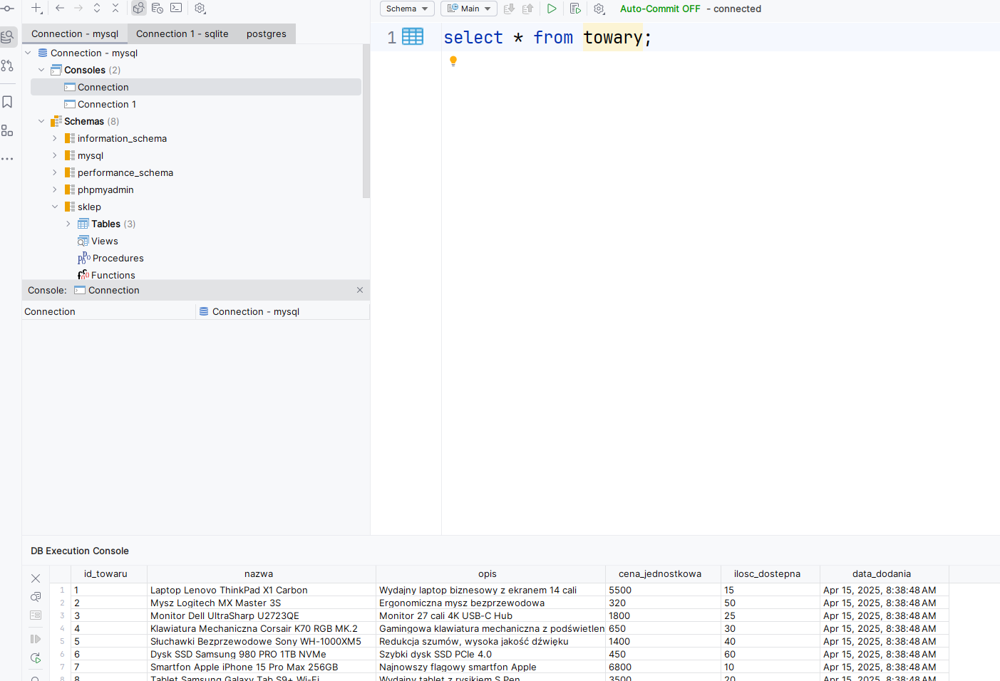
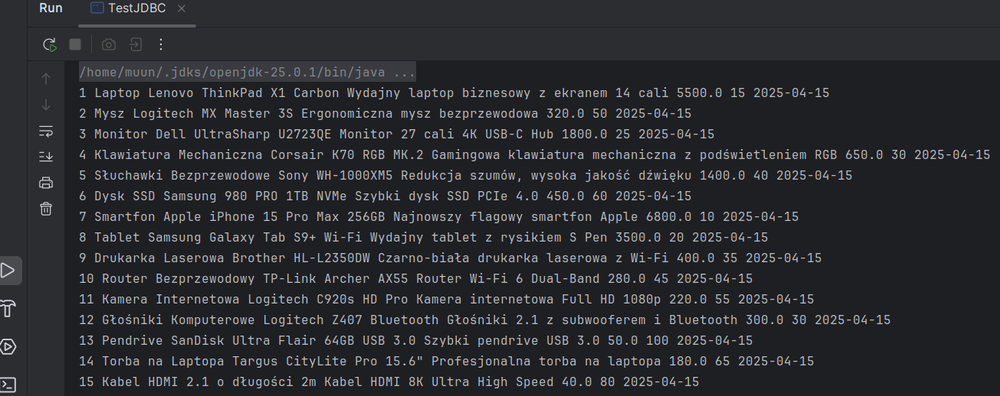

# Ćwiczenia 38-43 -- JTable -- baza danych

💡Na koniec zajęć prześlij pliki źródłowe i z danymi, wynikami do zasobu w
teams.
Potrzebne obrazki ściągnij z teams.

1. Napisz aplikację współpracującą z bazą danych.

1. Dokumentacja:

   <https://docs.oracle.com/javase/8/docs/api/index.html?javax/swing/event/TableModelListener.html>

   <https://docs.oracle.com/javase/8/docs/api/java/awt/event/ComponentListener.html>

   <https://docs.oracle.com/javase/tutorial/uiswing/events/componentlistener.html>

   <https://docs.oracle.com/javase/8/docs/api/javax/swing/JTable.html>

   <https://docs.oracle.com/javase/tutorial/uiswing/components/table.html>

   <https://regex101.com/>

1. Zaimportuj dane i struktury

   ```sql
   CREATE TABLE IF NOT EXISTS towary (
      id_towaru INT PRIMARY KEY AUTO_INCREMENT,
      nazwa VARCHAR(255) NOT NULL,
      opis TEXT,
      cena_jednostkowa DECIMAL(10, 2) NOT NULL,
      ilosc_dostepna INT NOT NULL DEFAULT 0,
      data_dodania TIMESTAMP DEFAULT CURRENT_TIMESTAMP
   );
   ```

   Dane do tabeli towary:

   ```sql
      INSERT INTO towary (nazwa, opis, cena_jednostkowa, ilosc_dostepna) VALUES ('Laptop Lenovo ThinkPad X1 Carbon', 'Wydajny laptop biznesowy z ekranem 14 cali', 5500.00, 15);
    INSERT INTO towary (nazwa, opis, cena_jednostkowa, ilosc_dostepna) VALUES ('Mysz Logitech MX Master 3S', 'Ergonomiczna mysz bezprzewodowa', 320.00, 50);
    INSERT INTO towary (nazwa, opis, cena_jednostkowa, ilosc_dostepna) VALUES ('Monitor Dell UltraSharp U2723QE', 'Monitor 27 cali 4K USB-C Hub', 1800.00, 25);
    INSERT INTO towary (nazwa, opis, cena_jednostkowa, ilosc_dostepna) VALUES ('Klawiatura Mechaniczna Corsair K70 RGB MK.2', 'Gamingowa klawiatura mechaniczna z podświetleniem RGB', 650.00, 30);
    INSERT INTO towary (nazwa, opis, cena_jednostkowa, ilosc_dostepna) VALUES ('Słuchawki Bezprzewodowe Sony WH-1000XM5', 'Redukcja szumów, wysoka jakość dźwięku', 1400.00, 40);
    INSERT INTO towary (nazwa, opis, cena_jednostkowa, ilosc_dostepna) VALUES ('Dysk SSD Samsung 980 PRO 1TB NVMe', 'Szybki dysk SSD PCIe 4.0', 450.00, 60);
    INSERT INTO towary (nazwa, opis, cena_jednostkowa, ilosc_dostepna) VALUES ('Smartfon Apple iPhone 15 Pro Max 256GB', 'Najnowszy flagowy smartfon Apple', 6800.00, 10);
    INSERT INTO towary (nazwa, opis, cena_jednostkowa, ilosc_dostepna) VALUES ('Tablet Samsung Galaxy Tab S9+ Wi-Fi', 'Wydajny tablet z rysikiem S Pen', 3500.00, 20);
    INSERT INTO towary (nazwa, opis, cena_jednostkowa, ilosc_dostepna) VALUES ('Drukarka Laserowa Brother HL-L2350DW', 'Czarno-biała drukarka laserowa z Wi-Fi', 400.00, 35);
    INSERT INTO towary (nazwa, opis, cena_jednostkowa, ilosc_dostepna) VALUES ('Router Bezprzewodowy TP-Link Archer AX55', 'Router Wi-Fi 6 Dual-Band', 280.00, 45);
    INSERT INTO towary (nazwa, opis, cena_jednostkowa, ilosc_dostepna) VALUES ('Kamera Internetowa Logitech C920s HD Pro', 'Kamera internetowa Full HD 1080p', 220.00, 55);
    INSERT INTO towary (nazwa, opis, cena_jednostkowa, ilosc_dostepna) VALUES ('Głośniki Komputerowe Logitech Z407 Bluetooth', 'Głośniki 2.1 z subwooferem i Bluetooth', 300.00, 30);
    INSERT INTO towary (nazwa, opis, cena_jednostkowa, ilosc_dostepna) VALUES ('Pendrive SanDisk Ultra Flair 64GB USB 3.0', 'Szybki pendrive USB 3.0', 50.00, 100);
    INSERT INTO towary (nazwa, opis, cena_jednostkowa, ilosc_dostepna) VALUES ('Torba na Laptopa Targus CityLite Pro 15.6"', 'Profesjonalna torba na laptopa', 180.00, 65);
    INSERT INTO towary (nazwa, opis, cena_jednostkowa, ilosc_dostepna) VALUES ('Kabel HDMI 2.1 o długości 2m', 'Kabel HDMI 8K Ultra High Speed', 40.00, 80);

   ```

1. Sprawdzić w xampp czy baza powstała i zawiera tabele z danymi.

1. Załóż konto w xampp z dostępem do bazy sklep o nazwie twoje imię.

   ```sql
   CREATE USER 'sprzedawca'@'localhost' IDENTIFIED BY '********';
   GRANT ALL PRIVILEGES ON `sklep`.* TO 'sprzedawca'@'localhost';
   ```

1. Włącz plugin DB Navigator.

   

1. Przejdź do Database Browser

   

1. Wykonaj test połączenia, nazwij
   połączenie swoim imieniem np.: mysql-paweł

   

1. Wykonaj zapytanie do bazy :

   ```sql
   SELECT * FROM towary;
   ```

   

1. Wykonaj przykładowy kod testujący połączenie

   ```java
   try (Connection conn = DriverManager.getConnection(DB_URL, USER, PASS);
   ```

1. Sprawdź wynik zapytania dla tabeli towary:

   

1. Odczytaj dane i wyświetl w jtable

   

1. Wynik wykonania:

   ```text
    1 Laptop Lenovo ThinkPad X1 Carbon Wydajny laptop biznesowy z ekranem 14 cali 5500.0 15 2025-04-15
    2 Mysz Logitech MX Master 3S Ergonomiczna mysz bezprzewodowa 320.0 50 2025-04-15
    3 Monitor Dell UltraSharp U2723QE Monitor 27 cali 4K USB-C Hub 1800.0 25 2025-04-15
    4 Klawiatura Mechaniczna Corsair K70 RGB MK.2 Gamingowa klawiatura mechaniczna z podświetleniem RGB 650.0 30 2025-04-15
    5 Słuchawki Bezprzewodowe Sony WH-1000XM5 Redukcja szumów, wysoka jakość dźwięku 1400.0 40 2025-04-15
    6 Dysk SSD Samsung 980 PRO 1TB NVMe Szybki dysk SSD PCIe 4.0 450.0 60 2025-04-15
    7 Smartfon Apple iPhone 15 Pro Max 256GB Najnowszy flagowy smartfon Apple 6800.0 10 2025-04-15
    8 Tablet Samsung Galaxy Tab S9+ Wi-Fi Wydajny tablet z rysikiem S Pen 3500.0 20 2025-04-15
    9 Drukarka Laserowa Brother HL-L2350DW Czarno-biała drukarka laserowa z Wi-Fi 400.0 35 2025-04-15
    10 Router Bezprzewodowy TP-Link Archer AX55 Router Wi-Fi 6 Dual-Band 280.0 45 2025-04-15
    11 Kamera Internetowa Logitech C920s HD Pro Kamera internetowa Full HD 1080p 220.0 55 2025-04-15
    12 Głośniki Komputerowe Logitech Z407 Bluetooth Głośniki 2.1 z subwooferem i Bluetooth 300.0 30 2025-04-15
    13 Pendrive SanDisk Ultra Flair 64GB USB 3.0 Szybki pendrive USB 3.0 50.0 100 2025-04-15
    14 Torba na Laptopa Targus CityLite Pro 15.6" Profesjonalna torba na laptopa 180.0 65 2025-04-15
    15 Kabel HDMI 2.1 o długości 2m Kabel HDMI 8K Ultra High Speed 40.0 80 2025-04-15i
   ```

1. Dodaj testy i klasę testową:

   ```java
    import org.junit.After;
    import org.junit.Before;
    import org.junit.Test;
    import pad.sql.simple.TestJDBC;

    import java.sql.SQLException;
    import java.util.List;

    import static org.junit.Assert.assertNotNull;
    import static org.junit.Assert.assertTrue;

   @Test
    public void testNotNullList() throws SQLException {

        assertNotNull("Lista nie powinna być null", towary);
    }
   ```

1. KONIEC.🔚
