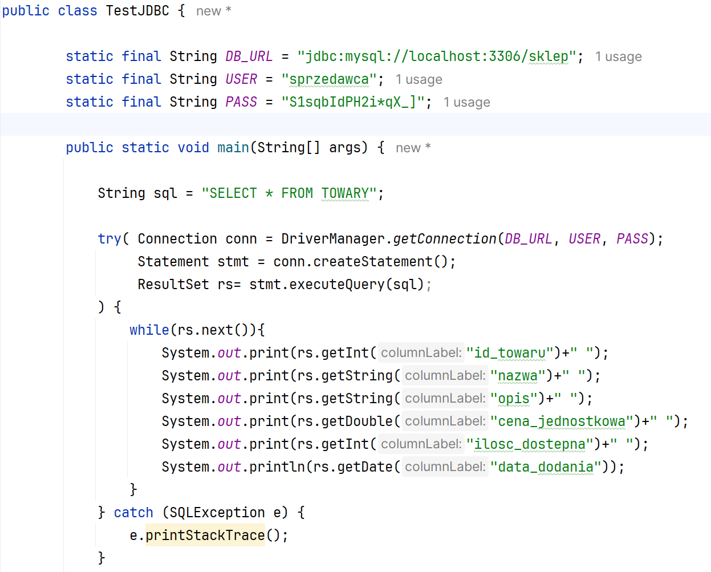

Ćwiczenia 38-43 -- JTable -- baza danych
Na koniec zajęć prześlij pliki źródłowe i z danymi, wynikami do zasobu w
teams.
Potrzebne obrazki ściągnij z teams.
1.  Napisz aplikację:
2.  Dokumentacja:
> <https://docs.oracle.com/javase/8/docs/api/index.html?javax/swing/event/TableModelListener.html>
>
> <https://docs.oracle.com/javase/8/docs/api/java/awt/event/ComponentListener.html>
>
> <https://docs.oracle.com/javase/tutorial/uiswing/events/componentlistener.html>
>
> <https://docs.oracle.com/javase/8/docs/api/javax/swing/JTable.html>
>
> <https://docs.oracle.com/javase/tutorial/uiswing/components/table.html>
>
> <https://regex101.com/>
3.  Zaimportuj dane i struktury z pliku sklep.sql
4.  Sprawdzić w xampp czy baza powstała i zawiera tabele z danymi.
5.  Załóż konto w xampp z dostępem do bazy sklep o nazwie twoje imię.
6.  Włącz plugin DB Navigator.
7.  Przejdź do Database Browser
> .
> 
8.  
    Wykonaj test połączenia, nazwij
    połączenie swoim imieniem np.: mysql-paweł
9.  Wykonaj zapytanie do bazy : SELECT \* FROM towaty;
> 
10. Wykonaj przykładowy kod testujący połączenie
> 
11. Odczytaj dane i wyświetl w jtable
> 
12. Dodaj ...
13. KONIEC.
