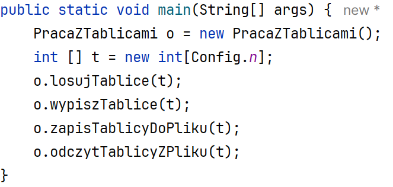
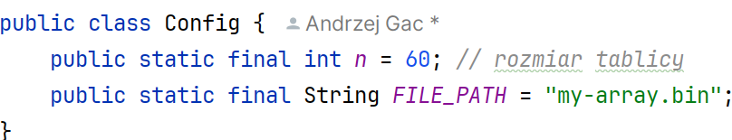
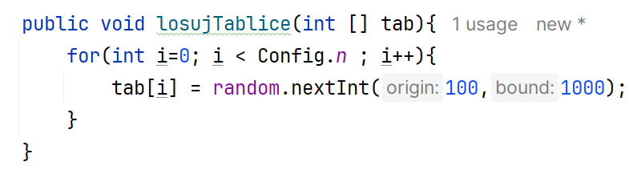
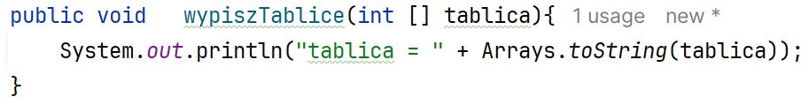
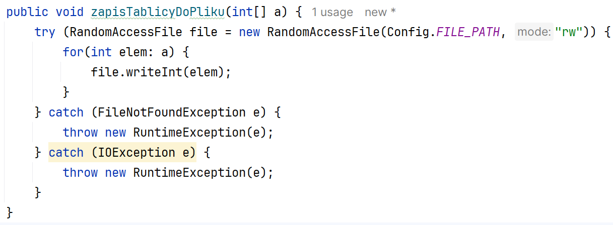
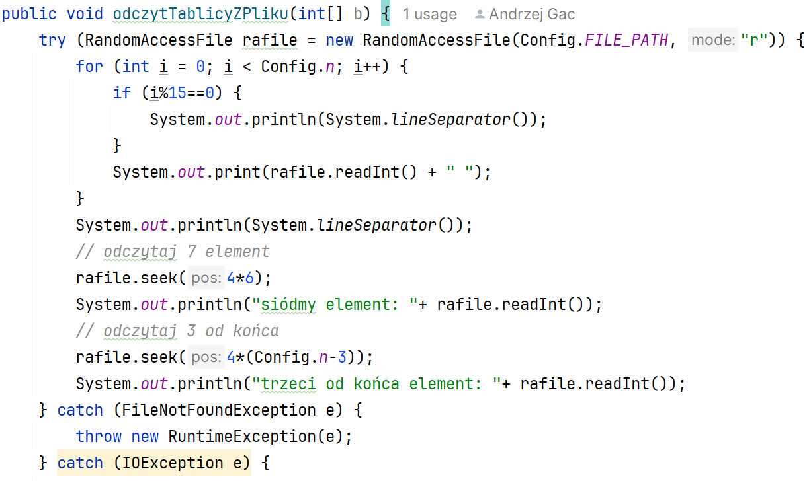

Ćwiczenia 3 -- praca z plikami RandomAccessFile, tablice
Na koniec zajęć prześlij pliki źródłowe i z danymi, wynikami do zasobu w
teams.
1.  Utwórz nowy projekt w katalogu na dysku C:
2.  Użyte w ćwiczeniach biblioteki: ( zostaną zaimportowane
    automatycznie)
3.  Zadanie 1: Dodaj nową klasę o nazwie PracaZTablicami, w której
    utworzysz 4 metody:
> do wyświetlenia zawartości tablicy,
>
> losowania zawartości tablicy,
>
> zapisania tablicy do pliku,
>
> odczytania tablicy z pliku.
4.  Przykładowy kod wywołujący te metody:
> 
5.  Zadanie 2: Utwórz klasę o nazwie Config, w której ustawisz rozmiar
    tablicy oraz nazwę ze ścieżką

6.  Zadanie 5: Utwórz metodę losującą zawartość tablicy.
> 
7.  
    Zadanie 6: Utwórz metodę wypisującą
    zawartość tablicy na ekranie.
8.  
    Zadanie 6: Utwórz metodę zapisującą
    elementy tablicy do pliku.
9.  Zadanie 7: Utwórz metodę odczytującą liczby z pliku.

10. Wykorzystaj kod do realizacji zadania domowego.
11. KONIEC.
