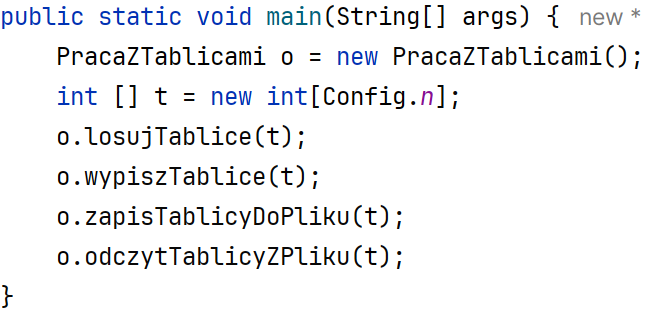
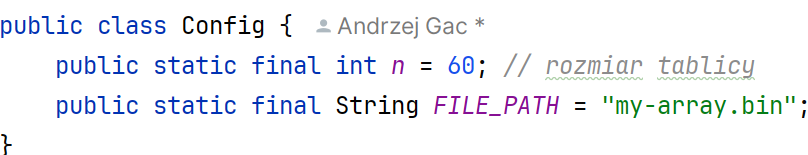
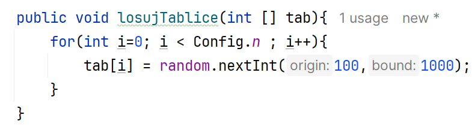
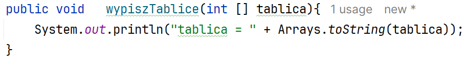
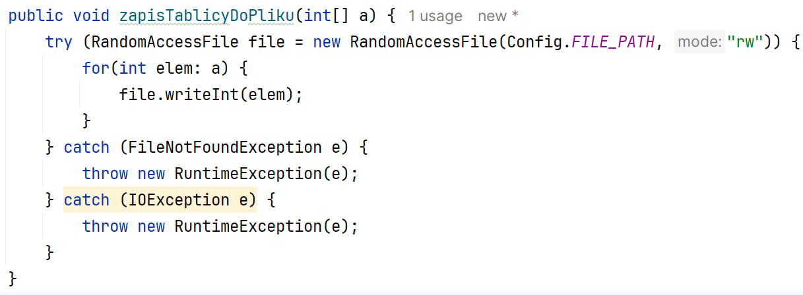
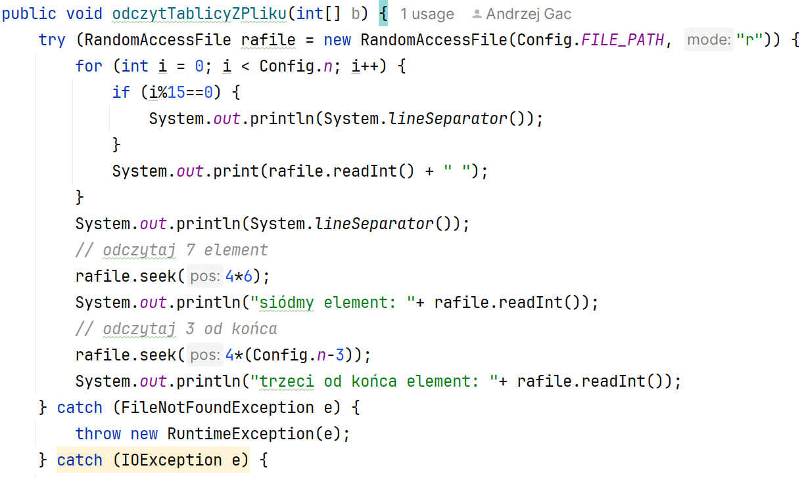

# Ćwiczenia 3 -- praca z plikami RandomAccessFile, tablice

Na koniec zajęć prześlij pliki źródłowe i z danymi, wynikami do zasobu w
teams.

1. Utwórz nowy projekt w katalogu na dysku C:

1. Użyte w ćwiczeniach biblioteki: ( zostaną zaimportowane
    automatycznie)

1. Zadanie 1: Dodaj nową klasę o nazwie PracaZTablicami, w której
    utworzysz 4 metody:

   do wyświetlenia zawartości tablicy,

   losowania zawartości tablicy,

   zapisania tablicy do pliku,

   odczytania tablicy z pliku.

1. Przykładowy kod wywołujący te metody:

   

1. Zadanie 2: Utwórz klasę o nazwie Config, w której ustawisz rozmiar
    tablicy oraz nazwę ze ścieżką

   

1. Zadanie 5: Utwórz metodę losującą zawartość tablicy.

   

1. Zadanie 6: Utwórz metodę wypisującą
    zawartość tablicy na ekranie.

   

1. Zadanie 6: Utwórz metodę zapisującą
    elementy tablicy do pliku.

   

   Dodaj kod:

   ```java
        File file = new File(Config.PATH);
        System.out.println("Rozmiar pliku:" + file.length());
        System.out.println("Nazwa pliku:" + file.getName());
        System.out.println("Ścieżka pliku:" + file.getPath());
        System.out.println("Pełna ścieżka pliku:" + file.getAbsolutePath());

   ```

1. Zadanie 7: Utwórz metodę odczytującą liczby z pliku.

   

1. Dodaj nową klasę dla tablic dwuwymiarowych oraz zadeklaruj w Main.java tablicę:

   ```java
   double [][] table = new double[Config.IlOSC_WIERSZY][Config.ILOSC_KOLUMN];

   TabliceLiczbRzeczywistych o2 = new TabliceLiczbRzeczywistych();
   ```

1. Wykorzystaj kod do realizacji zadania domowego.

1. KONIEC.
