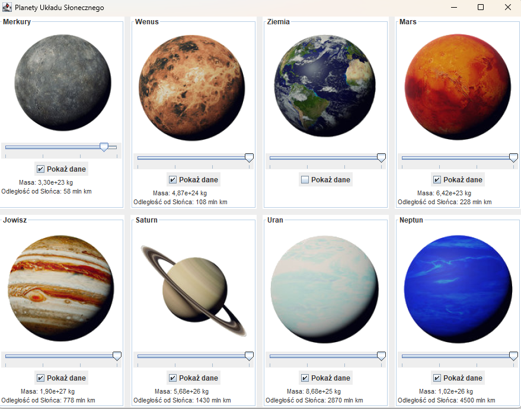
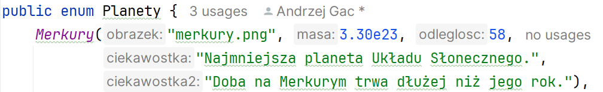
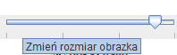
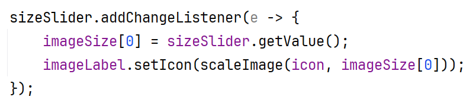
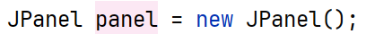
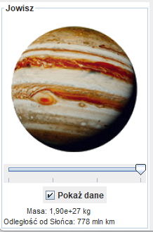
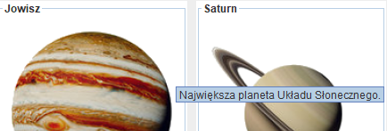
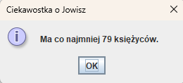
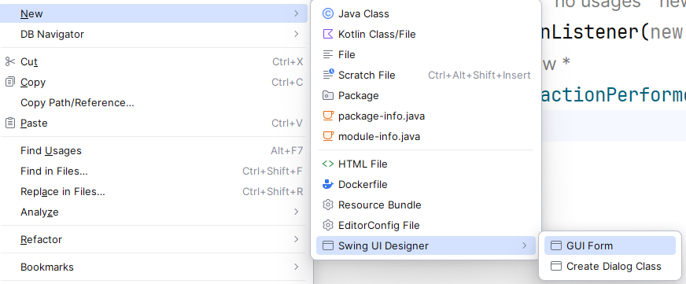
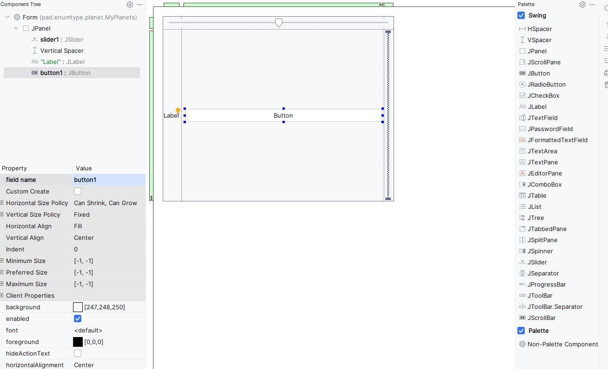

# Ćwiczenia 44-45 -- Enum + GridLayout + JSlider

💡Na koniec zajęć prześlij pliki źródłowe i z danymi, wynikami do zasobu w
teams.

Potrzebne obrazki ściągnij z teams.

1. Napisz aplikację, który wyświetli nazwy planet z typu wyliczeniowego
    oraz obrazki planet. Użytkownik klikając w checkbox ukrywa/odkrywa
    obrazek. Zastosuj GridLayout. Zastosuj suwak JSlider do
    powiększenia/zmniejszenia każdego obrazka planety.
1. Efekt końcowy:

   

1. Dokumentacja:

   <https://docs.oracle.com/javase/tutorial/uiswing/layout/grid.html>

   <https://docs.oracle.com/javase/tutorial/java/javaOO/enum.html>

   <https://docs.oracle.com/en/java/javase/17/docs/api/java.desktop/javax/swing/JCheckBox.html>

   <https://docs.oracle.com/javase/tutorial/uiswing/components/button.html>

   <https://docs.oracle.com/javase/tutorial/uiswing/components/slider.html>

1. Dodaj obrazki planet.

1. Utwórz klasę reprezentującą planety:

   

1. Wypisz na konsolę nazwy planet z typu wyliczeniowego.

1. Dla suwaka wyświetl również podpowiedź:

   

1. Dla suwaka dodaj listener, naprzykład

   

1. Zastosuj Border do każdej planety, widok poniżej dla

    

   

1. Dodaj podpowiedź:

   

1. Kliknięcie w obrazek wyświetla dodatkową ciekawostkę:

   

1. Zaprojektuj drugi raz aplikację z użyciem metody przeciągnij i
    upuść:

   

1. Widok projektowy:

   

1. Zaprogramuj zapisanie danych do JSON po kliknięciu w checkbox.

1. KONIEC.🔚
