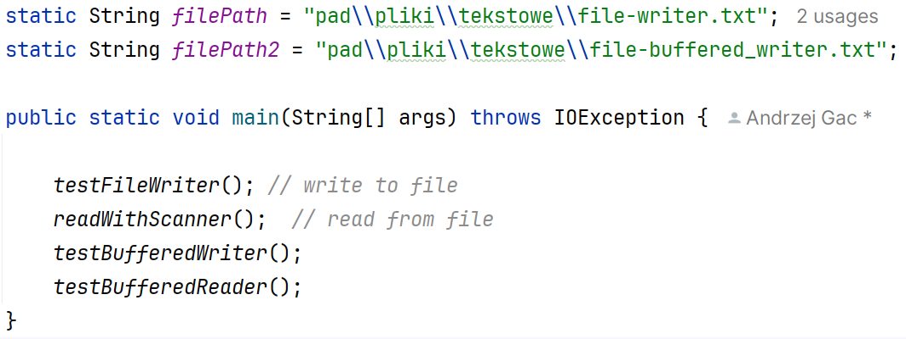
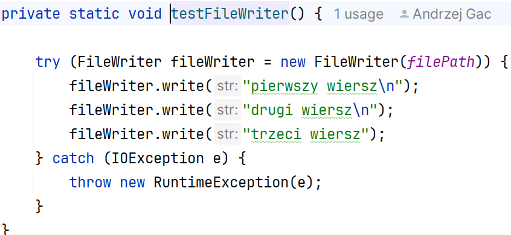
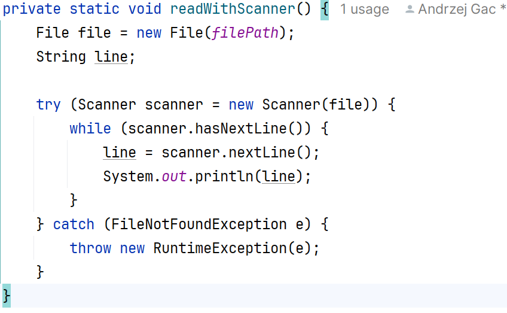
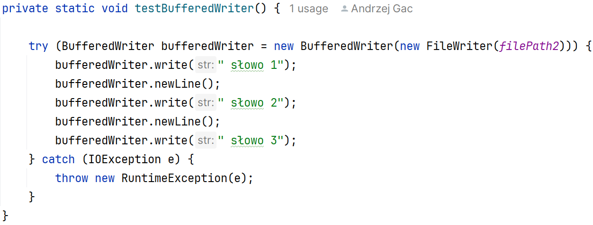
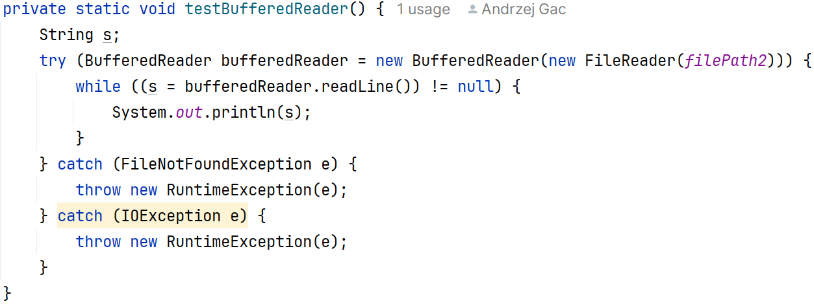
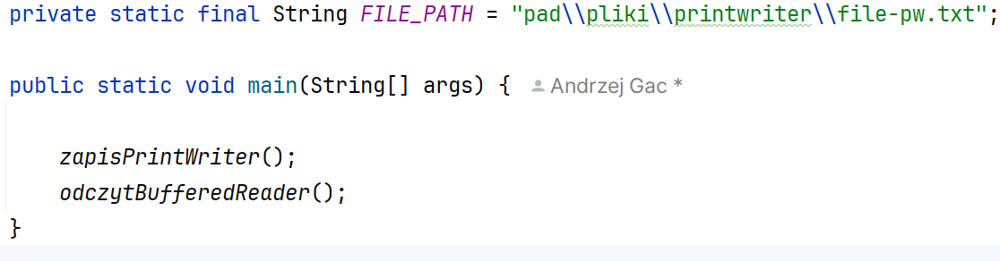
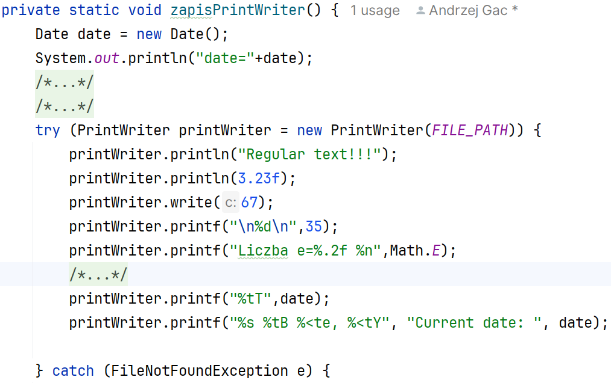
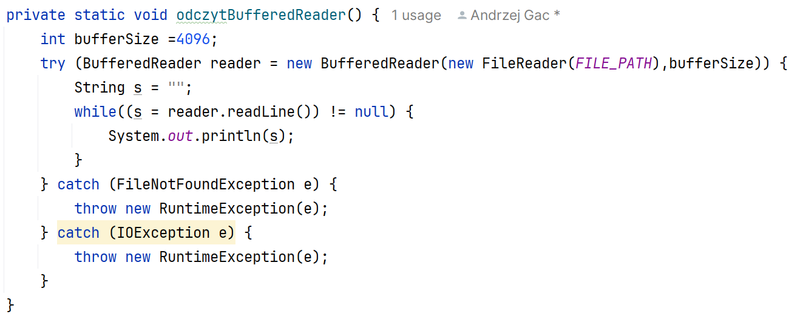
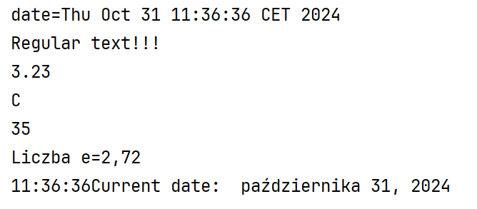
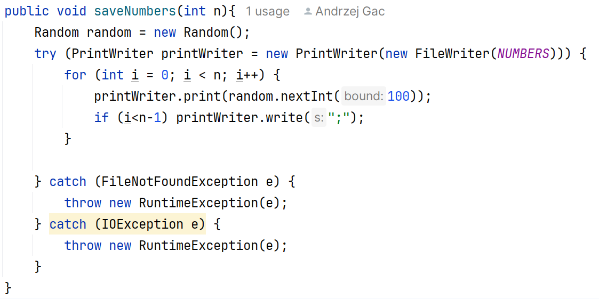

Ćwiczenia 4 -- praca z PrintWriter, Scanner, FileWriter, BufferedWriter
itd.
Na koniec zajęć prześlij pliki źródłowe i z danymi, wynikami do zasobu w
teams.
1.  Utwórz nowy projekt w katalogu na dysku C:
2.  Użyte w ćwiczeniach biblioteki: ( zostaną zaimportowane
    automatycznie)
3.  Dodaj nową klasę, w której utworzysz 6 metod:
> do zapisu danych strumieniem FileWriter,
>
> do odczytu danych strumieniem Scanner,
>
> do zapisu danych strumieniem BufferedWriter,
>
> do odczytu danych strumieniem BufferedReader,
>
> do zapisu danych strumieniem PrintWriter,
>
> do odczytu danych strumieniem BufferedReader zapisanych PrintWriterem.
4.  
    Przykładowy kod wywołujący 4 pierwsze
    metody:
5.  Dokumentacja:
<https://docs.oracle.com/javase/8/docs/api/java/io/FileWriter.html>
<https://docs.oracle.com/javase/8/docs/api/java/util/Scanner.html>
<https://docs.oracle.com/javase/8/docs/api/java/io/BufferedWriter.html>
<https://docs.oracle.com/javase/8/docs/api/java/io/BufferedReader.html>
<https://docs.oracle.com/javase/8/docs/api/java/io/PrintWriter.html>
<https://docs.oracle.com/javase/8/docs/api/java/io/FileReader.html>
6.  Realizacja: Utwórz metodę do zapisu danych strumieniem FileWriter.
> Dokumentacja:
> <https://docs.oracle.com/javase/8/docs/api/java/io/FileWriter.html>
>
> 
7.  Realizacja: Utwórz metodę do odczytu danych strumieniem Scanner.
> 
> <https://docs.oracle.com/javase/8/docs/api/java/util/Scanner.html>
8.  Realizacja: Utwórz metodę do zapisu danych strumieniem
    BufferedWriter.
> 
> <https://docs.oracle.com/javase/8/docs/api/java/io/BufferedWriter.html>
9.  Realizacja: Utwórz metodę do odczytu danych strumieniem
    BufferedReader.
Dokumentacja:
<https://docs.oracle.com/javase/8/docs/api/java/io/BufferedReader.html>
<https://docs.oracle.com/javase/8/docs/api/java/io/FileReader.html>

10. Realizacja: Utwórz metodę zapisującą dane: tekst, liczbę całkowitą,
    rzeczywistą oraz datę do pliku z pomocą PrintWritera.
> Dokumentacja:
> <https://docs.oracle.com/javase/8/docs/api/java/io/PrintWriter.html>
>
> 
>
> 
11. Realizacja: Odczytaj dane zapisane PrintWriterem za pomocą
    BufferedReadera.

Wynik:

12. Wylosować 10 liczb i zapisać do pliku printwriterem oddzielając
    średnikiem każdą liczbę.
> Odczytać scannerem liczby, następnie dodać je do listy.
>
> Realizacja:
>
> 
>
> Odczyt, na dwa sposoby:
>
> 
13. Wykorzystaj kod do realizacji zadania domowego.
14. KONIEC.
