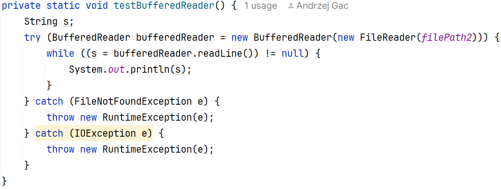
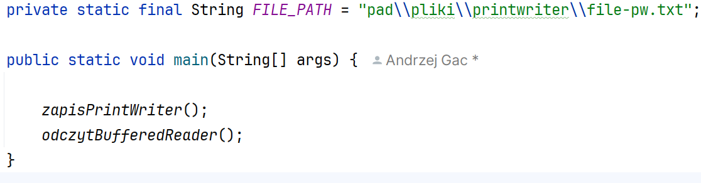
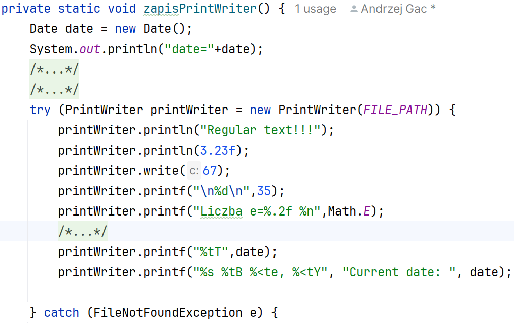
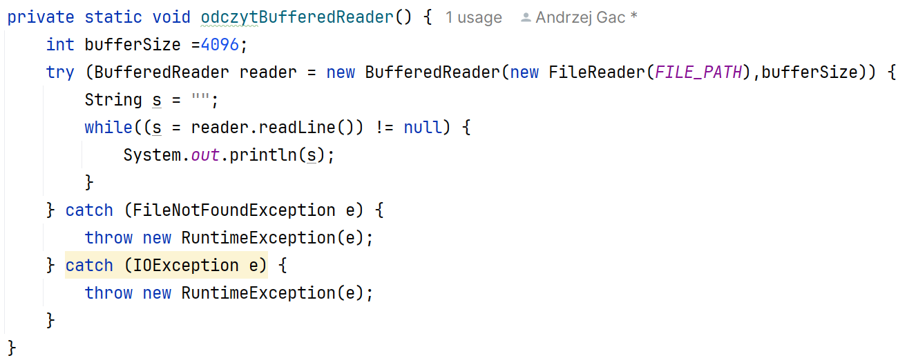
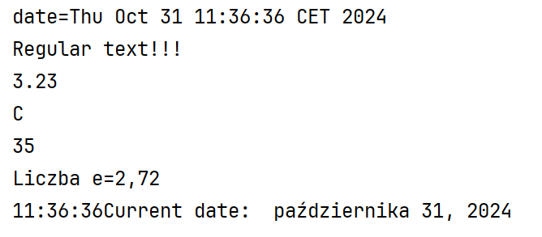
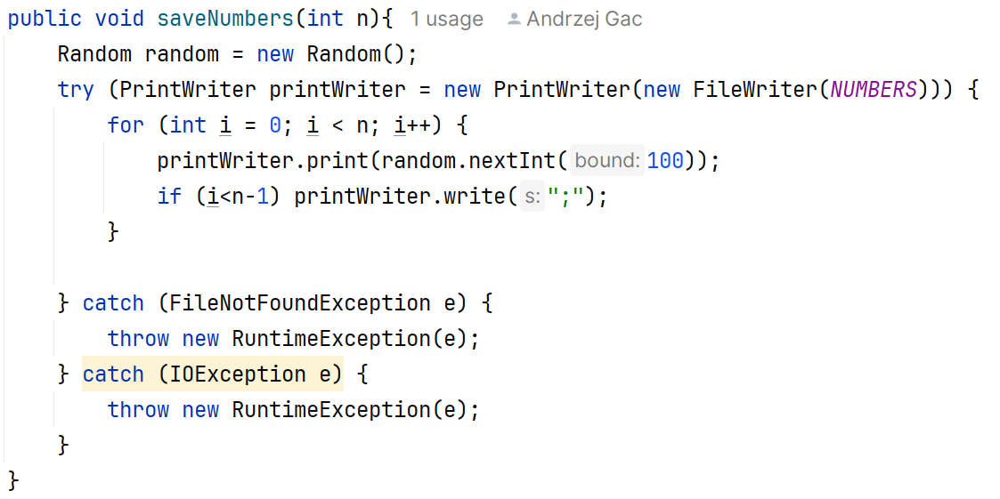
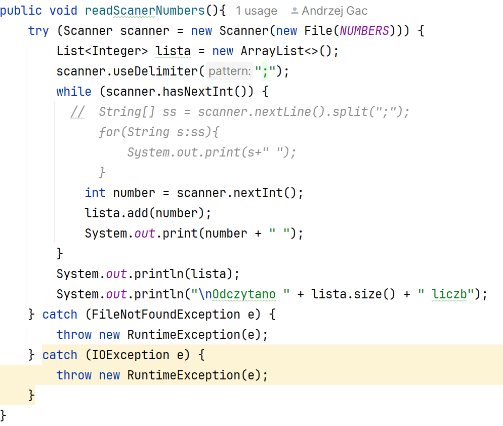

# Ćwiczenia 4 -- praca z PrintWriter, Scanner, FileWriter, BufferedWriter

Na koniec zajęć prześlij pliki źródłowe i z danymi, wynikami do zasobu w
teams.

1. Utwórz nowy projekt w katalogu na dysku C:

1. Użyte w ćwiczeniach biblioteki: ( zostaną zaimportowane
    automatycznie)

1. Dodaj nową klasę, w której utworzysz 6 metod:

    do zapisu danych strumieniem FileWriter,

    do odczytu danych strumieniem Scanner,

    do zapisu danych strumieniem BufferedWriter,

    do odczytu danych strumieniem BufferedReader,

    do zapisu danych strumieniem PrintWriter,

    do odczytu danych strumieniem BufferedReader zapisanych PrintWriterem.

1. Przykładowy kod wywołujący 4 pierwsze metody:

   ```java
   public static final String PATH_FILE = "plik_writera.txt";
    public static final String PATH_FILE_2 = "plik_buffered-writera.txt";

    void main() {
        IO.println(String.format("Praca ze strumieniami!"));
       // testFileWriter();
       // testOdczytuScanner();
        testOdczytuFileReader();
    }
   ```

1. Dokumentacja:

    <https://docs.oracle.com/javase/8/docs/api/java/io/FileWriter.html>

    <https://docs.oracle.com/javase/8/docs/api/java/util/Scanner.html>

    <https://docs.oracle.com/javase/8/docs/api/java/io/BufferedWriter.html>

    <https://docs.oracle.com/javase/8/docs/api/java/io/BufferedReader.html>

    <https://docs.oracle.com/javase/8/docs/api/java/io/PrintWriter.html>

    <https://docs.oracle.com/javase/8/docs/api/java/io/FileReader.html>

1. Realizacja: Utwórz metodę do zapisu danych strumieniem FileWriter.

   Dokumentacja:

   <https://docs.oracle.com/javase/8/docs/api/java/io/FileWriter.html>

   ```java
   private void testFileWriter() {
        try (FileWriter fw = new FileWriter(PATH_FILE)) {
            fw.write("New York Knicks\n");
            fw.write("Los Angeles Lakers\n");
            fw.write("Toronto Raptors\n");
            fw.write("Minesota Timberwolves");
        } catch (IOException e) {
            throw new RuntimeException(e);
        }
    }
   ```

1. Realizacja: Utwórz metodę do odczytu danych strumieniem Scanner.

   <https://docs.oracle.com/javase/8/docs/api/java/util/Scanner.html>

   ```java
   private void testOdczytuScanner() {
        String linia;
        try (Scanner sc = new Scanner(new File(PATH_FILE))) {
            while (sc.hasNextLine()) {
                linia = sc.nextLine();
                IO.println(linia);
            }
        } catch (FileNotFoundException e) {
            throw new RuntimeException(e);
        }

    }
   ```
1. Realizacja: Utwórz metodę do odczytu danych strumieniem FileReader.

   ```java
   private void testOdczytuFileReader() {
        try (FileReader fr = new FileReader(new File(PATH_FILE))) {
            int znak;
            while ((znak = fr.read()) != -1) {
                System.out.print((char) znak);
            }
        } catch (FileNotFoundException e) {
            throw new RuntimeException(e);
        } catch (IOException e) {
            throw new RuntimeException(e);
        }
    }
   ```

1. Realizacja: Utwórz metodę do zapisu danych strumieniem BufferedWriter.

   ```java
    private void testBufferedWriter() {
        try (BufferedWriter bw = new BufferedWriter(new FileWriter(PATH_FILE_2))) {
            bw.write("Decathlon CMA CGM Team");
            bw.newLine();
            bw.write("Bahrain – Victorious");
            bw.newLine();
            bw.write("UAE Team Emirates – XRG");
            bw.newLine();
            bw.write("Lidl – Trek");
            bw.newLine();
        } catch (IOException e) {
            throw new RuntimeException(e);
        }
    }
   ```

   <https://docs.oracle.com/javase/8/docs/api/java/io/BufferedWriter.html>

1. Realizacja: Utwórz metodę do odczytu danych strumieniem BufferedReader.

   Dokumentacja:

   <https://docs.oracle.com/javase/8/docs/api/java/io/BufferedReader.html>

   <https://docs.oracle.com/javase/8/docs/api/java/io/FileReader.html>

   

1. Realizacja: Utwórz metodę zapisującą dane: tekst, liczbę całkowitą,
    rzeczywistą oraz datę do pliku z pomocą PrintWritera.

   Dokumentacja:

   <https://docs.oracle.com/javase/8/docs/api/java/io/PrintWriter.html>

   

   

1. Realizacja: Odczytaj dane zapisane PrintWriterem za pomocą BufferedReadera.

   

   Wynik:

   

1. Wylosować 10 liczb i zapisać do pliku printwriterem oddzielając
    średnikiem każdą liczbę.

    Odczytać scannerem liczby, następnie dodać je do listy.

    Realizacja:

    

    Odczyt, na dwa sposoby:

    

1. Wykorzystaj kod do realizacji zadania domowego.

1. KONIEC. 😀
