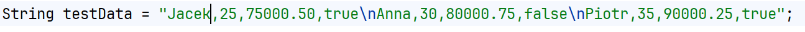
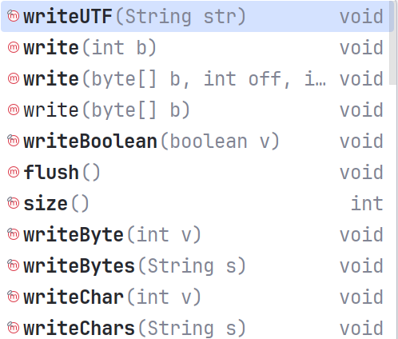
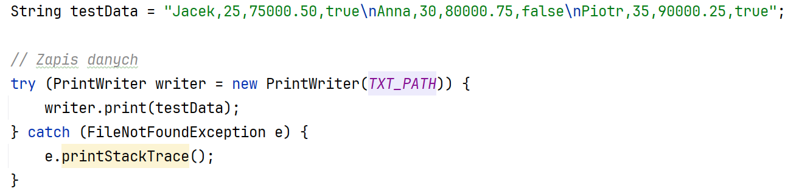
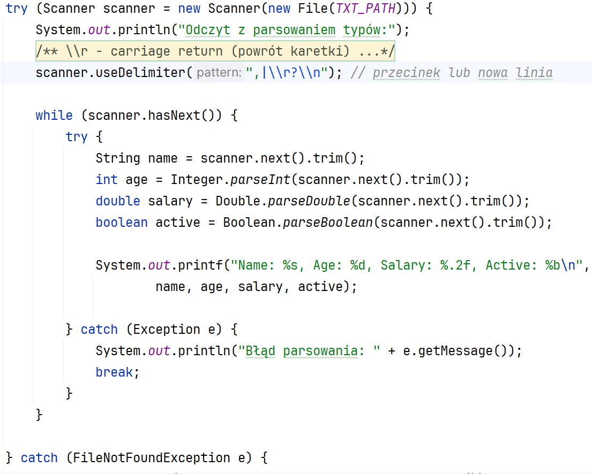
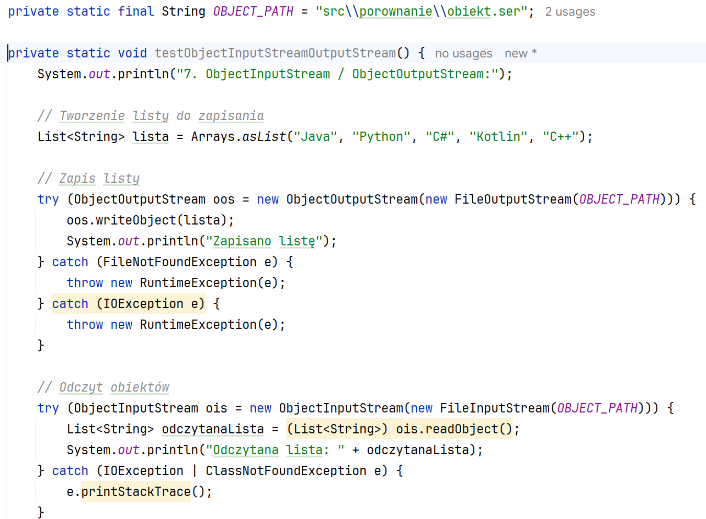
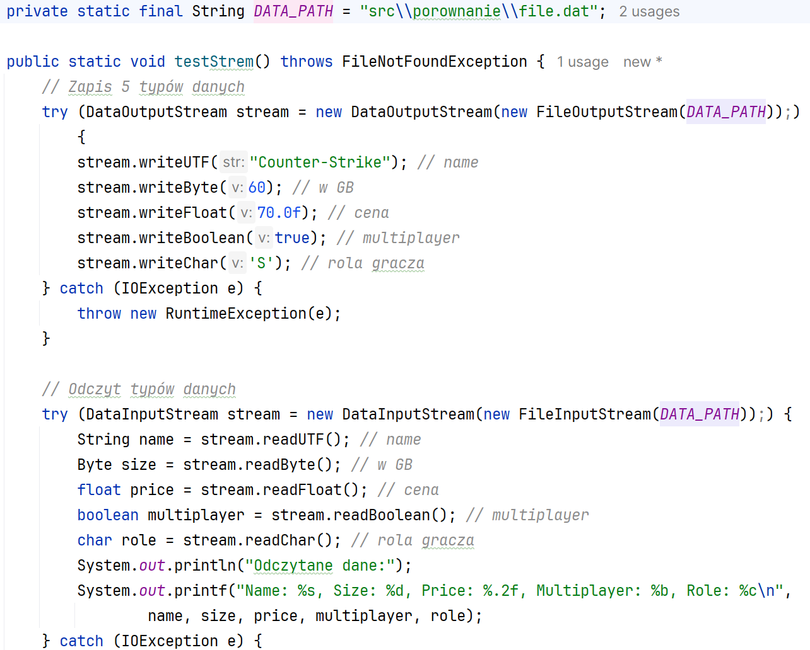
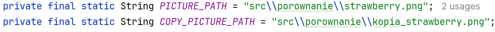
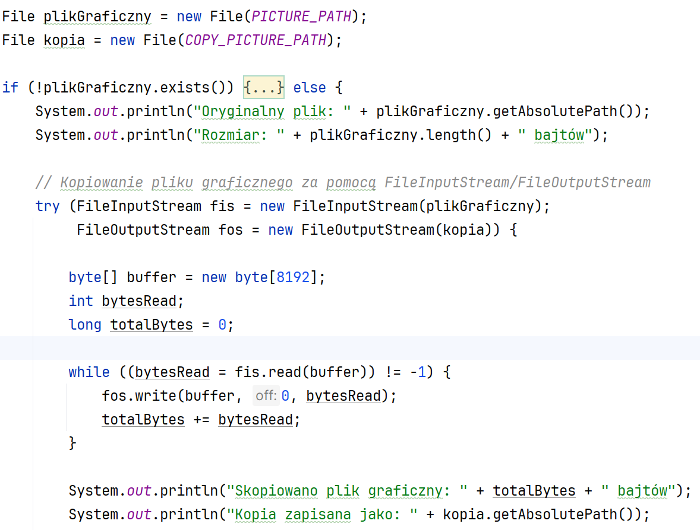

Ćwiczenia 5 -- praca z ObjectOutputStream, DataOutputStream,
FileOutputStream itd.
Na koniec zajęć prześlij pliki źródłowe i z danymi, wynikami do zasobu w
teams.
1.  Utwórz nowy projekt w katalogu na dysku C:
2.  Użyte w ćwiczeniach biblioteki: ( zostaną zaimportowane
    automatycznie)
3.  Dodaj nową klasę, w której utworzysz 8 metod:
> do zapisu danych strumieniem PrintWriter,
>
> do odczytu danych strumieniem Scanner+parsowanie,
>
> do zapisu danych strumieniem ObjectOutputStream,
>
> do odczytu danych strumieniem ObjectInputStream,
>
> do zapisu danych strumieniem DataOutputStream,
>
> do odczytu danych strumieniem DataInputStream,
>
> do zapisu danych strumieniem FileOutputStream,
>
> do odczytu danych strumieniem FileInputStream,
4.  
    Zadanie 1: PrintWriterem zapisać stringa z danymi
    dla trzech osób:
> Następnie sparsować np. i odczytać dane scanerem.
5.  Zadanie 2: Zapisz listę języków progr. do pliku z pomocą
    ObjectOutputStream,
> następnie odczytaj tę listę i wypisz na ekran.
\* Zadanie dodatkowe zapisz i odczytaj obiekt klasy.
6.  
    Zadanie 3: Z wykorzystaniem strumieni
    DataOutputStream/ DataInputStream zapisz i odczytaj minimum 5 typów
    danych.
7.  Zadanie 4: Skopiować wybrany obrazek \*.png lub inny z pomocą
    FileInputStream /FileOutputStream,
>
8.  
    Realizacja zadania 1:
> 
9.  Realizacja zadania 2:
> 
10. 
    Realizacja zadania 3:
11. Realizacja zadania 4:
> 
>
> 
12. KONIEC.
