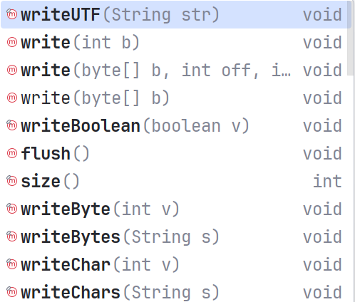
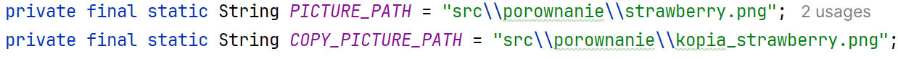
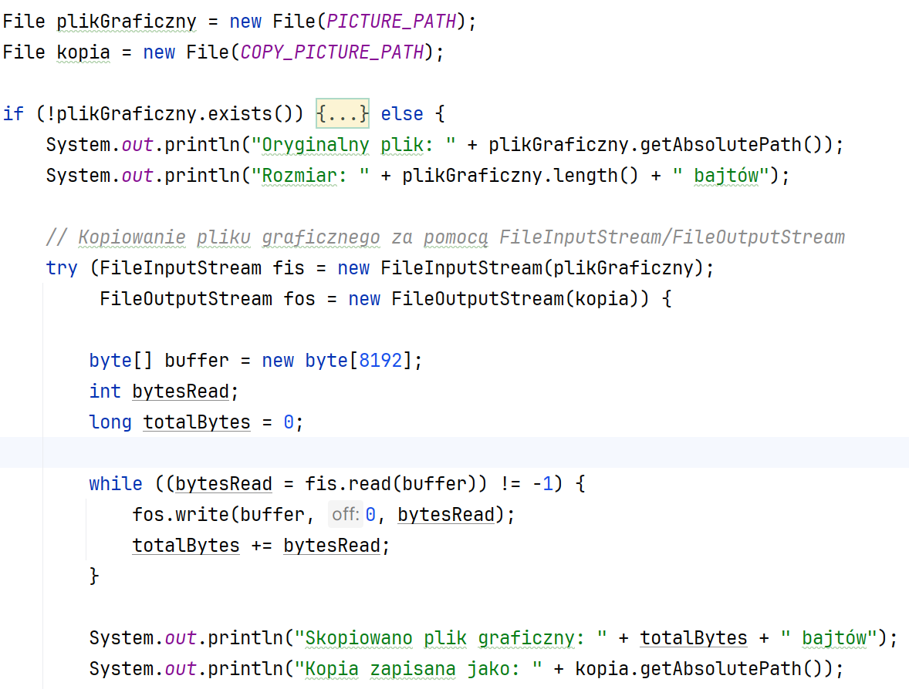

# Ćwiczenia 5 -- praca z ObjectOutputStream, DataOutputStream,FileOutputStream itd

Na koniec zajęć prześlij pliki źródłowe i z danymi, wynikami do zasobu w
teams.

1. Utwórz nowy projekt w katalogu na dysku C:

1. Użyte w ćwiczeniach biblioteki: ( zostaną zaimportowane
    automatycznie)

1. Dodaj nową klasę, w której utworzysz 8 metod:

   - do zapisu danych strumieniem PrintWriter,
   - do odczytu danych strumieniem Scanner+parsowanie,
   - do zapisu danych strumieniem ObjectOutputStream,
   - do odczytu danych strumieniem ObjectInputStream,
   - do zapisu danych strumieniem DataOutputStream,
   - do odczytu danych strumieniem DataInputStream,
   - do zapisu danych strumieniem FileOutputStream,
   - do odczytu danych strumieniem FileInputStream,

1. Zadanie 1: PrintWriterem zapisać stringa z danymi
    dla trzech osób:

   ```java
   String testData = "John,25,75000.50,true\nAnna,30,80000.75,false\nPiotr,35,90000.25,true";
   ```

   Następnie sparsować i odczytać dane scanerem.

1. Zadanie 2: Zapisz listę języków programowania do pliku z pomocą
    ObjectOutputStream,

   następnie odczytaj tę listę i wypisz na ekran.

   Zadanie dodatkowe zapisz i odczytaj obiekt klasy.

1. Zadanie 3: Z wykorzystaniem strumieni
    DataOutputStream/ DataInputStream zapisz i odczytaj minimum 5 typów
    danych.

   

1. Zadanie 4: Skopiować wybrany obrazek \*.png lub inny z pomocą
    FileInputStream /FileOutputStream,

1. Realizacja zadania 1:

   ```java
   private static void testScanner() {
        System.out.println("4. Scanner:");

        // Używamy konkretnego delimitera
        String testData = "John,25,75000.50,true\nAnna,30,80000.75,false\nPiotr,35,90000.25,true";

        // Zapis danych
        try (PrintWriter writer = new PrintWriter(tekstowyPath)) {
            writer.print(testData);
        } catch (FileNotFoundException e) {
            e.printStackTrace();
        }

        // Odczyt z custom delimiterem
        try (Scanner scanner = new Scanner(new File(tekstowyPath))) {
            System.out.println("Odczyt z parsowaniem typów:");
            /**
             * \\n - newline (nowa linia)
             */
            scanner.useDelimiter(",|\\n"); // delimiter: przecinek lub nowa linia

            while (scanner.hasNext()) {
                try {
                    String name = scanner.next();
                    int age = Integer.parseInt(scanner.next());
                    double salary = Double.parseDouble(scanner.next());
                    boolean active = Boolean.parseBoolean(scanner.next());

                    System.out.printf("Name: %s, Age: %d, Salary: %.2f, Active: %b\n",
                            name, age, salary, active);

                } catch (Exception e) {
                    System.out.println("Błąd parsowania: " + e.getMessage());
                    break;
                }
            }

        } catch (FileNotFoundException e) {
            System.out.println("Plik nie znaleziony: " + e.getMessage());
        }
        System.out.println("---");
    }
   ```

1. Realizacja zadania 2:

   ```java
   private static void testObjectStream() {
        System.out.println("7. ObjectInputStream / ObjectOutputStream:");

        // Tworzenie obiektów do zapisania
        List<String> lista = Arrays.asList("Java", "Go", "kotlin", "Python", "C++");
        Student student = new Student("Anna Nowak", 25, 4.5);

        // zapis objektów
        try (ObjectOutputStream out = new ObjectOutputStream(new FileOutputStream(FILE_PATH_2))) {
            out.writeObject(lista);
            out.writeObject(student);
        } catch (FileNotFoundException e) {
            throw new RuntimeException(e);
        } catch (IOException e) {
            throw new RuntimeException(e);
        }
        // Odczyt obiektów
        try (ObjectInputStream ois = new ObjectInputStream(new FileInputStream(FILE_PATH_2))) {
            List<String> odczytanaLista = (List<String>) ois.readObject();
            IO.println(odczytanaLista);
            Student student2 = (Student) ois.readObject();
            IO.println(student2);
        } catch (FileNotFoundException e) {
            throw new RuntimeException(e);
        } catch (IOException e) {
            throw new RuntimeException(e);
        } catch (ClassNotFoundException e) {
            throw new RuntimeException(e);
        }


    }

   private static class Student implements Serializable {
        private String name;
        private int age;
        private double grade;
        public Student(String name, int age, double grade) {
            this.name = name;
            this.age = age;
            this.grade = grade;
        }
        @Override
        public String toString() {
            return String.format("Student[name=%s, age=%d, grade=%.1f]", name, age, grade);
        }
    }
   ```

1. Realizacja zadania 3:

   ```java
   private static void testDataStream() {
        try (DataOutputStream dos = new DataOutputStream(new FileOutputStream(FILE_PATH_3))) {
            dos.writeUTF("Jan Kowalski");  // String
            dos.writeInt(30);              // int
            dos.writeDouble(4500.75);      // double
            dos.writeBoolean(true);        // boolean
            dos.writeChar('A');            // char

            // Zapis tablicy
            int[] numbers = {1, 2, 3, 4, 5};
            dos.writeInt(numbers.length);
            for (int num : numbers) {
                dos.writeInt(num);
            }
            System.out.println("Zapisano różne typy danych");
        } catch (FileNotFoundException e) {
            throw new RuntimeException(e);
        } catch (IOException e) {
            throw new RuntimeException(e);
        }

        // Odczyt różnych typów danych
        try (DataInputStream dis = new DataInputStream(new FileInputStream(FILE_PATH_3))) {
            String name = dis.readUTF();
            int age = dis.readInt();
            double salary = dis.readDouble();
            boolean active = dis.readBoolean();
            char grade = dis.readChar();

            // Odczyt tablicy
            int arraySize = dis.readInt();
            int[] numbers = new int[arraySize];
            for (int i = 0; i < arraySize; i++) {
                numbers[i] = dis.readInt();
            }

            System.out.println("Odczytane dane:");
            System.out.printf("Name: %s, Age: %d, Salary: %.2f, Active: %b, Grade: %c\n",
                    name, age, salary, active, grade);
            System.out.println("Tablica: " + Arrays.toString(numbers));
        } catch (IOException e) {
            e.printStackTrace();
        }

    }
   ```

1. Realizacja zadania 4:

   

   

1. KONIEC.🔚
