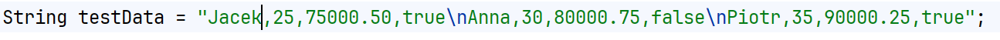
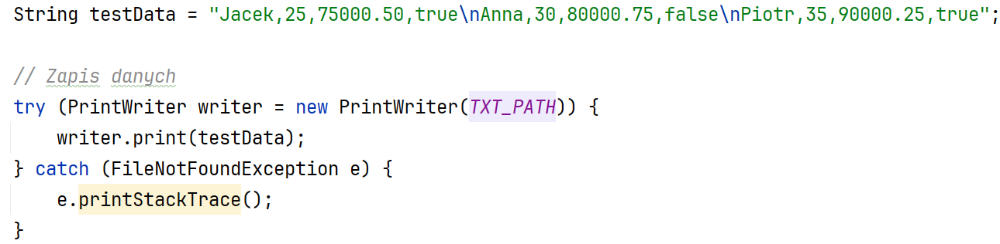
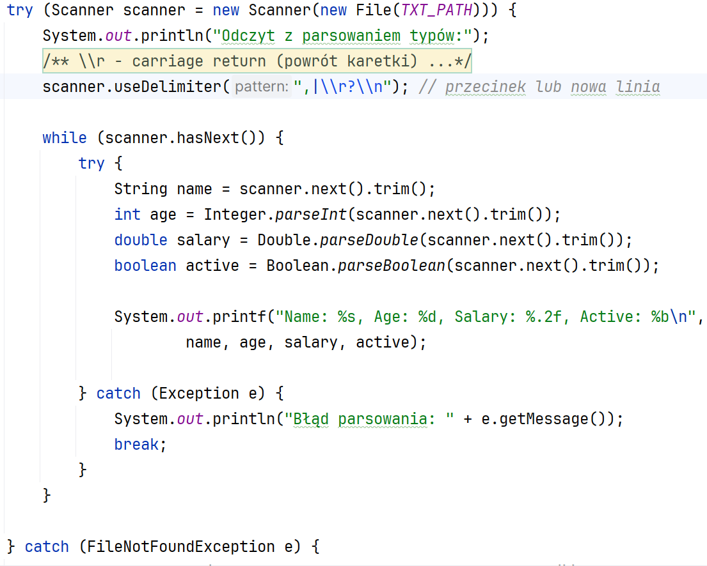
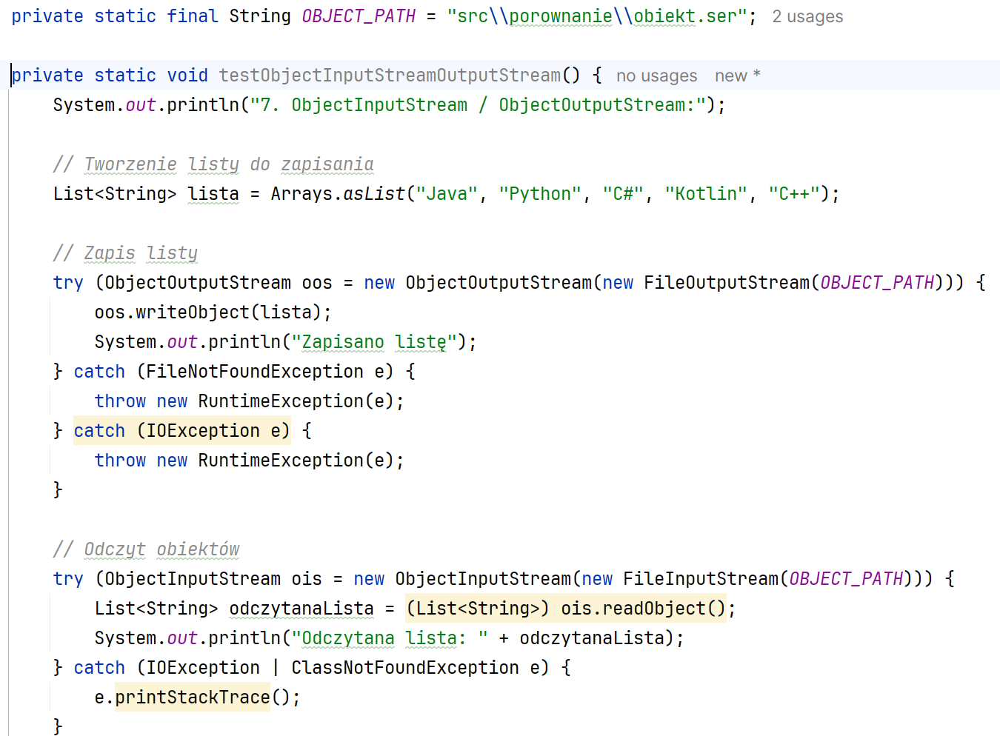
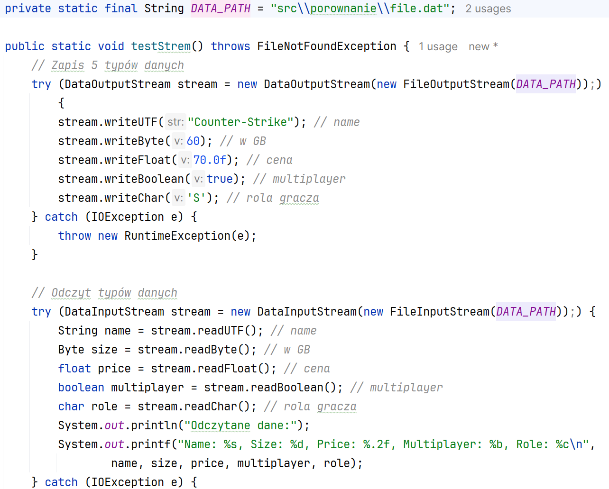

# Ćwiczenia 5 -- praca z ObjectOutputStream, DataOutputStream,FileOutputStream itd

Na koniec zajęć prześlij pliki źródłowe i z danymi, wynikami do zasobu w
teams.

1. Utwórz nowy projekt w katalogu na dysku C:

1. Użyte w ćwiczeniach biblioteki: ( zostaną zaimportowane
    automatycznie)

1. Dodaj nową klasę, w której utworzysz 8 metod:

   - do zapisu danych strumieniem PrintWriter,
   - do odczytu danych strumieniem Scanner+parsowanie,
   - do zapisu danych strumieniem ObjectOutputStream,
   - do odczytu danych strumieniem ObjectInputStream,
   - do zapisu danych strumieniem DataOutputStream,
   - do odczytu danych strumieniem DataInputStream,
   - do zapisu danych strumieniem FileOutputStream,
   - do odczytu danych strumieniem FileInputStream,

1. Zadanie 1: PrintWriterem zapisać stringa z danymi
    dla trzech osób:

   

   Następnie sparsować i odczytać dane scanerem.

1. Zadanie 2: Zapisz listę języków programowania do pliku z pomocą
    ObjectOutputStream,

   następnie odczytaj tę listę i wypisz na ekran.

   Zadanie dodatkowe zapisz i odczytaj obiekt klasy.

1. Zadanie 3: Z wykorzystaniem strumieni
    DataOutputStream/ DataInputStream zapisz i odczytaj minimum 5 typów
    danych.

   

1. Zadanie 4: Skopiować wybrany obrazek \*.png lub inny z pomocą
    FileInputStream /FileOutputStream,

   

1. Realizacja zadania 1:

   

1. Realizacja zadania 2:

   

1. Realizacja zadania 3:

   

1. Realizacja zadania 4:

   

   

1. KONIEC.🔚
