Ćwiczenia 6 -- klasy, dziedziczenie, polimorfizm, enkapsulacja
Na koniec zajęć prześlij pliki źródłowe z danymi, wynikami do zasobu w
teams.
1.  Utwórz nowy projekt.
2.  Nie importuj żadnych bibliotek, zostaną zaimportowane automatycznie.
3.  Stwórz package o nazwie komputery, prawy klawisz myszy na src
> 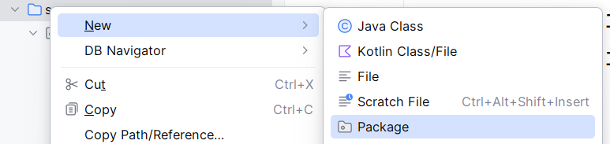
4.  Tworzymy klasę komputer o polach/atrybutach: producent, model i rok
    produkcji.
> 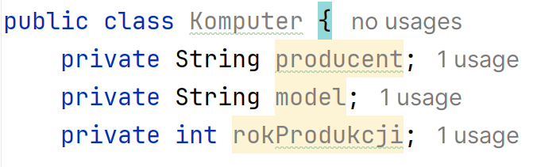
5.  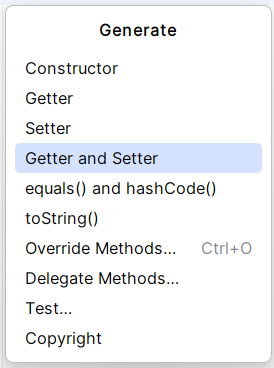
    Utwórz konstruktor dla tych pól.
> 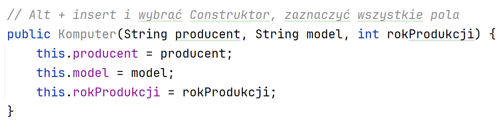
6.  Utwórz obiekt klasy Komputer
> 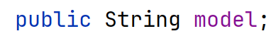
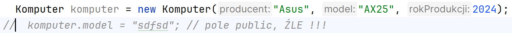
7.  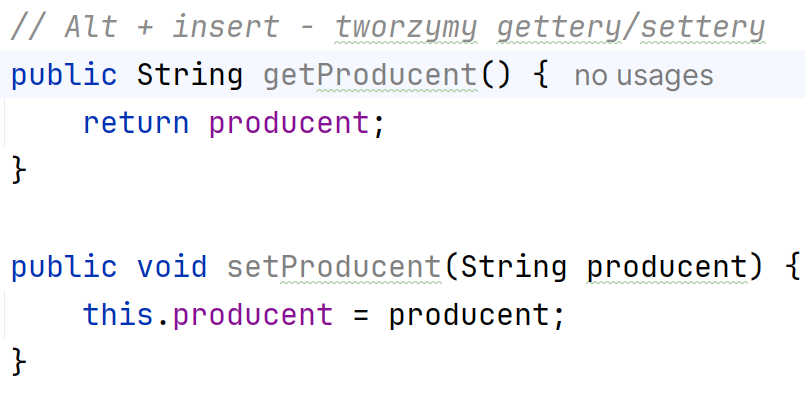
    Utwórz gettery i setery dla wszystkich
    pól.
8.  Testujemy gettery i setery dla wszystkich pól, ale najpierw utwórz
    konstruktor bezargumentowy:
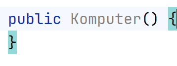
9.  Stwórz obiekt i nadaj/odczytaj wartości:
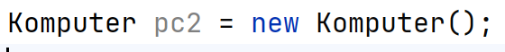

10. Widok po teście ( o ile dodasz wersję java 25):
> 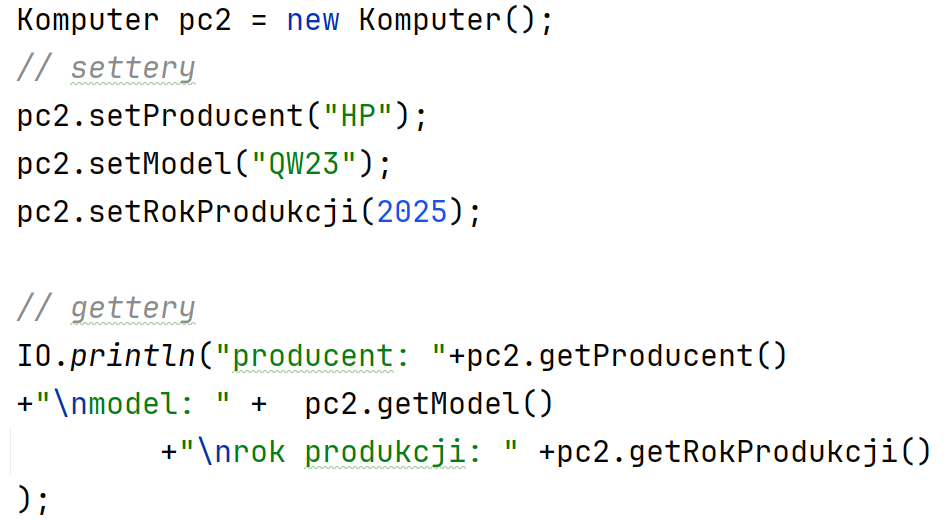
11. Utwórz klasę potomną o nazwie Laptop, na package komputery prawy
    klawisz myszy i New:
> 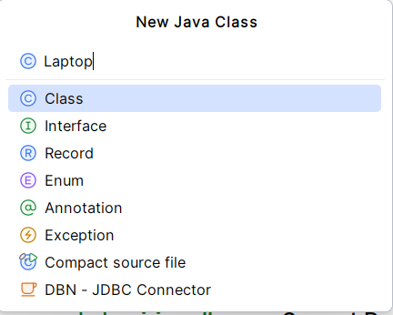
>
> 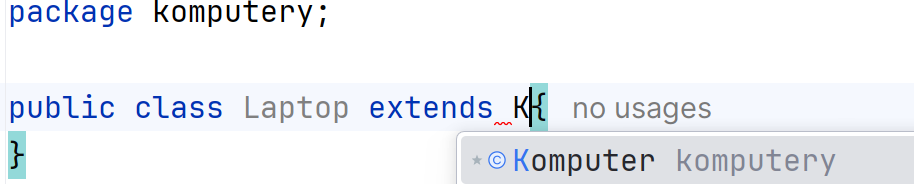
12. Dodaj trzy nowe pola:
> 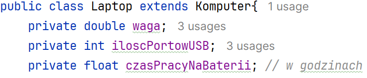
13. Dodaj konstruktor z klasy nadrzędnej z uwzględnieniem nowych pól:
> 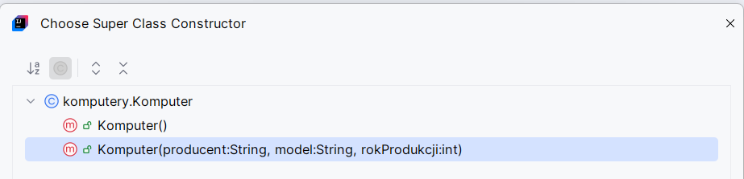
>
> W drugim kroku:
>
> 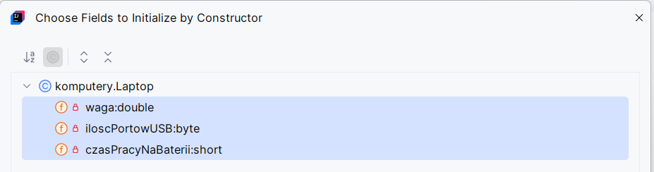
>
> 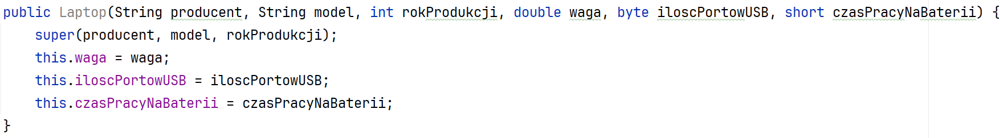
14. Dodaj metodę toString w klasie Komputer oraz w Laptop:
> 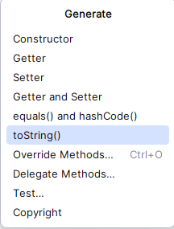
W klasie Laptop ( dopisz super.toString()):
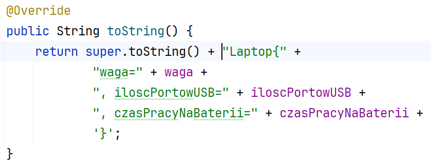
15. Utwórz obiekt klasy Laptop i nadaj/odczytaj wartości:
> 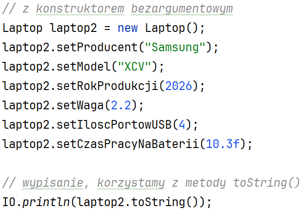
16. Utwórz metodę włącz w klasie nadrzędnej Komputer:
> 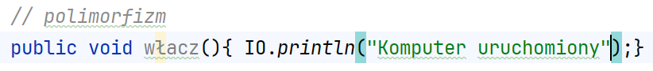
17. Nadpisz metodę włącz() w klasie Laptop:
> 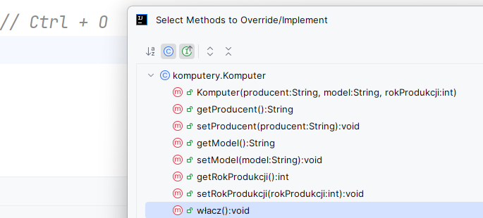
>
> Dla klasy Laptop:
>
> 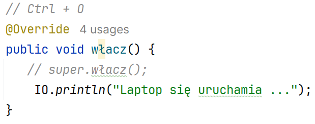
18. Przetestuj polimorfizm.
> 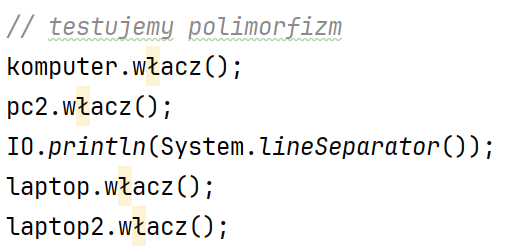
>
> 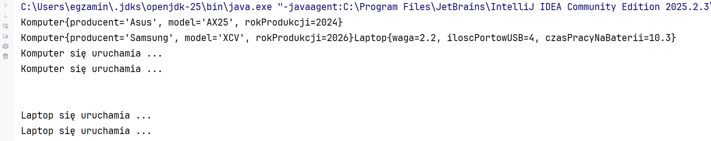
19. 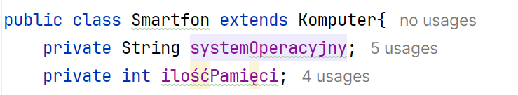
    Utwórz klasę potomną o nazwie
    Smartfon.
20. Dodaj wszystko tak jak dla klasy Laptop.
> 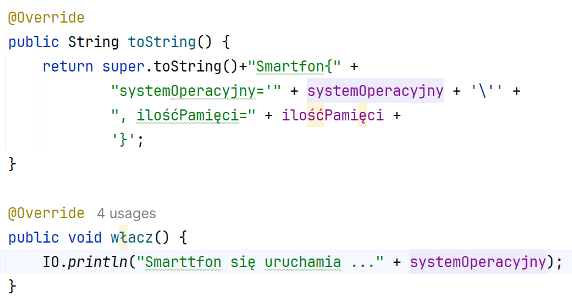
21. 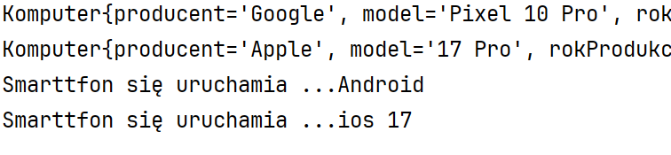
    Wykonaj testy.
22. Dodaj nowy package i utwórz klasę nadrzędną oraz dwie potomne według
    własnego pomysłu, testuj analogicznie jak wcześniej.
23. Dodatkowe zadania:
    a)  Dodaj klasę Desktop oraz potomną dla niej GamingDesktop,
    b)  Zaimplementuj metody equals() i hashCode()
> 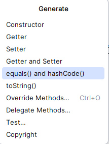
c)  Dodaj test
> 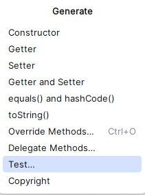
>
> 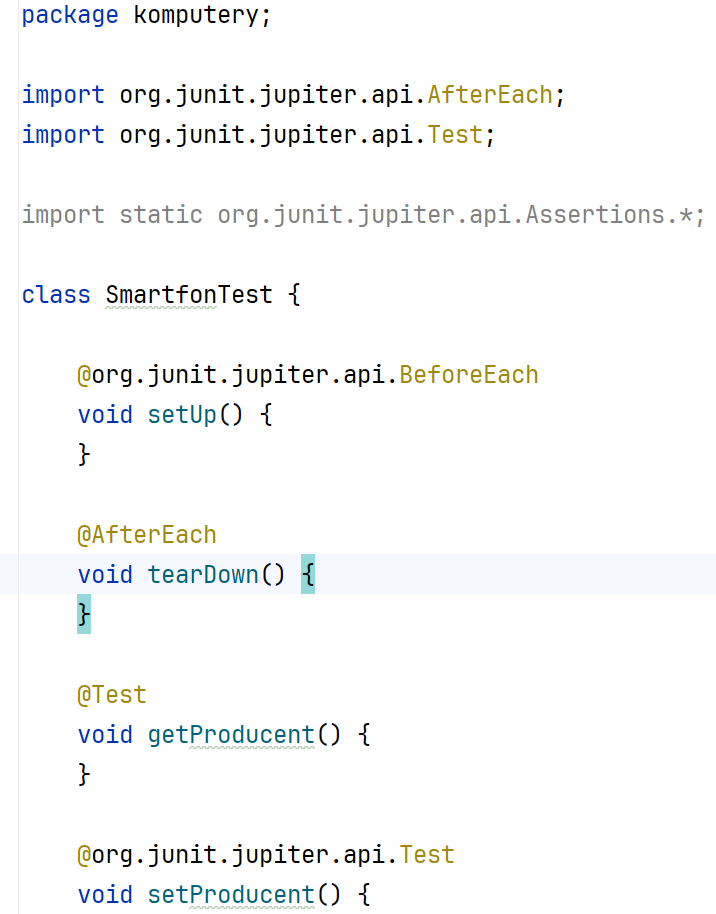
24. KONIEC.
