# Ćwiczenia 6 -- klasy, dziedziczenie, polimorfizm, enkapsulacja

Na koniec zajęć prześlij pliki źródłowe z danymi, wynikami do zasobu w
teams.

1. Utwórz nowy projekt.
1. Nie importuj żadnych bibliotek, zostaną zaimportowane automatycznie.
1. Stwórz package o nazwie komputery, prawy klawisz myszy na src

   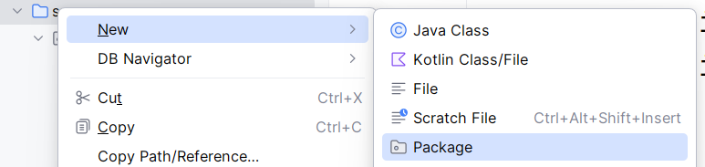

1. Tworzymy klasę komputer o polach/atrybutach: producent, model i rok
    produkcji.

   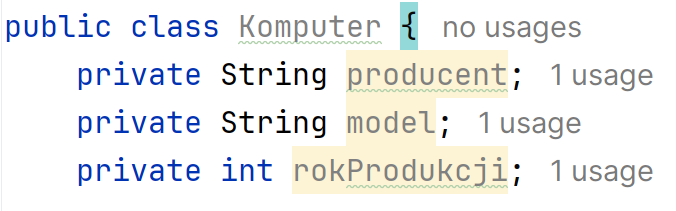

   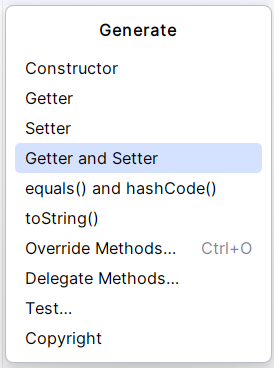

1. Utwórz konstruktor dla tych pól.

   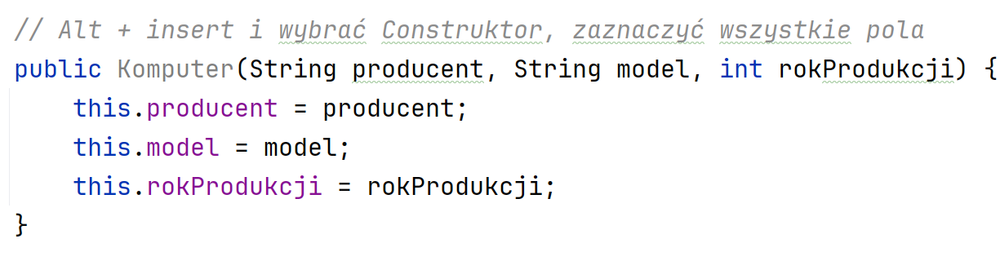

1. Utwórz obiekt klasy Komputer

   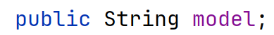
   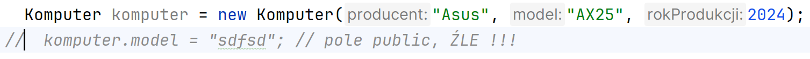

1. 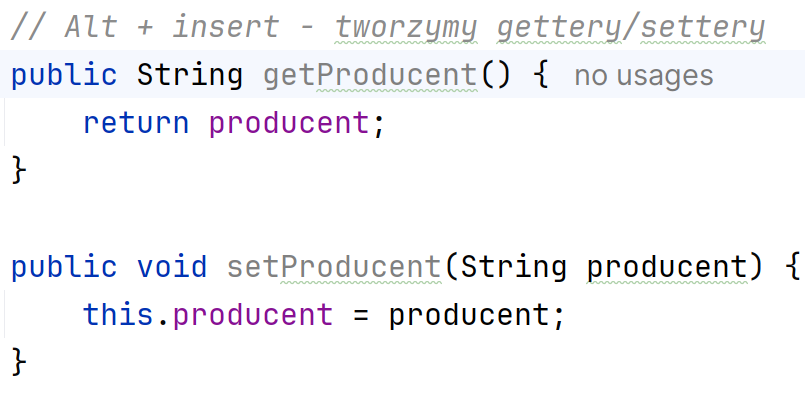
    Utwórz gettery i setery dla wszystkich
    pól.
2. Testujemy gettery i setery dla wszystkich pól, ale najpierw utwórz
    konstruktor bezargumentowy:
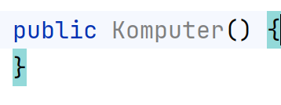
3. Stwórz obiekt i nadaj/odczytaj wartości:
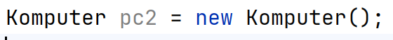
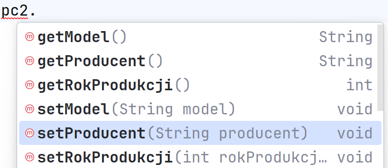
4. Widok po teście ( o ile dodasz wersję java 25):

> 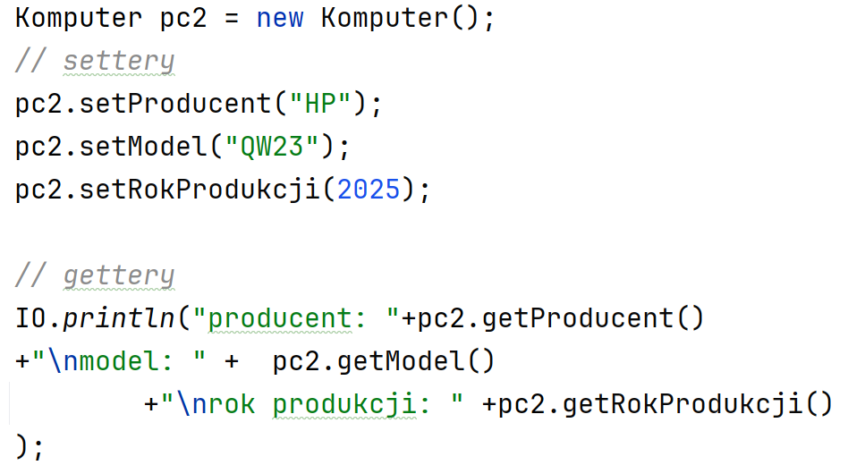

1. Utwórz klasę potomną o nazwie Laptop, na package komputery prawy
    klawisz myszy i New:

> 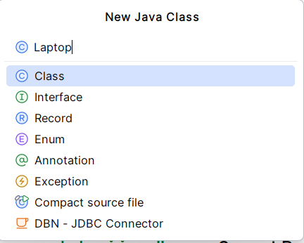
>
> 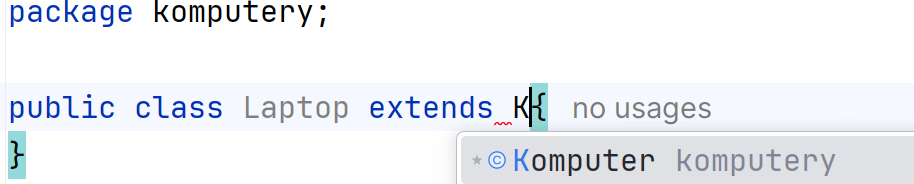

1. Dodaj trzy nowe pola:

> 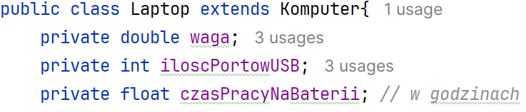

1. Dodaj konstruktor z klasy nadrzędnej z uwzględnieniem nowych pól:

> 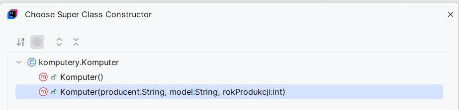
>
> W drugim kroku:
>
> 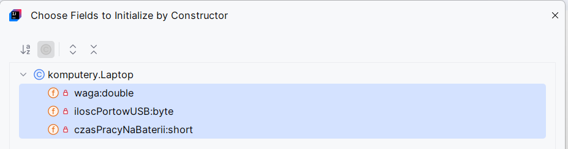
>
> 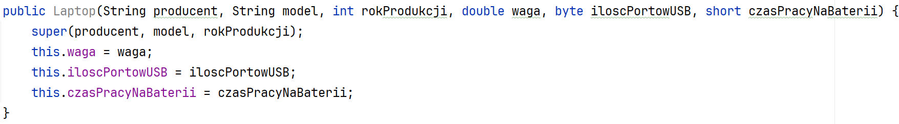

1. Dodaj metodę toString w klasie Komputer oraz w Laptop:

> 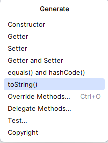
W klasie Laptop ( dopisz super.toString()):
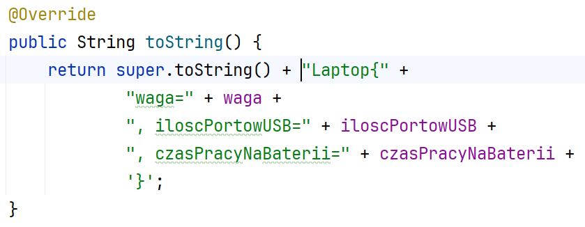

1. Utwórz obiekt klasy Laptop i nadaj/odczytaj wartości:

> 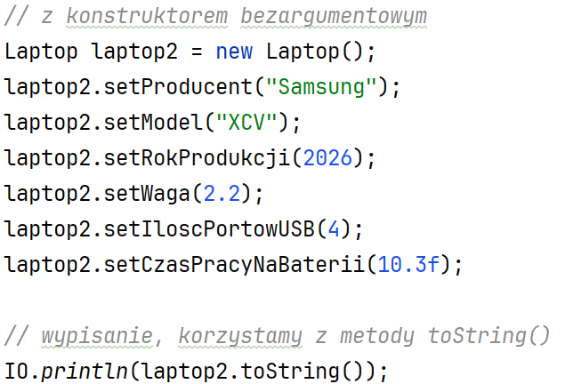

1. Utwórz metodę włącz w klasie nadrzędnej Komputer:

> 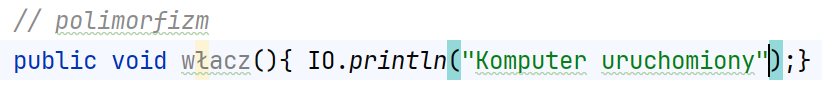

1. Nadpisz metodę włącz() w klasie Laptop:

> 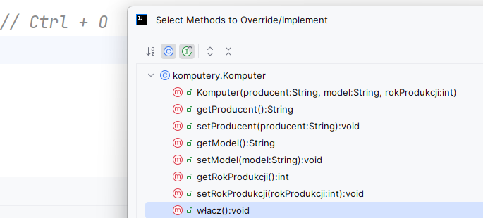
>
> Dla klasy Laptop:
>
> 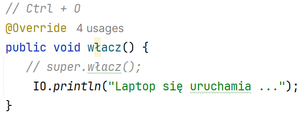

1. Przetestuj polimorfizm.

> 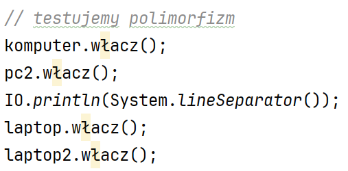
>
> 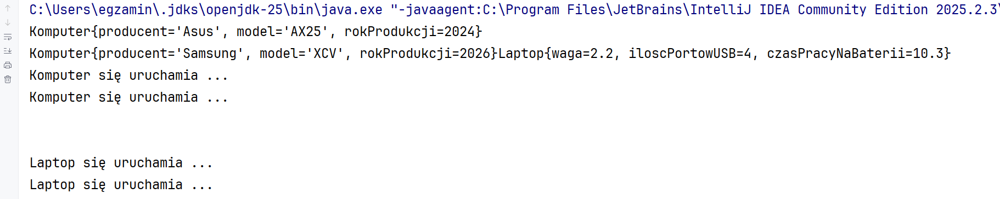

1. 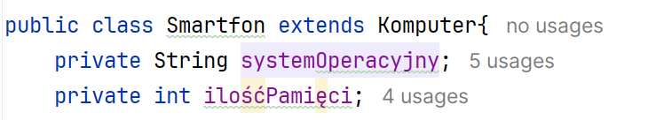
    Utwórz klasę potomną o nazwie
    Smartfon.
2. Dodaj wszystko tak jak dla klasy Laptop.

> 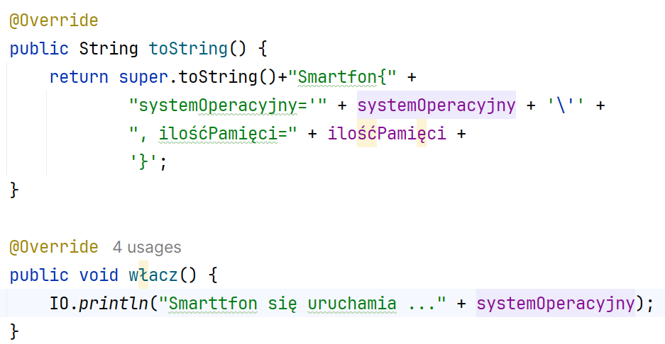

1. 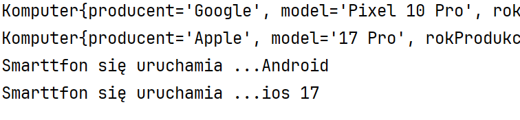
    Wykonaj testy.
2. Dodaj nowy package i utwórz klasę nadrzędną oraz dwie potomne według
    własnego pomysłu, testuj analogicznie jak wcześniej.
3. Dodatkowe zadania:
    a)  Dodaj klasę Desktop oraz potomną dla niej GamingDesktop,
    b)  Zaimplementuj metody equals() i hashCode()

> 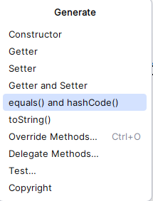
c)  Dodaj test
> 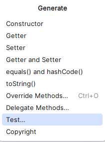
>
> 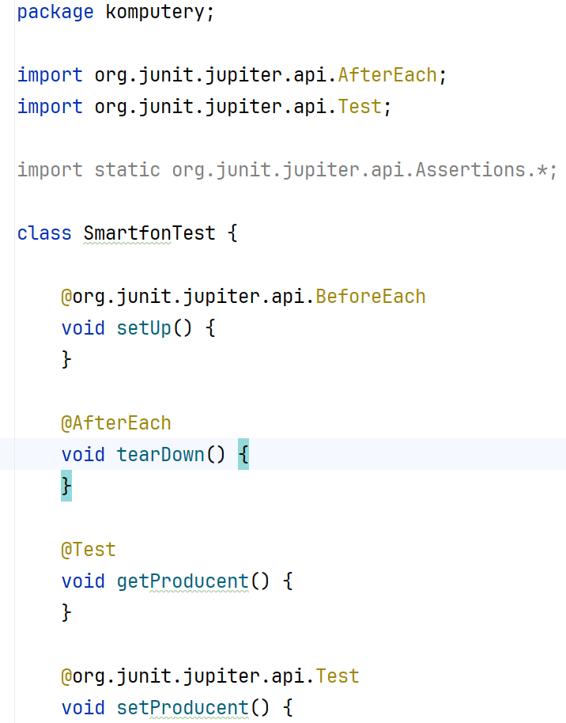

1. KONIEC.
