Ćwiczenia 7 -- biblioteka swing, JFrame
Na koniec zajęć prześlij pliki źródłowe i z danymi, wynikami do zasobu w
teams.
1.  Otwórz dokumentację:
> <https://docs.oracle.com/javase/tutorial/uiswing/components/toplevel.html>
>
> <https://docs.oracle.com/javase/8/docs/api/javax/swing/JFrame.html>
2.  Utwórz nowy projekt w katalogu na dysku C:, nie dodawaj
    przykładowego kodu
3.  Dodaj package o nazwie cwiczenie7
4.  Zadanie 1: Dodaj nową klasę o nazwie MainWindow, które dziedziczy po
    JFrame:

5.  Dodaj metodę main oraz widoczność okna i skompiluj kod Shift +F10
> 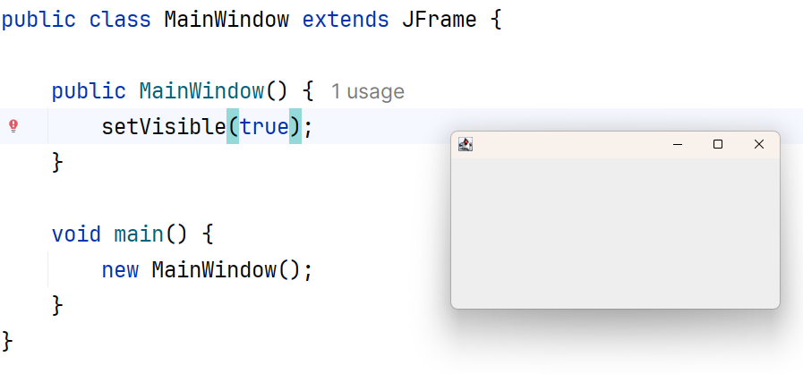
6.  Dodaj konstruktor i ustaw tytuł okna, rozmiar oraz jego położenie i
    kolor frama:
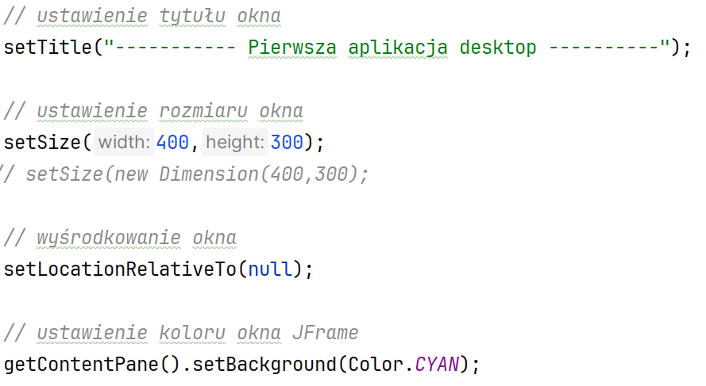
7.  Dodaj zamknięcie okna x:
> 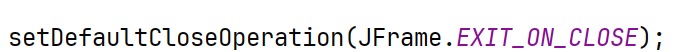
8.  Dodaj panel:
> 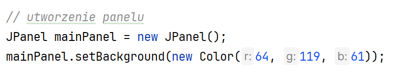
9.  Dodaj kolor tła panelu oraz dodaj panel do ramki:
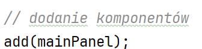
10. 
    Cały konstruktor:
11.
12. Sprawdź widok okna:
> 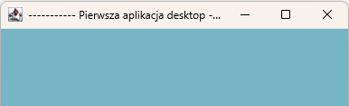
13. Dodaj menadżer układu na FlowLayout:
> 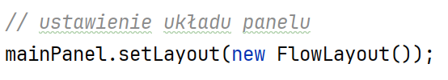
14. 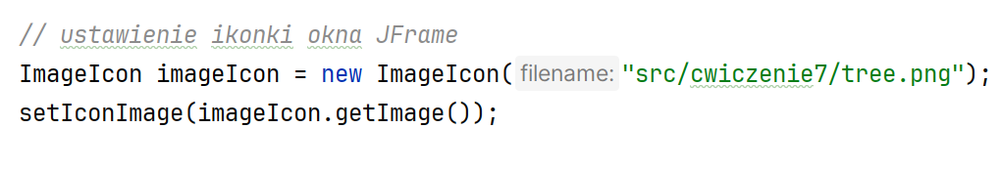
    Dodaj ikonkę dla aplikacji:
15. Zadeklaruj etykietę, pole tekstowe oraz przycisk:
> 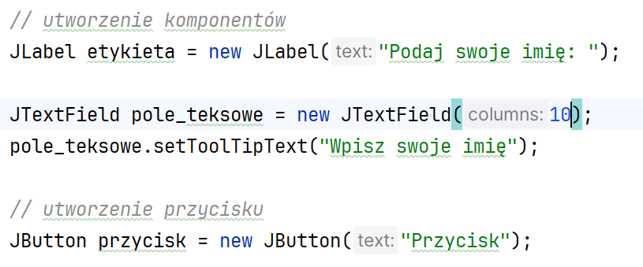
16. Dodaj komponenty do panelu:
> 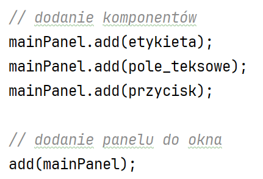
17. Realizacja:
> 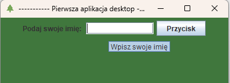
18. Zadanie 3: Zmień tło dla przycisku oraz kolor tekstu:
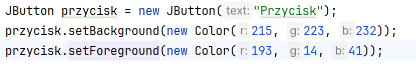
19. Zmień kolory dla przycisku po jego kliknięciu dodaj okno wiadomości
    z podanym imieniem:
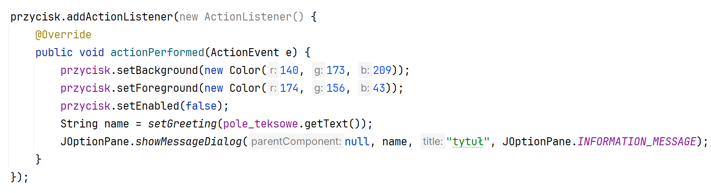
20. Ustaw przycisk na nieaktywny:
> 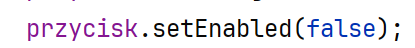
21. Przygotuj wcześniej 100 liczb i je posortuj:
> 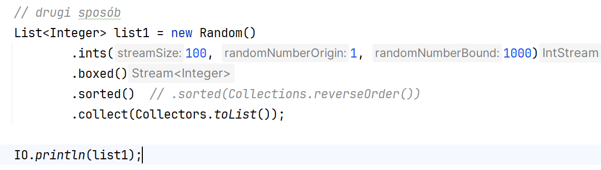
22. Dodaj przycisk sortowania i JTextArea na wyniki:
> 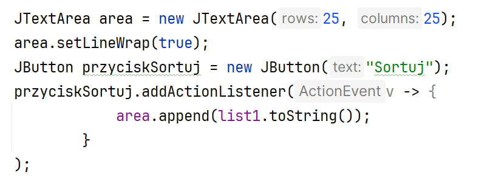
23. Pamiętaj o dodaniu komponentów do panelu:
> 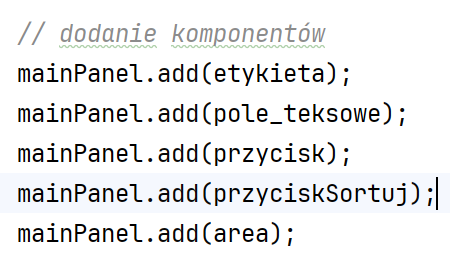
24. Uruchomienie:
> 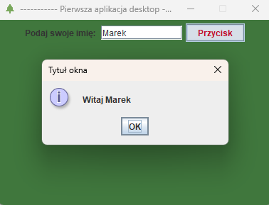
> 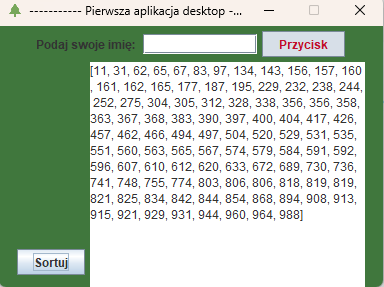
25. KONIEC.
