# Ćwiczenia 7 -- biblioteka swing, JFrame

Na koniec zajęć prześlij pliki źródłowe i z danymi, wynikami do zasobu w
teams.

1. Otwórz dokumentację:

   <https://docs.oracle.com/javase/tutorial/uiswing/components/toplevel.html>

   <https://docs.oracle.com/javase/8/docs/api/javax/swing/JFrame.html>

1. Utwórz nowy projekt w katalogu na dysku C:, nie dodawaj
    przykładowego kodu

1. Dodaj package o nazwie cwiczenie7

1. Zadanie 1: Dodaj nową klasę o nazwie MainWindow, które dziedziczy po
    JFrame:

   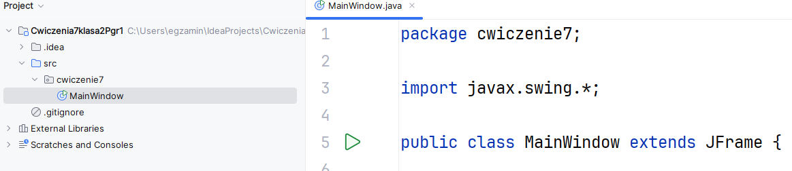

1. Dodaj metodę main oraz widoczność okna i skompiluj kod Shift +F10

   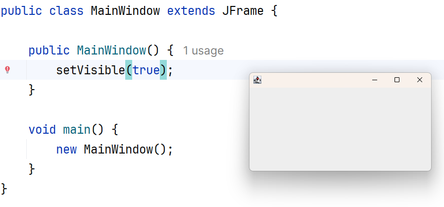

1. Dodaj konstruktor i ustaw tytuł okna, rozmiar oraz jego położenie i
    kolor frama:

   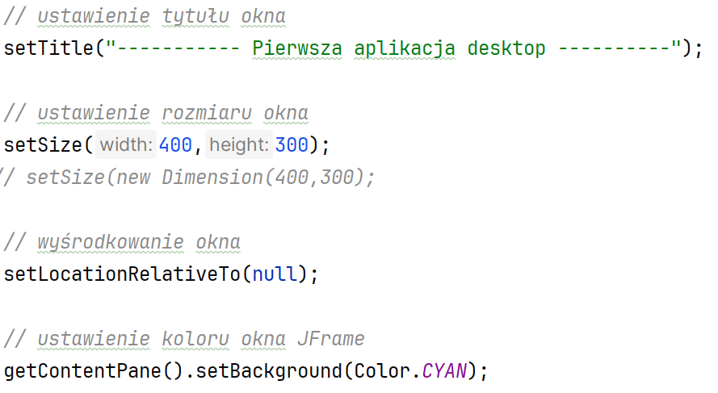

1. Dodaj zamknięcie okna x:

   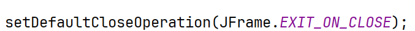

1. Dodaj panel:

   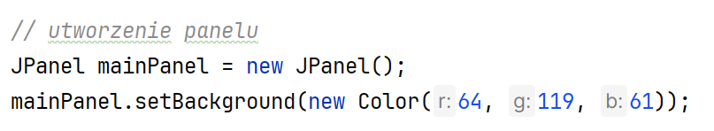

1. Dodaj kolor tła panelu oraz dodaj panel do ramki:

   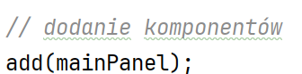

1. Cały konstruktor:

   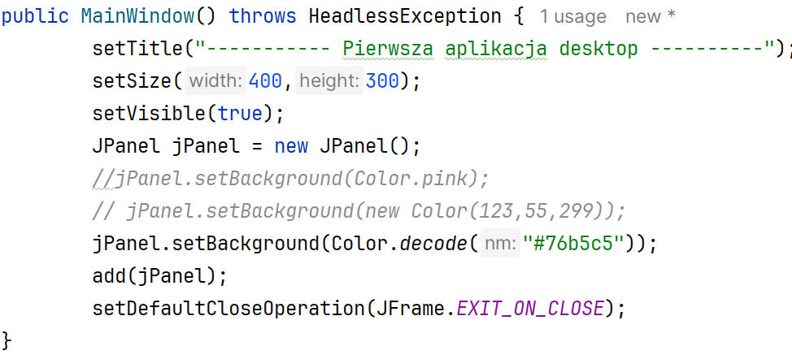

1. Sprawdź widok okna:

> 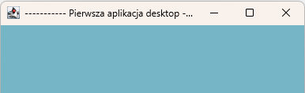

1. Dodaj menadżer układu na FlowLayout:

> 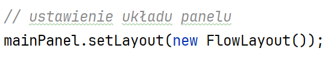

1. 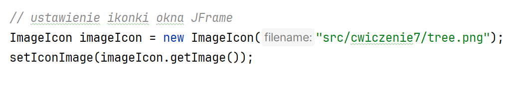
    Dodaj ikonkę dla aplikacji:
2. Zadeklaruj etykietę, pole tekstowe oraz przycisk:

> 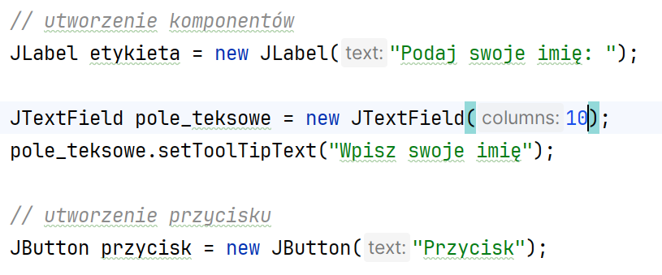

1. Dodaj komponenty do panelu:

> 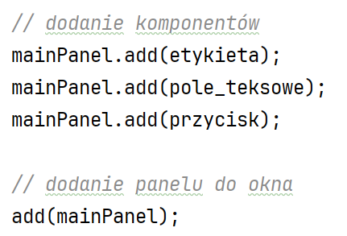

1. Realizacja:

> 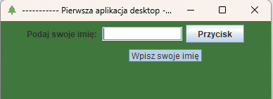

1. Zadanie 3: Zmień tło dla przycisku oraz kolor tekstu:
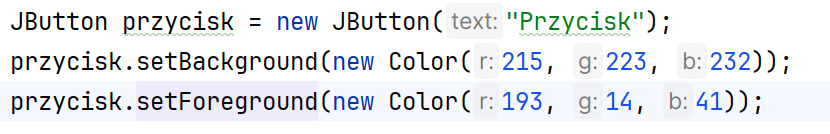
2. Zmień kolory dla przycisku po jego kliknięciu dodaj okno wiadomości
    z podanym imieniem:
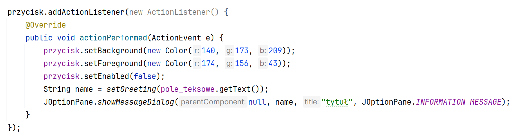
3. Ustaw przycisk na nieaktywny:

> 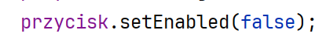

1. Przygotuj wcześniej 100 liczb i je posortuj:

> 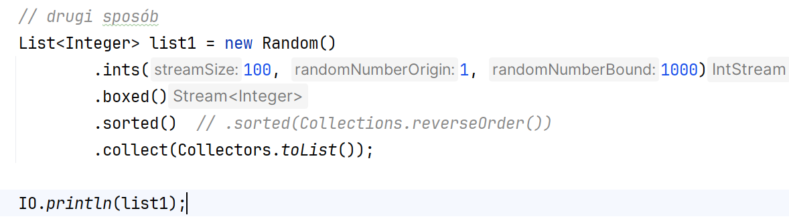

1. Dodaj przycisk sortowania i JTextArea na wyniki:

> 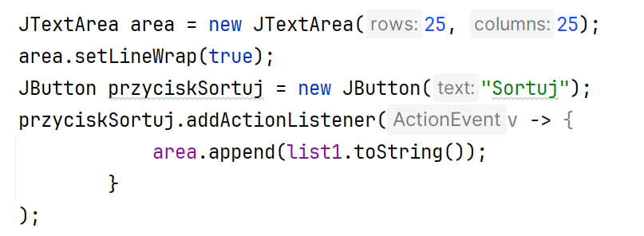

1. Pamiętaj o dodaniu komponentów do panelu:

> 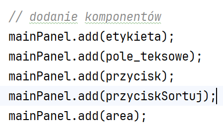

1. Uruchomienie:

> 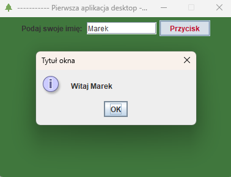
> 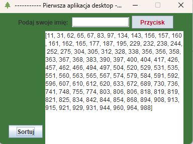

1. KONIEC.
