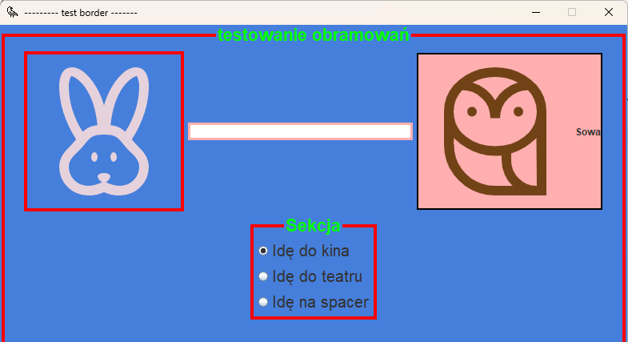
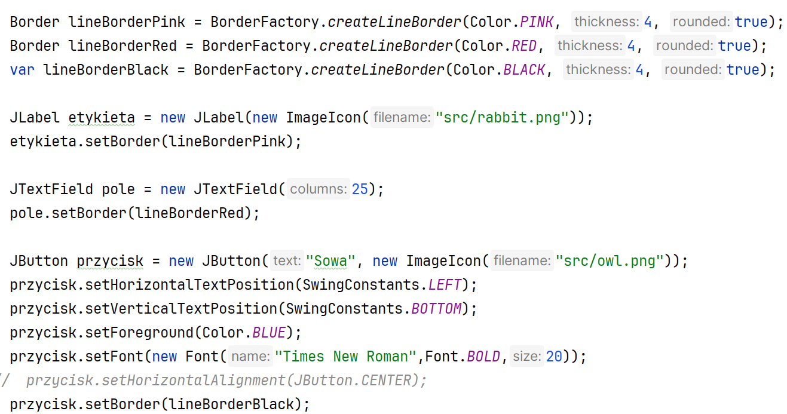
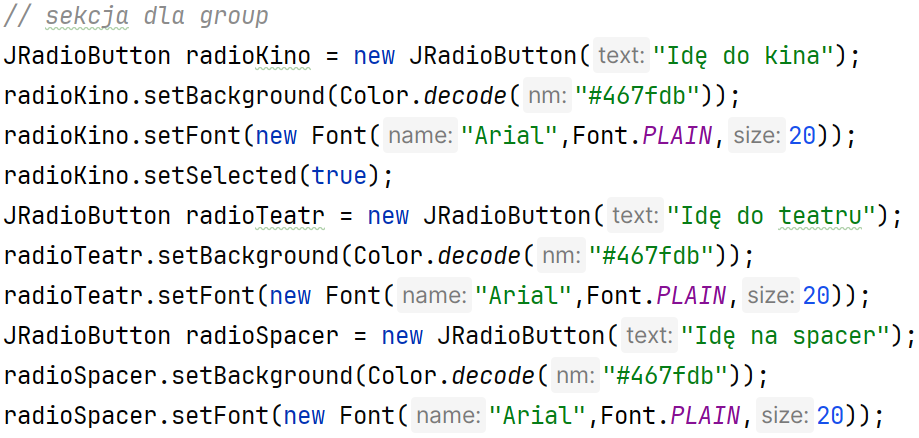
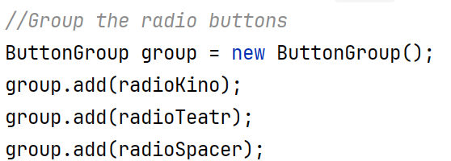
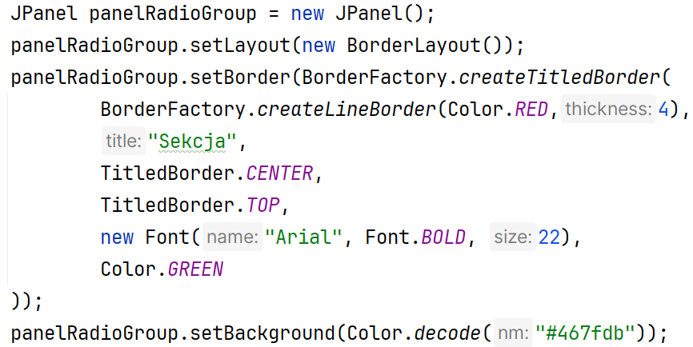
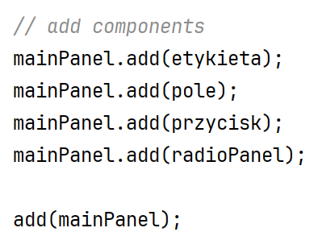

Ćwiczenia 8 -- praca z JFrame, border
Na koniec zajęć prześlij pliki źródłowe i z danymi, wynikami do zasobu w
teams.
1.  Utwórz nowy projekt w katalogu na dysku C:
2.  Użyte w ćwiczeniach biblioteki: ( zostaną zaimportowane
    automatycznie).
3.  Otwórz dokumentację:
> <https://docs.oracle.com/javase/tutorial/uiswing/components/border.html>
>
> <https://docs.oracle.com/javase/8/docs/api/javax/swing/BorderFactory.html>
4.  Dodaj nowy package o nazwie cwiczenia8.
5.  Dodaj nową klasę o nazwie Okno dziedziczące po JFrame.
6.  Ściągnij z teams plik picture.zip
7.  Dla panelu ustaw:
> 
8.  Efekt końcowy:

9.  Utwórz obramowanie z tytułem: testowanie obramowań dla panelu.
10. Dodaj etykietę (tylko ikona ), pole tekstowe i przycisk z ikoną i
    tekstem, następnie dodaj obramowania.
11. Dodaj sekcję dla trzech przycisków radio.
12. Realizacja: Utwórz obramowanie z tytułem: testowanie obramowań dla
    panelu.

13. 
    Realizacja: Dodaj etykietę (tylko ikona ), pole
    tekstowe i przycisk z ikoną i tekstem, następnie dodaj obramowania.
14. Realizacja: Dodaj sekcję dla trzech przycisków radio.
15. 
    Dodanie radio:
16. Zgrupowanie radio:
> 
17. Dodanie nowego panelu
> 
18. 
    Dodać elementy do nowego panelu:
19. Dodanie panelu do głównego panelu:
> 
20. KONIEC.
