# Ćwiczenia 9 -- praca z JFrame, border, podział na klasy

Na koniec zajęć prześlij pliki źródłowe i z danymi, wynikami do zasobu w
teams.

1. Utwórz nowy projekt w katalogu na dysku C:

1. Użyte w ćwiczeniach biblioteki: ( zostaną zaimportowane
    automatycznie).

1. Otwórz dokumentację:

   <https://docs.oracle.com/javase/tutorial/uiswing/components/border.html>

   <https://docs.oracle.com/javase/8/docs/api/javax/swing/BorderFactory.html>

1. Dodaj nowy package o nazwie cwiczenia9.

1. Dodaj nową klasę o nazwie Okno dziedziczące po JFrame.

1. Ściągnij z teams plik picture.zip lub animal.zip

1. Dla panelu ustaw:

   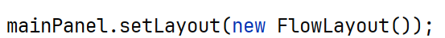

1. Efekt końcowy:

   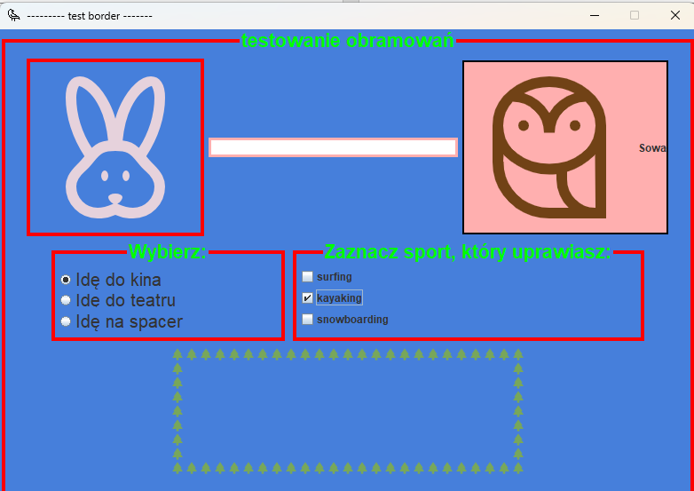

1. Utwórz obramowanie z tytułem: testowanie obramowań dla panelu.

1. Dodaj etykietę (tylko ikona ), pole tekstowe i przycisk z ikoną i
    tekstem, następnie dodaj obramowania.

1. Dodaj sekcję dla trzech przycisków radio.

1. Realizacja: Utwórz obramowanie z tytułem: testowanie obramowań dla panelu.

   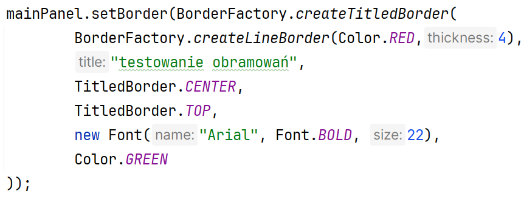

1. Realizacja: Dodaj etykietę (tylko ikona ), pole
    tekstowe i przycisk z ikoną i tekstem, następnie dodaj obramowania.

   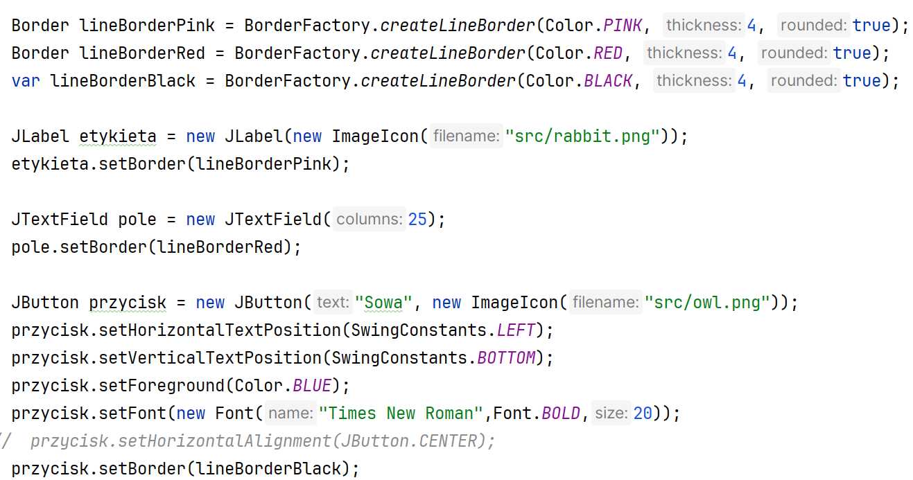

1. Realizacja: Dodaj sekcję dla trzech przycisków radio.

1. Dodanie radio:

   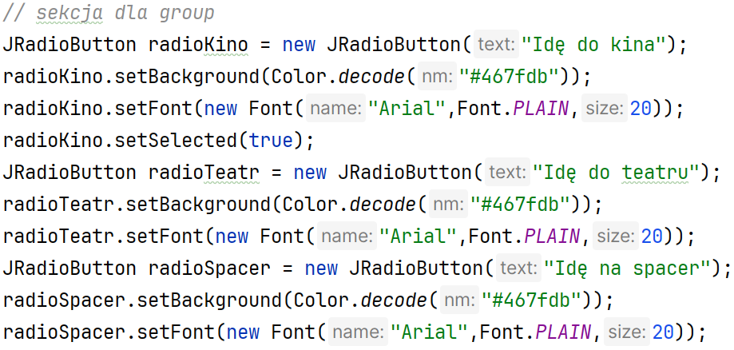

1. Zgrupowanie radio:

   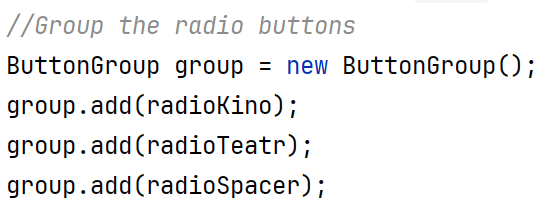

1. Dodanie nowego panelu

   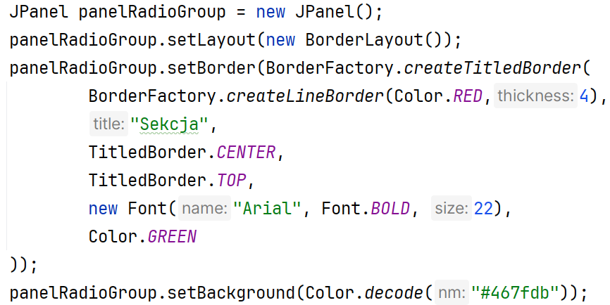

1. Dodać elementy do nowego panelu:

   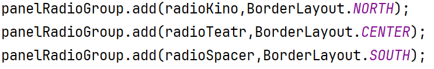

1. Dodanie panelu do głównego panelu:

   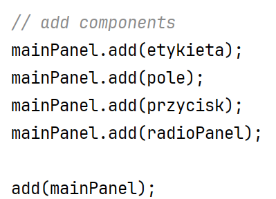

1. Dodaj panel z układem BoxLayout dla
    elementów checkbox, obok radiopanel:

   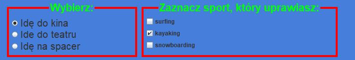

   Rozwiązanie:

   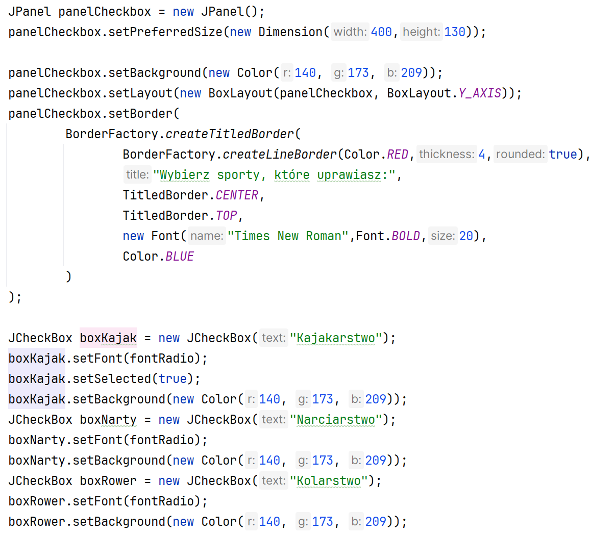

   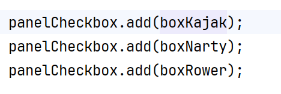

1. Dodaj nowy panel dla obramowania poprzez ikonę.

   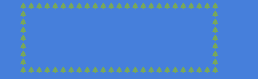

   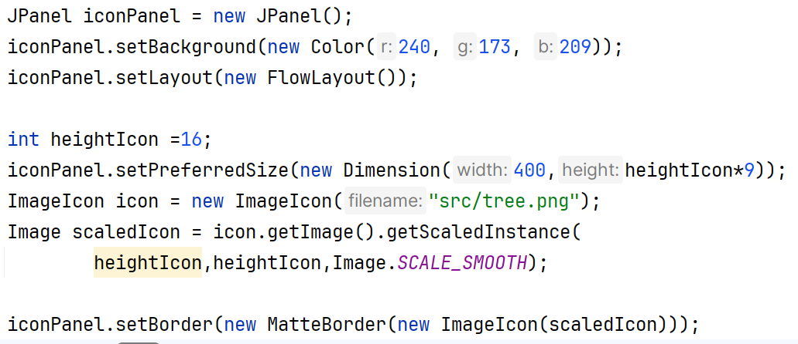

1. Podziel kod na poszczególne panele
    jako osobne klasy, również panel główny.( 45 minut )

   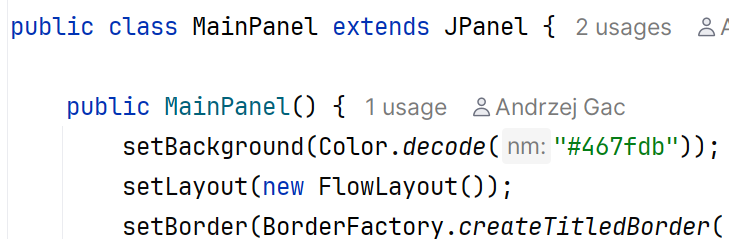

1. KONIEC. 🔚
